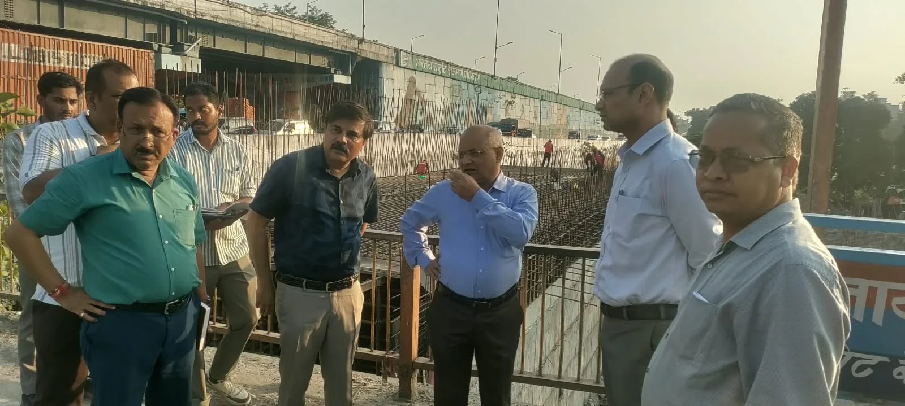
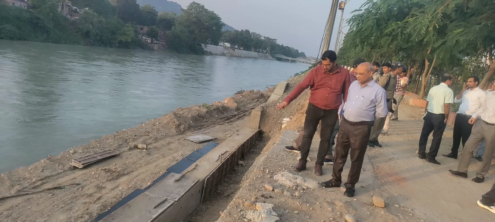

**हरिद्वार संवाददाता | आसिफ खान**

हरिद्वार। कुंभ मेला-2027 की तैयारियों को लेकर प्रशासन अब निर्माण कार्यों की रफ्तार और गुणवत्ता दोनों पर सख्त नजर रख रहा है। रविवार देर शाम आयुक्त गढ़वाल मंडल आनंद स्वरूप ने हरिद्वार पहुंचकर कुंभ से जुड़े विभिन्न निर्माण कार्यों का स्थलीय निरीक्षण किया। एडमिन रोड से लेकर चंडी चौक के समीप निर्माणाधीन बॉक्स कलवर्ट पुल, अमरापुर घाट और साक्षी सतनाम घाट के पास बन रहे नए घाटों तक मंडलायुक्त ने मौके पर पहुंचकर कार्यों की प्रगति परखी और अधिकारियों से सीधी जानकारी ली।

मंडलायुक्त ने स्पष्ट निर्देश दिए कि कुंभ-2027 से जुड़े किसी भी निर्माण कार्य में अनावश्यक देरी बर्दाश्त नहीं की जाएगी। निर्धारित समयसीमा के भीतर कार्य पूरा करने के साथ निर्माण की गुणवत्ता के तकनीकी मानकों का कड़ाई से पालन सुनिश्चित किया जाए।

**एडमिन रोड और बॉक्स कलवर्ट पर जांची रफ्तार**

निरीक्षण की शुरुआत एडमिन रोड के निर्माण कार्य से हुई। मंडलायुक्त ने सड़क निर्माण की वर्तमान स्थिति और प्रगति की जानकारी ली। इसके बाद चंडी चौक के समीप निर्माणाधीन बॉक्स कलवर्ट पुल का निरीक्षण किया। उन्होंने अधिकारियों को पर्याप्त संसाधन और श्रमशक्ति लगाकर कार्य में तेजी लाने के निर्देश दिए।

उन्होंने कहा कि कुंभ मेला-2027 की दृष्टि से एडमिन रोड और इससे जुड़े निर्माण कार्य बेहद महत्वपूर्ण हैं। इसलिए काम की गति के साथ गुणवत्ता की नियमित निगरानी भी जरूरी है।

**घाट निर्माण में भी समयसीमा पर फोकस**

इसके बाद मंडलायुक्त अमरापुर घाट और साक्षी सतनाम घाट के निकट निर्माणाधीन नए घाटों पर पहुंचे। यहां उन्होंने निर्माण कार्य की प्रगति, निर्धारित समयसीमा और अब तक हुए कार्यों की जानकारी ली। उन्होंने अधिकारियों को निर्देश दिए कि घाटों का निर्माण तय समय में पूरा किया जाए, ताकि कुंभ के दौरान श्रद्धालुओं को बेहतर सुविधाएं उपलब्ध कराई जा सकें।

**गंगनहर क्लोजिंग को लेकर पहले से तैयारी के निर्देश**

मंडलायुक्त ने गंगनहर की आगामी क्लोजिंग अवधि में प्रस्तावित कार्यों की भी समीक्षा की। उन्होंने अधिकारियों से कहा कि क्लोजिंग शुरू होने से पहले सभी आवश्यक तैयारियां पूरी कर ली जाएं। सामग्री, मशीनरी, संसाधन और पर्याप्त श्रमशक्ति की व्यवस्था पहले से सुनिश्चित की जाए, ताकि क्लोजिंग की अवधि का एक-एक दिन निर्माण कार्यों की रफ्तार बढ़ाने में इस्तेमाल हो सके।

**‘देरी भी नहीं, गुणवत्ता से समझौता भी नहीं’**

मंडलायुक्त आनंद स्वरूप ने अधिकारियों को दो टूक निर्देश दिए कि कुंभ मेला-2027 से जुड़े निर्माण कार्यों में न तो अनावश्यक विलंब हो और न ही गुणवत्ता से किसी स्तर पर समझौता किया जाए। सभी कार्यदायी संस्थाएं आपसी समन्वय के साथ काम करें और किसी भी स्तर पर सामने आने वाली तकनीकी अथवा प्रशासनिक समस्या का तत्काल समाधान सुनिश्चित करें।

उन्होंने निर्माण कार्यों की नियमित समीक्षा और लगातार स्थलीय निगरानी के भी निर्देश दिए। मंडलायुक्त ने कहा कि कुंभ की तैयारियों का सीधा उद्देश्य श्रद्धालुओं और आमजन को बेहतर सुविधाएं उपलब्ध कराना है। ऐसे में सभी निर्माण कार्य समय पर पूरे हों और उनका वास्तविक लाभ कुंभ के दौरान जनता को मिले, यह सुनिश्चित करना अधिकारियों की प्राथमिक जिम्मेदारी है।

**ये अधिकारी रहे मौजूद**

निरीक्षण के दौरान उप मेलाधिकारी आकाश जोशी, नगर मजिस्ट्रेट हर गिरि, तकनीकी प्रकोष्ठ के अधीक्षण अभियंता मनोज कुमार भट्ट, अधीक्षण अभियंता लोक निर्माण विभाग डी.पी. सिंह, अधिशासी अभियंता पीआईयू प्रवीण कुश, अधिशासी अभियंता लोक निर्माण विभाग योगेश कुमार, अधिशासी अभियंता सिंचाई अनुभव नौटियाल सहित अन्य अधिकारी मौजूद रहे।
