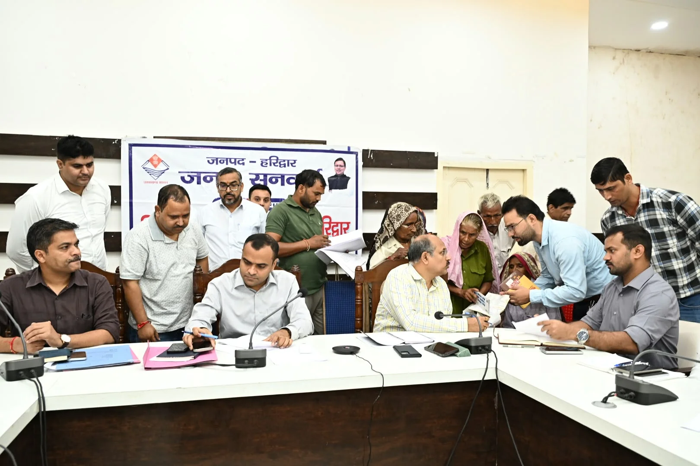
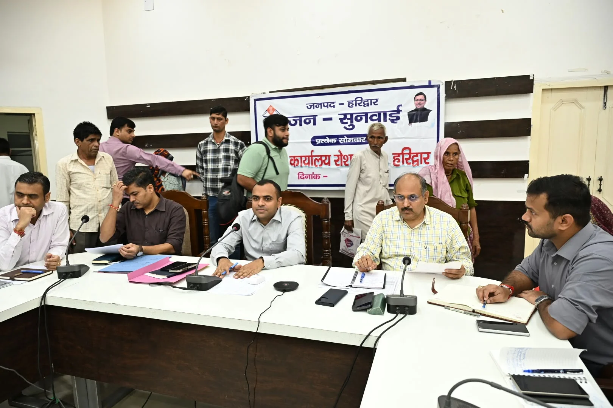

**हरिद्वार संवाददाता | आसिफ खान**

हरिद्वार। जनपदवासियों की समस्याओं के त्वरित समाधान को लेकर सोमवार को जिला कार्यालय सभागार में आयोजित जनसुनवाई में फरियादों का अंबार लगा रहा। जिलाधिकारी मयूर दीक्षित की अध्यक्षता में आयोजित कार्यक्रम में विभिन्न विभागों से संबंधित 68 शिकायतें दर्ज की गईं। इनमें से 32 समस्याओं का मौके पर ही निस्तारण कर दिया गया, जबकि शेष शिकायतों को संबंधित विभागों के अधिकारियों के पास त्वरित कार्रवाई के लिए भेजा गया।

जनसुनवाई में राजस्व, भूमि विवाद, विद्युत, अतिक्रमण, जलभराव, पेयजल और राशन कार्ड सहित कई प्रमुख समस्याएं सामने आईं। जिलाधिकारी ने अधिकारियों को स्पष्ट निर्देश दिए कि जनता की शिकायतों को महज औपचारिकता न समझा जाए, बल्कि समयबद्ध और संवेदनशील तरीके से समाधान सुनिश्चित किया जाए।

**लापरवाही पर डीएम की दो टूक—जिम्मेदारी तय होगी**

जिलाधिकारी मयूर दीक्षित ने अधिकारियों को निर्देशित किया कि जनसुनवाई में दर्ज प्रत्येक शिकायत का त्वरित एवं समयबद्ध निस्तारण सुनिश्चित किया जाए। उन्होंने स्पष्ट कहा कि शिकायतों के निस्तारण में किसी भी स्तर पर लापरवाही या शिथिलता बर्दाश्त नहीं की जाएगी। लापरवाही सामने आने पर संबंधित अधिकारी के विरुद्ध आवश्यक कार्रवाई सुनिश्चित की जाएगी।

जिन मामलों में स्थलीय निरीक्षण की आवश्यकता है, उनमें संबंधित अधिकारी आपसी समन्वय स्थापित कर मौके पर पहुंचें और समस्या का समाधान सुनिश्चित करें। जिलाधिकारी ने अधिकारियों से कहा कि जनता की समस्याओं को शीर्ष प्राथमिकता और पूरी संवेदनशीलता के साथ लिया जाए।

**बीमार पत्नी के इलाज से लेकर सड़क और जमीन की पैमाइश तक पहुंचीं फरियादें**

जनसुनवाई में ग्राम बंजारेवाला ग्रंट निवासी सुरजीत सिंह ने गंभीर रूप से बीमार पत्नी के इलाज के लिए आर्थिक सहायता तथा मुख्यमंत्री राहत कोष से मदद दिलाने की मांग की।

ग्राम जैनपुर मुबारिकपुर, लक्सर निवासी आलम मीर ने लंबे समय से लंबित राशन कार्ड बनवाने की मांग रखी। सीतापुर निवासी बृजानन्द शर्मा ने वोटर आईडी कार्ड अपडेट कराने के संबंध में प्रार्थना पत्र दिया।

सूरज कुमार पुत्र धर्मपाल सिंह ने कृषि भूमि की पैमाइश कराने की मांग रखी। उन्होंने बताया कि खाता संख्या 00041, खसरा नंबर 23, रकबा 0.0970 हेक्टेयर की भूमि मौके पर कम पाई जा रही है।

देवनगर के निवासियों ने वार्ड संख्या 12 में मकान संख्या जे-1 से देवनगर मुख्य मार्ग तक करीब 250 मीटर लंबे खराब मार्ग की हालत सुधारते हुए सड़क निर्माण कराने की मांग की।

वहीं सुरेंद्र सैनी ने जनपद में डेंगू और स्वाइन फ्लू के बढ़ते मामलों को देखते हुए रोकथाम के लिए प्रभावी कदम उठाने की मांग की। एक अन्य फरियादी ने रुकी हुई वृद्धावस्था पेंशन दोबारा शुरू कराने की मांग रखी।

**सीएम हेल्पलाइन पर भी अफसरों की जवाबदेही तय**

जनसुनवाई के साथ बैठक में सीएम हेल्पलाइन पर दर्ज शिकायतों की भी समीक्षा की गई। अधिकारियों को निर्देश दिए गए कि लंबित शिकायतों का गंभीरता और संवेदनशीलता के साथ निस्तारण किया जाए।

समीक्षा में सामने आया कि 36 दिन से अधिक समय से लंबित शिकायतों के निस्तारण में तेजी लाने के निर्देश दिए गए हैं। वर्तमान में एल-1 स्तर पर 290 तथा एल-2 स्तर पर 84 शिकायतें निस्तारण के लिए लंबित बताई गईं। संबंधित अधिकारियों को इन शिकायतों का प्राथमिकता के आधार पर निस्तारण सुनिश्चित करने के निर्देश दिए गए।

**जनता की शिकायतें बनीं प्रशासन की प्राथमिकता**

जिलाधिकारी ने अधिकारियों को स्पष्ट किया कि जनसुनवाई का उद्देश्य केवल शिकायतें दर्ज करना नहीं, बल्कि उनका जमीनी स्तर पर समाधान कर जनता को राहत पहुंचाना है। उन्होंने कहा कि जिन शिकायतों में विभागीय समन्वय की आवश्यकता है, वहां अधिकारी आपसी तालमेल से कार्रवाई करें और शिकायतकर्ता को अनावश्यक रूप से कार्यालयों के चक्कर न काटने पड़ें।

बैठक में मुख्य विकास अधिकारी डॉ. ललित नारायण मिश्र, जॉइंट मजिस्ट्रेट रुड़की दीपक रामचंद्र सेठ, अपर जिलाधिकारी वित्त एवं राजस्व वैभव गुप्ता, अपर जिलाधिकारी प्रशासन जितेंद्र कुमार, मुख्य चिकित्साधिकारी डॉ. आरके सिंह समेत विभिन्न विभागों के जिला स्तरीय अधिकारी मौजूद रहे।
