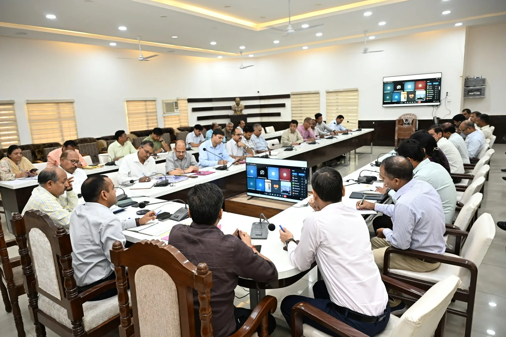
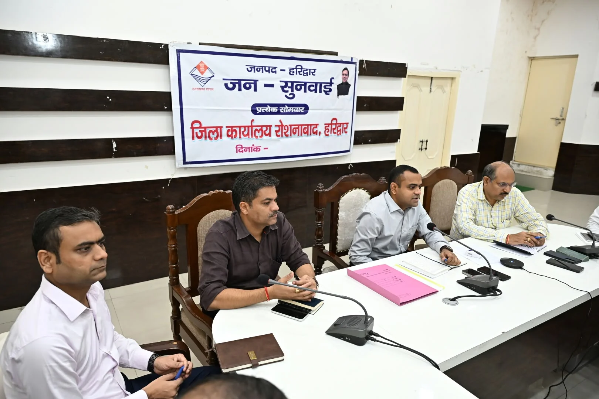

**हरिद्वार संवाददाता | आसिफ खान**

हरिद्वार। जनपद में सरकारी योजनाओं और विकास कार्यों की रफ्तार को लेकर जिलाधिकारी मयूर दीक्षित ने अधिकारियों को सख्त निर्देश दिए हैं। जिला कार्यालय सभागार में विभिन्न विभागों की योजनाओं की समीक्षा करते हुए जिलाधिकारी ने साफ कहा कि जनहित से जुड़ी योजनाओं में किसी भी स्तर पर अनावश्यक देरी बर्दाश्त नहीं की जाएगी। सभी कार्य निर्धारित समयसीमा, गुणवत्ता और मानकों के अनुरूप पूरे किए जाएं।

बैठक में 20 सूत्रीय कार्यक्रम की समीक्षा करते हुए जिलाधिकारी ने डी और सी श्रेणी में चल रहे विभागों को प्रदर्शन में सुधार लाने तथा ए श्रेणी में पहुंचने के लिए लगातार प्रयास करने के निर्देश दिए। उन्होंने अधिकारियों से योजनाओं की प्रगति में तेजी लाने और नियमित समीक्षा सुनिश्चित करने को कहा।

**पहली किस्त खर्च करो, दूसरी के प्रस्ताव भेजो**

जिला योजना की समीक्षा के दौरान जिलाधिकारी ने पहली किस्त के रूप में प्राप्त धनराशि का शीघ्र और निर्धारित कार्यों पर प्रभावी उपयोग सुनिश्चित करने के निर्देश दिए। उन्होंने कहा कि स्वीकृत कार्यों को प्राथमिकता के आधार पर पूरा कराया जाए और सरकारी धनराशि का समयबद्ध सदुपयोग सुनिश्चित हो।

वहीं, जिला योजना की द्वितीय किस्त 30 सितंबर तक स्वीकृत कराने के लिए सभी संबंधित विभागों को अपने प्रस्ताव जल्द से जल्द जिला अर्थ एवं संख्या अधिकारी को उपलब्ध कराने के निर्देश दिए गए। जिलाधिकारी ने स्पष्ट किया कि प्रस्ताव भेजने में देरी से स्वीकृति प्रक्रिया प्रभावित नहीं होनी चाहिए।

**शिविरों में अफसरों की मौजूदगी अनिवार्य**

सेवा संकल्प अभियान के तहत ‘जन-जन की सरकार, जन-जन के द्वार’ आयोजित किए जा रहे शिविरों को लेकर भी जिलाधिकारी ने अधिकारियों को सख्त निर्देश दिए। उन्होंने कहा कि इन शिविरों में सभी संबंधित विभागों के अधिकारी अनिवार्य रूप से प्रतिभाग करें और मौके पर ही आमजन को शासन की योजनाओं एवं सेवाओं का लाभ उपलब्ध कराने की दिशा में प्रभावी कार्रवाई करें।

शिविरों में प्राप्त शिकायतों और समस्याओं को प्राथमिकता के आधार पर निस्तारित करने के निर्देश भी दिए गए। जिलाधिकारी ने कहा कि सरकार की योजनाओं का लाभ अंतिम व्यक्ति तक पहुंचाना अधिकारियों की प्राथमिकता होनी चाहिए।

**गुणवत्ता से समझौता नहीं**

जिलाधिकारी ने अधिकारियों को निर्देशित किया कि सभी योजनाओं और कार्यक्रमों की नियमित समीक्षा कर लंबित कार्यों की रफ्तार बढ़ाई जाए। उन्होंने शासन की निर्धारित समयसीमा, गुणवत्ता और मानकों का पूरी तरह पालन सुनिश्चित करने को कहा।

बैठक में मुख्य विकास अधिकारी डॉ. लालित नारायण मिश्र, जॉइंट मजिस्ट्रेट रुड़की दीपक रामचंद्र सेठ, अपर जिलाधिकारी वित्त एवं राजस्व वैभव गुप्ता, अपर जिलाधिकारी प्रशासन जितेंद्र कुमार, मुख्य चिकित्साधिकारी डॉ. आरके सिंह, जिला विकास अधिकारी कमलेश कुमार पंत, मुख्य शिक्षा अधिकारी अमित कुमार चन्द, जिला खाद्य सुरक्षा अधिकारी महिमानंद जोशी, जिला पर्यटन अधिकारी सुशील नौटियाल, जिला आपदा प्रबंधन अधिकारी मीरा रावत, डीपीआरओ मुस्तफा खां, अधिशासी अभियंता यूपीसीएल दीपक सैनी, मुख्य उद्यान अधिकारी तेजपाल सिंह, नोडल स्वजल चंद्रकांत मणि त्रिपाठी, अधिशासी अभियंता जल संस्थान विपिन चौहान, परियोजना अधिकारी उरेडा युद्धवीर सिंह बिष्ट सहित अन्य जिला स्तरीय अधिकारी मौजूद रहे।
