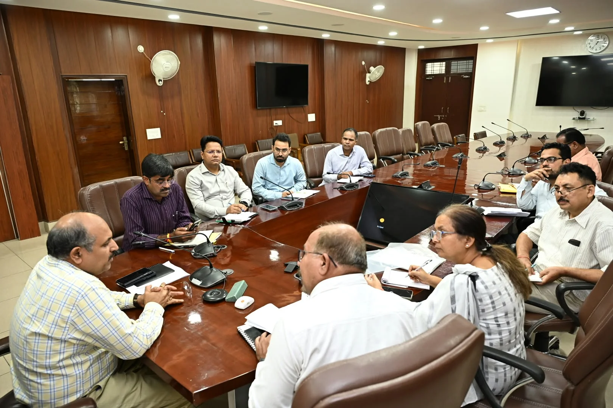
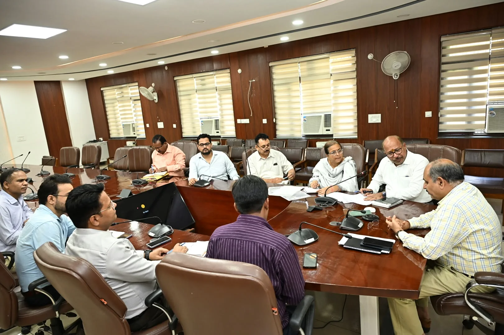

**हरिद्वार संवाददाता | आसिफ खान**

**हरिद्वार।** कुष्ठ रोगियों के हक और सरकारी योजनाओं के लाभ में किसी भी स्तर पर लापरवाही अब भारी पड़ सकती है। प्रशासन ने कुष्ठ रोगियों के कल्याण और पुनर्वास को लेकर कड़ा रुख अपनाते हुए संबंधित विभागों को समयबद्ध कार्रवाई के निर्देश दिए हैं। सोमवार को विकास भवन सभागार में मुख्य विकास अधिकारी डॉ. ललित नारायण मिश्र की अध्यक्षता में अंतरविभागीय बैठक हुई, जिसमें कुष्ठ रोगियों की समस्याओं और उन्हें सरकारी योजनाओं से जोड़ने को लेकर अधिकारियों के साथ विस्तार से मंथन किया गया।

बैठक में स्वास्थ्य सुविधाओं, सामाजिक सुरक्षा पेंशन, राशन कार्ड और कुष्ठ रोगियों के बच्चों की शिक्षा जैसे अहम मुद्दे प्रमुखता से उठे। मुख्य विकास अधिकारी ने स्पष्ट निर्देश दिए कि पात्र कुष्ठ रोगियों को सरकारी योजनाओं का लाभ दिलाने में किसी तरह की ढिलाई नहीं होनी चाहिए। उन्होंने संबंधित विभागों को अपनी जिम्मेदारी तय करते हुए पात्र लाभार्थियों को योजनाओं से जोड़ने और लंबित प्रकरणों का शीघ्र निस्तारण सुनिश्चित करने को कहा।

**कागजों में नहीं, धरातल पर दिखे योजनाओं का लाभ**

मुख्य विकास अधिकारी ने अधिकारियों को निर्देशित किया कि सरकारी योजनाओं का लाभ केवल कागजी कार्रवाई तक सीमित न रहे, बल्कि हर पात्र कुष्ठ रोगी तक उसका वास्तविक लाभ पहुंचना चाहिए। स्वास्थ्य सुविधाओं के साथ पात्र लोगों की पेंशन, राशन कार्ड और अन्य सामाजिक सुरक्षा योजनाओं का लाभ सुनिश्चित करने पर विशेष जोर दिया गया।

उन्होंने कहा कि कुष्ठ रोगियों के बच्चों की शिक्षा भी प्राथमिकता में शामिल है। संबंधित विभाग आपसी समन्वय के साथ कार्य करते हुए यह सुनिश्चित करें कि पात्र बच्चों को शिक्षा से जुड़ी सुविधाओं से वंचित न रहना पड़े।

**लंबित फाइलों पर भी प्रशासन की नजर**

बैठक में अधिकारियों को निर्देश दिए गए कि अपने-अपने विभाग से संबंधित लंबित प्रकरणों को प्राथमिकता के आधार पर निपटाया जाए। पात्र कुष्ठ रोगियों को शासन की विभिन्न जनकल्याणकारी योजनाओं से जोड़ने के लिए विभागवार प्रभावी कार्ययोजना तैयार कर समयबद्ध कार्रवाई की जाए।

मुख्य विकास अधिकारी ने साफ किया कि कुष्ठ रोगियों के कल्याण से जुड़े मामलों में विभागीय समन्वय मजबूत किया जाए और पात्र व्यक्ति योजनाओं के लाभ से वंचित न रहे।

बैठक में मुख्य चिकित्सा अधिकारी डॉ. आरके सिंह, जिला प्रोविजन अधिकारी अविनाश भदौरिया, सहायक श्रम आयुक्त प्रशांत कुमार सहित संबंधित विभागों के अधिकारी मौजूद रहे।
