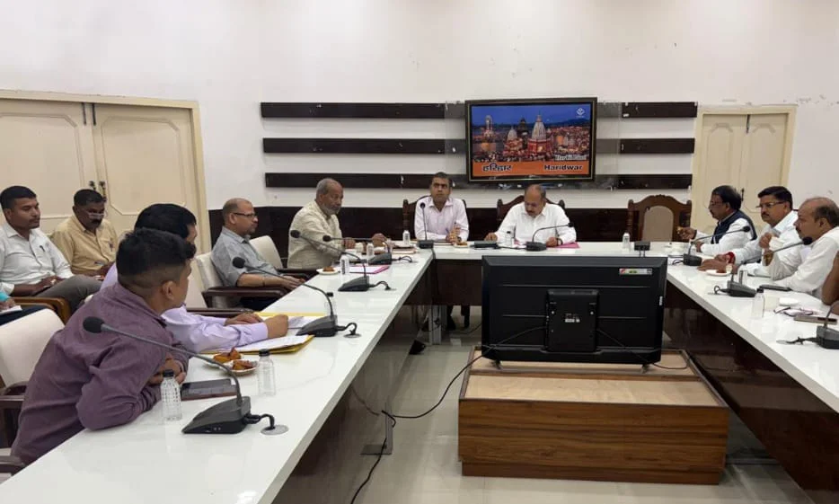
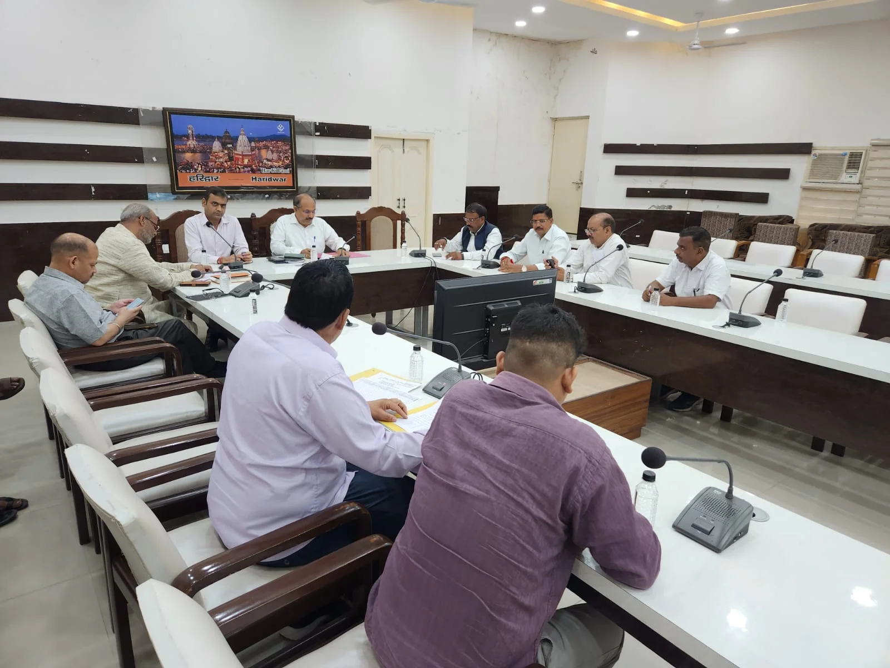

**हरिद्वार संवाददाता | आसिफ खान**

हरिद्वार। भारत निर्वाचन आयोग के निर्देश पर चल रहे विशेष गहन पुनरीक्षण (एसआईआर) अभियान को लेकर जिला प्रशासन ने तैयारियां तेज कर दी हैं। इसी कड़ी में मुख्य विकास अधिकारी डॉ. ललित नारायण मिश्र की अध्यक्षता में जिला कार्यालय सभागार में राजनीतिक दलों के प्रतिनिधियों के साथ महत्वपूर्ण बैठक आयोजित की गई। बैठक में मतदाता सूची के पुनरीक्षण से लेकर फॉर्म-6, 7 और 8 के निस्तारण तक की प्रक्रिया पर विस्तार से चर्चा हुई।

बैठक में मुख्य विकास अधिकारी ने स्पष्ट किया कि जनपद में विशेष गहन पुनरीक्षण का कार्य अंतिम चरण में पहुंच चुका है। उन्होंने राजनीतिक दलों के प्रतिनिधियों को बताया कि मतदाता सूची का अंतिम प्रकाशन, जो पूर्व निर्धारित कार्यक्रम के अनुसार 15 सितंबर 2026 को होना था, अब संशोधित कार्यक्रम के तहत 3 अक्टूबर 2026 को किया जाएगा।

**फॉर्म-6, 7 और 8 के निस्तारण पर भी फोकस**

बैठक में फॉर्म-6, 7 और 8 के निस्तारण को लेकर भी राजनीतिक दलों के प्रतिनिधियों को विस्तृत जानकारी दी गई। प्रशासन की ओर से पुनरीक्षण प्रक्रिया में प्राप्त दावों एवं आपत्तियों के निस्तारण की स्थिति से प्रतिनिधियों को अवगत कराया गया।

मुख्य विकास अधिकारी डॉ. ललित नारायण मिश्र ने कहा कि विशेष गहन पुनरीक्षण जैसे महत्वपूर्ण निर्वाचन कार्य में सभी राजनीतिक दलों का सहयोग मिल रहा है। उन्होंने कहा कि शेष प्रक्रिया भी पूरी पारदर्शिता और निष्पक्षता के साथ पूरी कराई जाएगी।

**राजनीतिक दलों ने भी प्रशासन की कार्यप्रणाली को सराहा**

बैठक में मौजूद राजनीतिक दलों के प्रतिनिधियों ने भी जिला प्रशासन की कार्यप्रणाली की सराहना की। प्रतिनिधियों ने कहा कि जिला निर्वाचन अधिकारी मयूर दीक्षित के नेतृत्व एवं निर्देशन में जनपद में विशेष गहन पुनरीक्षण का कार्य पारदर्शिता और निष्पक्षता के साथ आगे बढ़ाया जा रहा है।

प्रशासन ने राजनीतिक दलों से पुनरीक्षण कार्य के अंतिम चरण में भी सक्रिय सहयोग बनाए रखने की अपील की, ताकि मतदाता सूची का अंतिम प्रकाशन निर्धारित संशोधित कार्यक्रम के अनुसार कराया जा सके।

बैठक में अपर जिलाधिकारी वित्त एवं राजस्व वैभव गुप्ता, बालेश्वर सिंह (अध्यक्ष, जिला कांग्रेस कमेटी हरिद्वार), सतीश कुमार दुबे (कांग्रेस), कैलाश प्रधान (प्रदेश सचिव, कांग्रेस), राजीव गर्ग (सीपीआई-एम), राजेंद्र चौधरी, सहायक जिला निर्वाचन अधिकारी अरुणेश पैन्यूली सहित संबंधित अधिकारी एवं कर्मचारी उपस्थित रहे।
