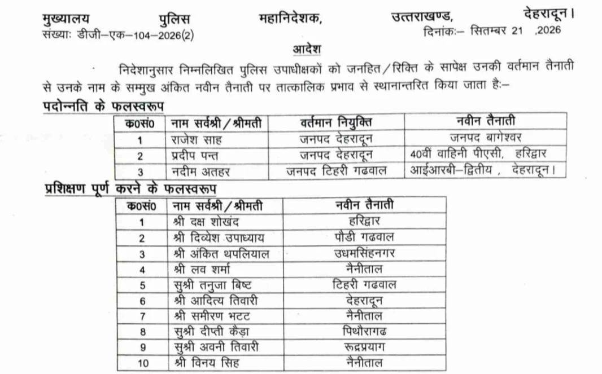

देहरादून विशेष संवाददाता | आसिफ खान 

देहरादून। उत्तराखंड पुलिस महकमे में सोमवार को बड़ा प्रशासनिक फेरबदल हुआ। पुलिस मुख्यालय ने 21 सितंबर 2026 को एक साथ 14 अधिकारियों की तैनाती के आदेश जारी कर पूरे पुलिस महकमे में हलचल बढ़ा दी। तबादलों और नई जिम्मेदारियों के इस आदेश में हरिद्वार सबसे ज्यादा चर्चा में रहा, जहां युवा आईपीएस अधिकारी देव व्रत जोशी को सहायक पुलिस अधीक्षक (ASP) की कमान सौंपी गई है।

**हरिद्वार में IPS की नई तैनाती**

IPS देव व्रत जोशी (IPS-RR-2023) अब हरिद्वार में सहायक पुलिस अधीक्षक की जिम्मेदारी संभालेंगे। सरदार वल्लभ भाई पटेल राष्ट्रीय पुलिस अकादमी, हैदराबाद में Phase-II Training of Basic Course पूरा करने के बाद उन्हें यह तैनाती दी गई है।

पुलिस मुख्यालय के आदेश में उन्हें तत्काल कार्यभार ग्रहण करने के निर्देश दिए गए हैं। देव व्रत जोशी ने 31 अगस्त 2026 को पुलिस मुख्यालय में आमद दर्ज कराई थी। अब प्रशिक्षण पूरा करने के बाद उन्हें हरिद्वार जैसे महत्वपूर्ण जनपद में मैदान में उतारा गया है।

**3 पदोन्नत अधिकारियों का भी तबादला**

**फेरबदल की गाज पदोन्नति पाने वाले तीन पुलिस उपाधीक्षकों पर भी पड़ी है। नई जिम्मेदारी के तहत—**

**राजेश साह को देहरादून से बागेश्वर भेजा गया है।**

**प्रदीप पन्त को देहरादून से 40वीं वाहिनी पीएसी, हरिद्वार भेजा गया है।**

**नदीम अहमद को टिहरी गढ़वाल से आईआरबी द्वितीय, देहरादून की जिम्मेदारी दी गई है।**

**ट्रेनिंग पूरी होते ही मैदान में उतरे 10 अधिकारी**

पुलिस प्रशिक्षण पूरा करने वाले 10 अधिकारियों को भी प्रदेश के अलग-अलग जनपदों में तैनाती दे दी गई है। इनमें—

**दक्ष शौरखंद — हरिद्वार
दिव्येश उपाध्याय — पौड़ी गढ़वाल
अंकित थापलियाल — ऊधमसिंहनगर
लव शर्मा — नैनीताल
तनुजा बिष्ट — टिहरी गढ़वाल
आदित्य तिवारी — देहरादून
समीरन भट्ट — नैनीताल
दीप्ति कैड़ा — पिथौरागढ़
अवनी तिवारी — रुद्रप्रयाग
विनय सिंह — नैनीताल**

**एक आदेश…14 अफसर…बदल गई तस्वीर**

पुलिस मुख्यालय के इस आदेश ने प्रदेश के पुलिस प्रशासन में एक साथ बड़े स्तर पर जिम्मेदारियों का फेरबदल कर दिया है। 3 पदोन्नत पुलिस उपाधीक्षक + 10 प्रशिक्षण पूर्ण अधिकारी + 1 IPS अधिकारी, यानी कुल 14 अधिकारियों को नई जिम्मेदारियां दी गई हैं।

इनमें सबसे बड़ा बदलाव हरिद्वार में देखने को मिला है। देव व्रत जोशी की ASP के रूप में तैनाती के साथ अब हरिद्वार पुलिस प्रशासन में नई जिम्मेदारी और नई टीम के साथ कामकाज का दौर शुरू होगा।

**पुलिस मुख्यालय का बड़ा संदेश—अब नई जिम्मेदारियों के साथ मैदान में उतरेंगे अफसर**
