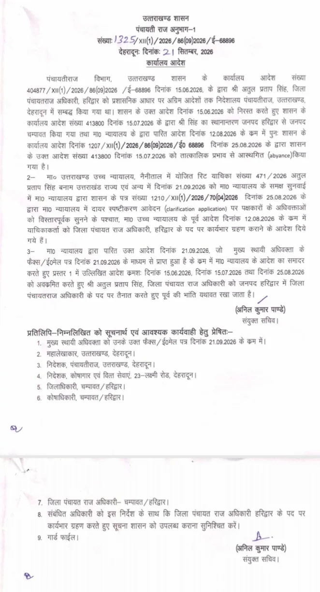

**देहरादून विशेष संवाददाता | आसिफ खान**

देहरादून । जिला पंचायतराज अधिकारी अतुल प्रताप सिंह के तबादले और सम्बद्धीकरण को लेकर चल रही लंबी प्रशासनिक और न्यायालयी उठापटक पर सोमवार को बड़ा मोड़ आ गया। उत्तराखण्ड हाईकोर्ट के आदेश के बाद शासन को अपने पूर्व के फैसलों को पलटना पड़ा है। पंचायती राज विभाग ने 21 सितंबर 2026 को बाकायदा कार्यालय आदेश जारी कर अतुल प्रताप सिंह को जिला पंचायतराज अधिकारी, हरिद्वार के पद पर पूर्व की भांति यथावत रखने के आदेश जारी कर दिए।

मामले में पहले 15 जून 2026 को शासन ने अतुल प्रताप सिंह को प्रशासनिक आधार पर अग्रिम आदेशों तक निदेशालय पंचायतीराज, देहरादून में सम्बद्ध कर दिया था। इसके बाद 15 जुलाई को उनका हरिद्वार से चम्पावत तबादला कर दिया गया। मामला न्यायालय पहुंचने के बाद घटनाक्रम ने फिर करवट ली और 25 अगस्त को शासन ने चम्पावत स्थानांतरण आदेश को तत्काल प्रभाव से आस्थगित कर दिया।

**कोर्ट में हुई सुनवाई, फिर आया बड़ा आदेश**

अतुल प्रताप सिंह ने इस पूरे प्रकरण को लेकर उत्तराखण्ड हाईकोर्ट, नैनीताल में रिट याचिका संख्या 471/2026—अतुल प्रताप सिंह बनाम उत्तराखण्ड राज्य एवं अन्य दाखिल की थी। 21 सितंबर को मामले की सुनवाई के दौरान शासन की ओर से दायर स्पष्टीकरण आवेदन पर दोनों पक्षों के अधिवक्ताओं को विस्तार से सुनने के बाद हाईकोर्ट ने पूर्व आदेश के क्रम में याचिकाकर्ता को जिला पंचायतराज अधिकारी, हरिद्वार के पद पर कार्यभार ग्रहण कराने के आदेश दिए।

**हाईकोर्ट के आदेश के आगे पुराने शासनादेश बेअसर**

न्यायालय के आदेश की जानकारी मिलते ही पंचायती राज विभाग ने तत्काल कदम उठाया। संयुक्त सचिव अनिल कुमार पाण्डे की ओर से जारी आदेश में 15 जून, 15 जुलाई और 25 अगस्त 2026 के पूर्ववर्ती आदेशों को अवक्रमित करते हुए अतुल प्रताप सिंह को हरिद्वार में जिला पंचायतराज अधिकारी के पद पर पूर्व की भांति यथावत रखा गया है।

शासन ने संबंधित अधिकारी को निर्देश दिए हैं कि वह जिला पंचायतराज अधिकारी, हरिद्वार के पद पर कार्यभार ग्रहण कर इसकी सूचना शासन को उपलब्ध कराएं।

**तीन आदेशों के बाद अब आया निर्णायक मोड़**

अतुल प्रताप सिंह को लेकर पिछले तीन महीनों में शासन स्तर से सम्बद्धीकरण, स्थानांतरण और स्थानांतरण स्थगन के आदेश जारी होते रहे, लेकिन मामला न्यायालय तक पहुंचने के बाद अब शासन ने हाईकोर्ट के निर्देश के अनुपालन में स्थिति स्पष्ट कर दी है।

शासन के ताजा आदेश के बाद अतुल प्रताप सिंह की हरिद्वार वापसी का रास्ता पूरी तरह साफ हो गया है और अब वह जिला पंचायतराज अधिकारी के रूप में हरिद्वार में कार्यभार संभालेंगे।
