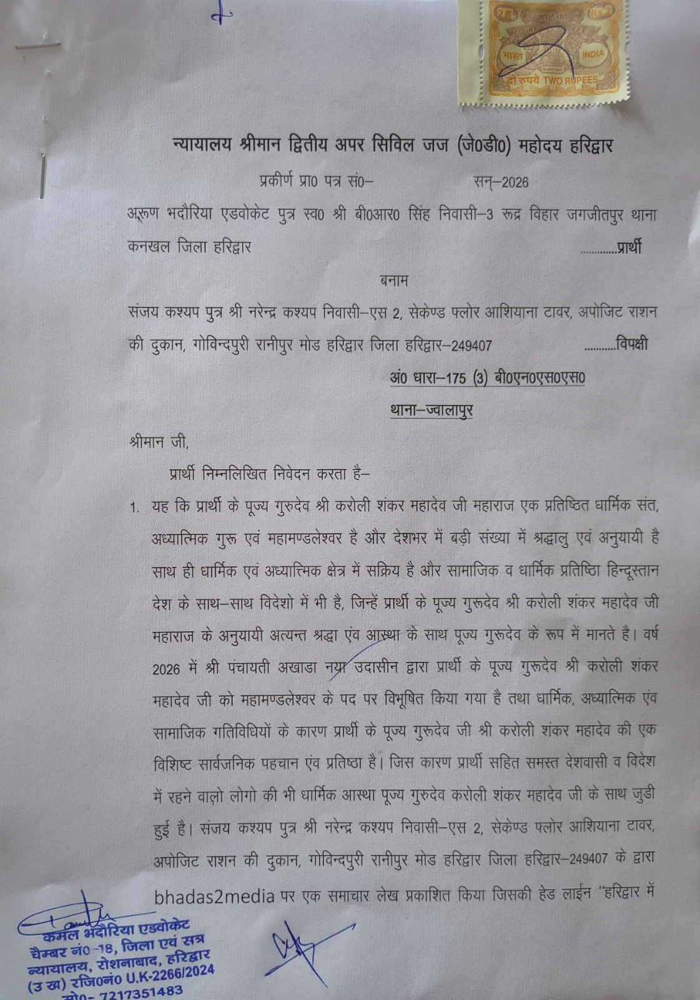
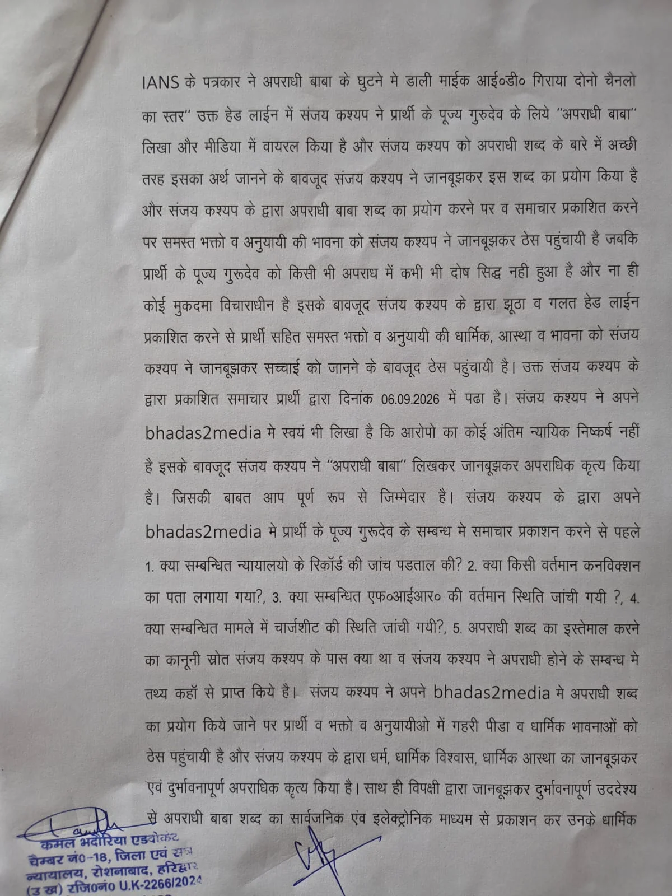
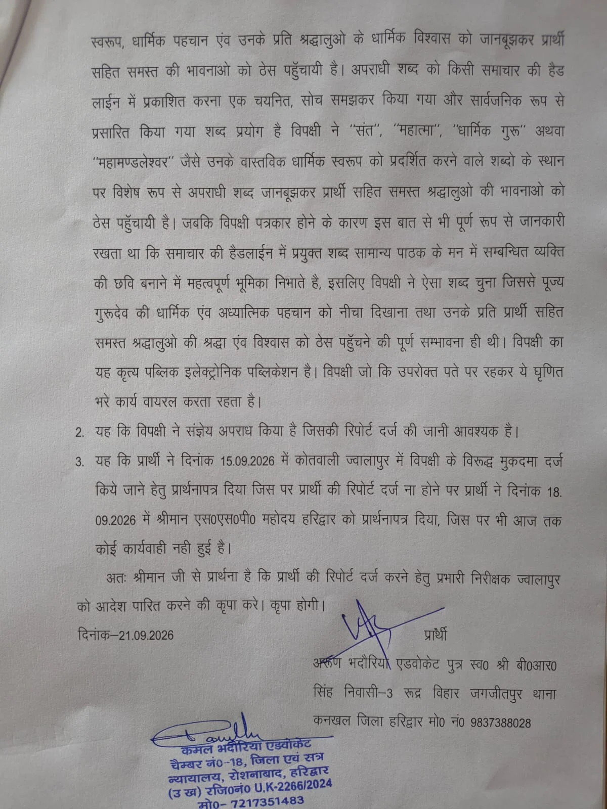
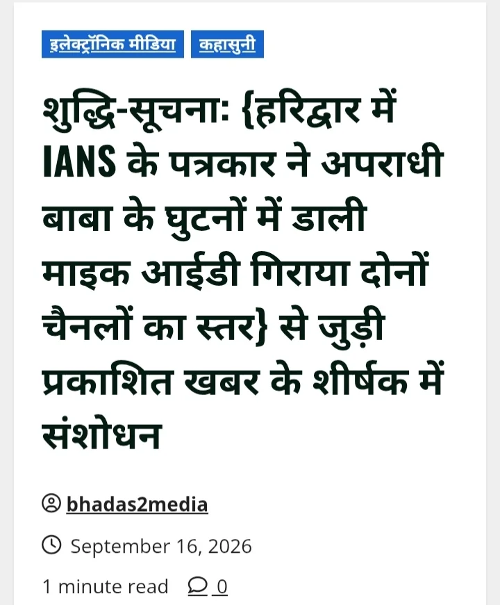

**हरिद्वार संवाददाता | आसिफ खान**

हरिद्वार। महामंडलेश्वर करौली शंकर महादेव को लेकर **bhadas2media** पर प्रकाशित एक खबर के मूल शीर्षक में ‘अपराधी बाबा’ शब्द के इस्तेमाल को लेकर विवाद गहरा गया है। मामले में अधिवक्ता अरुण भदौरिया ने पत्रकार/पोर्टल संचालक संजय कश्यप के खिलाफ मुकदमा दर्ज कराने की मांग को लेकर द्वितीय अपर सिविल जज (जूनियर डिवीजन), हरिद्वार के न्यायालय में BNSS की धारा 175(3) के तहत प्रार्थना-पत्र दाखिल किया है।

**पहले ‘अपराधी बाबा’… फिर शीर्षक में संशोधन!**

मामले में एक महत्वपूर्ण तथ्य यह भी सामने आया है कि **bhadas2media** पर प्रकाशित खबर के मूल शीर्षक में ‘अपराधी बाबा’ शब्द का इस्तेमाल किया गया था, लेकिन बाद में उक्त शीर्षक में संशोधन कर खबर को प्रकाशित किया गया।

यही संशोधन अब पूरे मामले में अहम सवाल खड़ा कर रहा है। प्रार्थी की ओर से न्यायालय में दिए गए प्रार्थना-पत्र में मूल शीर्षक में इस्तेमाल किए गए ‘अपराधी बाबा’ शब्द पर आपत्ति जताई गई है और आरोप लगाया गया है कि यह शब्द जानबूझकर इस्तेमाल किया गया, जबकि संबंधित व्यक्ति के संबंध में अंतिम न्यायिक निष्कर्ष का प्रश्न अलग है।

**‘अपराधी’ शब्द का आधार क्या था?**

प्रार्थना-पत्र में सवाल उठाया गया है कि समाचार प्रकाशित करने से पहले क्या संबंधित न्यायालयों के रिकॉर्ड की जांच की गई थी? क्या किसी वर्तमान दोषसिद्धि की जानकारी प्राप्त की गई? संबंधित FIR की मौजूदा स्थिति क्या थी? क्या चार्जशीट की स्थिति जांची गई थी? और सबसे अहम—‘अपराधी’ शब्द इस्तेमाल करने का कानूनी आधार क्या था?

प्रार्थी का आरोप है कि समाचार की हेडलाइन में इस शब्द के इस्तेमाल से उनके पूज्य गुरु की धार्मिक एवं आध्यात्मिक पहचान और उनके अनुयायियों की भावनाओं को ठेस पहुंची।

**खबर में खुद लिखा—अंतिम न्यायिक निष्कर्ष नहीं!**

प्रार्थना-पत्र में विशेष रूप से यह बात उठाई गई है कि **bhadas2media** की खबर में स्वयं यह उल्लेख किया गया था कि आरोपों का कोई अंतिम न्यायिक निष्कर्ष नहीं है। इसके बावजूद मूल शीर्षक में ‘अपराधी बाबा’ शब्द का इस्तेमाल किए जाने पर प्रार्थी ने सवाल खड़े किए हैं।

प्रार्थी की ओर से इसी आधार पर आरोप लगाया गया है कि जब अंतिम न्यायिक निष्कर्ष नहीं था तो किसी व्यक्ति के लिए ‘अपराधी’ शब्द का इस्तेमाल किस आधार पर किया गया।

**15 सितंबर को पुलिस, 18 सितंबर को SSP… फिर अदालत**

प्रार्थना-पत्र के अनुसार, अधिवक्ता अरुण भदौरिया ने 15 सितंबर 2026 को थाना ज्वालापुर में शिकायत देकर मुकदमा दर्ज करने की मांग की। कार्रवाई नहीं होने का आरोप लगाते हुए 18 सितंबर 2026 को एसएसपी हरिद्वार के समक्ष भी प्रार्थना-पत्र दिया गया। वहां से भी कार्रवाई नहीं होने के बाद अब न्यायालय में धारा 175(3) BNSS के तहत प्रार्थना-पत्र दाखिल किया गया है।

**शीर्षक बदला, लेकिन विवाद नहीं थमा**

इस पूरे मामले में सबसे महत्वपूर्ण पहलू यही है कि मूल शीर्षक में इस्तेमाल किए गए विवादित शब्द को बाद में संशोधित कर दिया गया, लेकिन मूल प्रकाशन को लेकर उठी आपत्ति अब न्यायालय तक पहुंच चुकी है।

प्रार्थी ने आरोप लगाया है कि ‘अपराधी’ शब्द का सार्वजनिक एवं इलेक्ट्रॉनिक माध्यम से इस्तेमाल धार्मिक गुरु की छवि और उनके अनुयायियों की आस्था को प्रभावित करने वाला था। हालांकि, इन आरोपों पर अंतिम निर्णय अभी न्यायालय द्वारा किया जाना बाकी है।

**अब न्यायालय की ओर टिकी निगाहें**

मामले में प्रार्थी ने न्यायालय से थाना ज्वालापुर के प्रभारी निरीक्षक को मुकदमा दर्ज करने के संबंध में आदेश जारी करने की मांग की है। अब आगे की कार्रवाई न्यायालय के आदेश और पुलिस की रिपोर्ट पर निर्भर करेगी।

फिलहाल सवाल यही है—मूल शीर्षक में ‘अपराधी बाबा’ शब्द किस आधार पर आया, बाद में उसे क्यों बदला गया और क्या शीर्षक में किए गए संशोधन से पहले प्रकाशित सामग्री को लेकर उठे कानूनी सवाल खत्म हो जाते हैं? इन सवालों का जवाब अब न्यायालयीन प्रक्रिया में सामने आना बाकी है।
