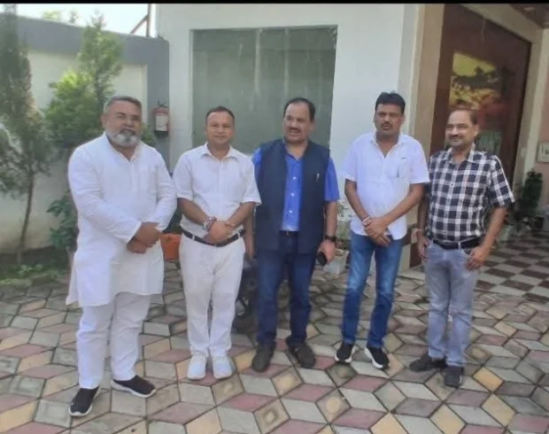

**विशेष संवाददाता | आसिफ खान**

रुड़की। उत्तराखंड की सियासत में 2027 विधानसभा चुनाव को लेकर राजनीतिक गतिविधियां लगातार तेज हो रही हैं। इसी बीच रुड़की के वरिष्ठ कांग्रेस नेता सचिन गुप्ता और कांग्रेस सेवादल के रुड़की महानगर अध्यक्ष नीरज अग्रवाल ने देहरादून पहुंचकर कांग्रेस के वरिष्ठ नेता एवं पूर्व कैबिनेट मंत्री डॉ. हरक सिंह रावत से शिष्टाचार भेंट की। मुलाकात के दौरान कांग्रेस संगठन को जमीनी स्तर पर मजबूत करने, कार्यकर्ताओं को सक्रिय करने और आगामी विधानसभा चुनाव की तैयारियों को लेकर विस्तार से चर्चा हुई।

मुलाकात को आगामी चुनावी तैयारियों के लिहाज से महत्वपूर्ण माना जा रहा है। खासतौर पर रुड़की क्षेत्र में संगठन की सक्रियता बढ़ाने, पार्टी कार्यकर्ताओं के बीच बेहतर समन्वय बनाने तथा जनता से जुड़े मुद्दों को मजबूती के साथ उठाने को लेकर नेताओं के बीच विचार-विमर्श हुआ।

**2027 के चुनावी रण की तैयारी, संगठन को धार देने पर जोर**

डॉ. हरक सिंह रावत वर्तमान में कांग्रेस की चुनाव प्रबंधन समिति के अध्यक्ष की जिम्मेदारी संभाल रहे हैं और पार्टी की 2027 की चुनावी तैयारियों में सक्रिय भूमिका निभा रहे हैं। ऐसे में रुड़की के कांग्रेस नेताओं की उनसे हुई मुलाकात को संगठनात्मक और चुनावी दृष्टि से अहम माना जा रहा है।

मुलाकात के दौरान इस बात पर जोर दिया गया कि कांग्रेस संगठन को केवल चुनाव के समय नहीं, बल्कि लगातार जनता के बीच सक्रिय रखा जाए। बूथ स्तर तक कार्यकर्ताओं की भूमिका मजबूत करने, युवाओं को संगठन से जोड़ने तथा स्थानीय जनसमस्याओं को राजनीतिक स्तर पर प्रमुखता से उठाने की जरूरत पर भी चर्चा हुई।

**सचिन गुप्ता की सक्रियता से रुड़की कांग्रेस में बढ़ी हलचल**

रुड़की के वरिष्ठ कांग्रेस नेता सचिन गुप्ता लंबे समय से क्षेत्र में कांग्रेस की राजनीतिक गतिविधियों में सक्रिय भूमिका निभाते रहे हैं। संगठन से जुड़े कार्यक्रमों के साथ-साथ जनहित के मुद्दों को लेकर उनकी सक्रियता लगातार नजर आती रही है। उनकी राजनीतिक गतिविधियों का केंद्र रुड़की क्षेत्र में कांग्रेस के संगठनात्मक आधार को मजबूत करने और कार्यकर्ताओं के साथ संवाद बनाए रखने पर रहा है।

हरक सिंह रावत जैसे वरिष्ठ नेता से उनकी मुलाकात को इसी संगठनात्मक सक्रियता की कड़ी के रूप में देखा जा रहा है। 2027 के चुनाव को लेकर कांग्रेस के भीतर तैयारियां तेज होने के बीच ऐसी बैठकों से स्थानीय नेताओं और वरिष्ठ नेतृत्व के बीच समन्वय बढ़ाने का प्रयास भी दिखाई देता है।

**नीरज अग्रवाल भी संगठन को मजबूत करने में जुटे**

वहीं कांग्रेस सेवादल के रुड़की महानगर अध्यक्ष नीरज अग्रवाल भी संगठनात्मक गतिविधियों में लगातार सक्रिय हैं। सेवादल के माध्यम से कार्यकर्ताओं को जोड़ने, संगठन के कार्यक्रमों को गति देने और कांग्रेस की विचारधारा को जमीनी स्तर तक पहुंचाने की दिशा में उनकी भूमिका बनी हुई है।

सचिन गुप्ता और नीरज अग्रवाल की एक साथ हरक सिंह रावत से हुई मुलाकात ने रुड़की कांग्रेस की गतिविधियों को लेकर राजनीतिक चर्चाओं को भी तेज कर दिया है। हालांकि मुलाकात को नेताओं ने शिष्टाचार भेंट बताया, लेकिन 2027 के विधानसभा चुनाव की तैयारियों के बीच संगठन की मजबूती और चुनावी रणनीति पर हुई चर्चा ने इसे राजनीतिक रूप से महत्वपूर्ण बना दिया है।

**रुड़की से देहरादून तक कांग्रेस का चुनावी नेटवर्क मजबूत करने की कवायद**

उत्तराखंड में 2027 के विधानसभा चुनाव को लेकर कांग्रेस के भीतर तैयारियां पहले से तेज हैं। ऐसे में रुड़की के स्थानीय नेताओं की वरिष्ठ नेतृत्व से लगातार बातचीत और संगठनात्मक मुद्दों पर मंथन आने वाले समय में पार्टी की चुनावी गतिविधियों को नई दिशा दे सकता है। हरक सिंह रावत भी हाल के महीनों में 2027 की तैयारियों को लेकर लगातार सक्रिय दिखाई दे रहे हैं।

मुलाकात के बाद यह साफ है कि रुड़की कांग्रेस के स्थानीय नेता भी अब 2027 के चुनावी रण को लेकर संगठन को सक्रिय और धारदार बनाने की दिशा में कदम बढ़ा रहे हैं।
