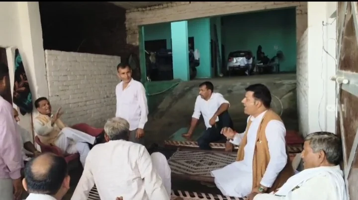

**हरिद्वार संवाददाता | आसिफ खान**

लक्सर। लक्सर क्षेत्र की राजनीति में उस समय हलचल तेज हो गई, जब हुसैनपुर गांव में आयोजित शोकसभा के दौरान कांग्रेस नेता एवं पूर्व राज्यमंत्री रविंद्र सिंह आनंद और पूर्व विधायक संजय गुप्ता के बीच तीखी बातचीत का वीडियो सोशल मीडिया पर वायरल हो गया। वीडियो सामने आने के बाद दोनों नेताओं के बीच चल रहा विवाद खुलकर सामने आ गया है। पूर्व राज्यमंत्री ने पूर्व विधायक पर अभद्रता, गाली-गलौज और धमकी देने के गंभीर आरोप लगाते हुए कोतवाली पहुंचकर तहरीर दी है।

बताया जा रहा है कि विवाद की शुरुआत हाल ही में सोशल मीडिया पर वायरल हुए एक वीडियो को लेकर हुई। वायरल वीडियो में एक युवक एक पक्ष के खिलाफ कथित तौर पर अभद्र टिप्पणी करता दिखाई दिया था। इस मामले में दूसरे पक्ष की ओर से पुलिस को तहरीर भी दी गई थी। इसी प्रकरण को लेकर पूर्व राज्यमंत्री रविंद्र सिंह आनंद ने युवक की टिप्पणी की आलोचना करते हुए उसे पूर्व विधायक संजय गुप्ता का रिश्तेदार बताया था।

हालांकि पूर्व विधायक संजय गुप्ता ने इस दावे को खारिज करते हुए स्पष्ट किया कि वायरल वीडियो में नजर आ रहा युवक न तो उनका रिश्तेदार है और न ही उसका उनसे कोई संबंध है। उनका आरोप है कि उनकी राजनीतिक और सामाजिक छवि को प्रभावित करने के उद्देश्य से बेवजह उनका नाम युवक से जोड़ा जा रहा है।

सोमवार को हुसैनपुर गांव की शोकसभा में इसी मुद्दे को लेकर दोनों नेताओं के बीच बातचीत हुई। इसी दौरान हुई बातचीत का वीडियो सोशल मीडिया पर वायरल हो गया। वीडियो वायरल होने के बाद मामला और गरमा गया। पूर्व राज्यमंत्री रविंद्र सिंह आनंद ने कोतवाली पहुंचकर पूर्व विधायक के खिलाफ तहरीर देते हुए अभद्रता, गाली-गलौज और धमकी देने के आरोप लगाए तथा पुलिस से कार्रवाई की मांग की।

आनंद का कहना है कि शोकसभा जैसे गंभीर और संवेदनशील अवसर पर इस प्रकार का व्यवहार उचित नहीं है। उन्होंने पूरे मामले में पुलिस से निष्पक्ष कार्रवाई की मांग की है।

वहीं पूर्व विधायक संजय गुप्ता ने अपने ऊपर लगाए गए आरोपों को पूरी तरह निराधार बताया। उनका कहना है कि उन्होंने वायरल वीडियो में दिखाई दे रहे युवक के साथ किसी भी प्रकार का संबंध नहीं होने की बात मित्रवत तरीके से स्पष्ट करने का प्रयास किया था। उनके अनुसार, उनकी बात को गलत तथ्यों के साथ पेश कर उनके खिलाफ मिथ्या आरोप लगाए जा रहे हैं।

फिलहाल वायरल वीडियो और दोनों पक्षों के आरोपों ने लक्सर की सियासत में नई गर्मी पैदा कर दी है। पुलिस को दी गई तहरीर के बाद अब मामले में आगे क्या कार्रवाई होती है, इस पर नजर बनी हुई है।
