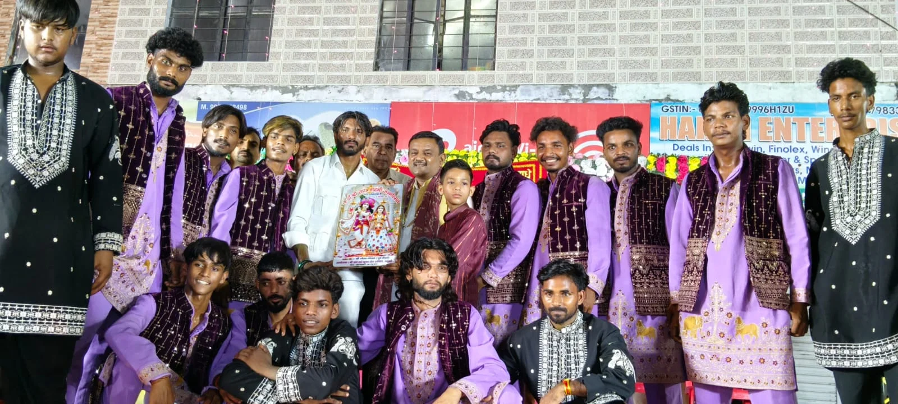
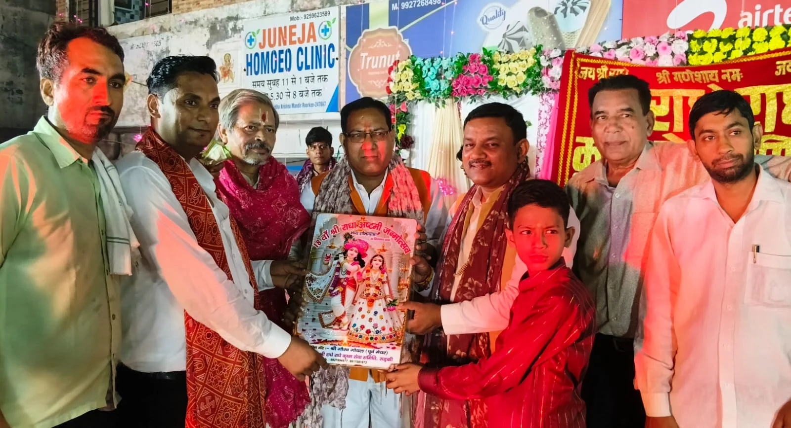

**रुड़की संवाददाता | आसिफ खान**

रुड़की। 18वें श्री राधा रानी अष्टमी जन्मोत्सव के अवसर पर रुड़की में बुधवार को भक्ति और आस्था का ऐसा अद्भुत नजारा देखने को मिला कि पूरा शहर ‘श्री राधे-श्री राधे’ के जयकारों से गूंज उठा। श्री राधा कृष्ण मंदिर, पुरानी तहसील से निकली भव्य शोभायात्रा में श्रद्धालुओं का सैलाब उमड़ पड़ा। आकर्षक रथ पर सजी श्री राधा रानी की दिव्य झांकी और भगवान श्रीकृष्ण की मनमोहक लीलाओं ने श्रद्धालुओं का मन मोह लिया।

शोभायात्रा पुरानी तहसील स्थित श्री राधा कृष्ण मंदिर से विधिवत रूप से प्रारंभ हुई और नगर के विभिन्न प्रमुख मार्गों एवं चौराहों से होती हुई देर रात पुनः श्री राधा कृष्ण मंदिर पहुंची। शोभायात्रा के मार्ग में जगह-जगह श्रद्धालुओं ने पुष्पवर्षा कर राधा रानी का स्वागत किया। भजनों की गूंज, ढोल-नगाड़ों की थाप और राधा रानी के जयकारों के बीच श्रद्धालु भक्ति में झूमते नजर आए।

शोभायात्रा में महिलाओं, बच्चों और युवाओं की बड़ी भागीदारी रही। जगह-जगह श्रद्धालुओं ने नृत्य और भजन-कीर्तन कर अपनी भक्ति का प्रदर्शन किया। सजे-धजे रथ पर राधा रानी की सुंदर झांकी और भगवान कृष्ण की लीलाओं के मनोहारी दृश्य आकर्षण का प्रमुख केंद्र रहे।

**पुष्पवर्षा से हुआ भव्य स्वागत**

शोभायात्रा जैसे-जैसे नगर के विभिन्न मार्गों से गुजरी, श्रद्धालुओं ने पुष्पवर्षा कर स्वागत किया। कई स्थानों पर लोगों ने धार्मिक गीतों और भजनों पर झूमते हुए वातावरण को पूरी तरह भक्तिमय बना दिया। राधा रानी के जयकारों से पूरा नगर गूंजता रहा।

**भव्य भंडारे में उमड़ी श्रद्धालुओं की भीड़**

श्री राधा कृष्ण मंदिर पहुंचने के बाद देर रात तक धार्मिक कार्यक्रमों का दौर चला। इस अवसर पर विशाल भंडारे का आयोजन किया गया, जिसमें बड़ी संख्या में श्रद्धालुओं ने प्रसाद ग्रहण किया। शोभायात्रा में शामिल विभिन्न झांकियों के कलाकारों का आयोजन समिति की ओर से सम्मान भी किया गया।

आयोजन समिति के सदस्यों ने कहा कि श्री राधा रानी अष्टमी का यह आयोजन भक्ति, प्रेम, सद्भाव और सामाजिक एकता का संदेश देता है। रुड़की में इस धार्मिक आयोजन को सफल बनाने में समाजसेवियों, श्रद्धालुओं और विभिन्न वर्गों के लोगों का निरंतर सहयोग रहता है।

इस अवसर पर पूर्व मेयर गौरव गोयल, समाजसेवी नवीन कुमार जैन एडवोकेट, ध्रुव गुप्ता, अंकुश राज एडवोकेट, पंडित पवन वत्स, पंडित अंकित वत्स, सुनील यादव, मुदित गर्ग, राजीव गुप्ता, अभिषेक मित्तल, शिवांग सिंघल, रॉबिन गर्ग, पुनीत गोयल, मनोज जैन, श्याम सुंदर, मोहित अग्रवाल, चंद्र मोहन, प्रतीक गर्ग, नरेश रोड, आदित्य त्यागी, हर्ष शर्मा, अर्जुन सिंह, अंशुल शर्मा, अमन कुमार, वंश शर्मा सहित बड़ी संख्या में श्रद्धालु एवं गणमान्य लोग मौजूद रहे।
