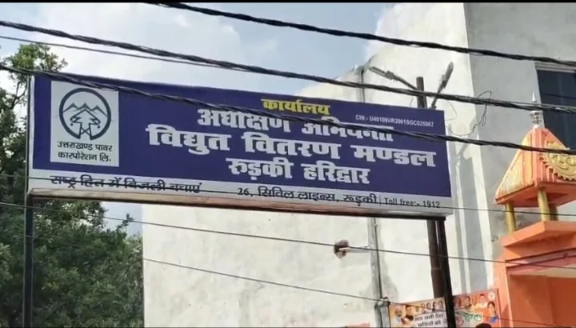
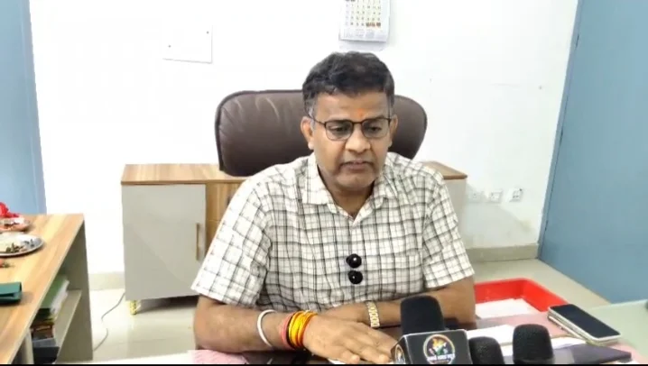

**हरिद्वार संवाददाता | आसिफ खान**

हरिद्वार। प्रदेश की बिजली व्यवस्था इन दिनों लो-फ्रीक्वेंसी की चुनौती से जूझ रही है। पिछले दो-तीन दिनों से फ्रीक्वेंसी में गिरावट के कारण विद्युत विभाग को ग्रामीण और शहरी क्षेत्रों के साथ-साथ औद्योगिक उपभोक्ताओं के इलाकों में भी आकस्मिक रोस्टिंग यानी अचानक बिजली कटौती का सहारा लेना पड़ रहा है। बिजली गुल होने से उपभोक्ताओं की परेशानी बढ़ रही है और विद्युत व्यवस्था को लेकर सवाल भी खड़े हो रहे हैं।

विभाग का कहना है कि यह कटौती किसी सामान्य स्थिति का हिस्सा नहीं है, बल्कि ग्रिड को सुरक्षित रखने और विद्युत आपूर्ति व्यवस्था को संतुलित बनाए रखने के लिए परिस्थितियों के अनुसार करनी पड़ रही है। ऐसे में अब विभाग ने सीधे उपभोक्ताओं से सहयोग की अपील की है।

**फ्रीक्वेंसी गिरी तो बिजली आपूर्ति पर पड़ा सीधा असर**

अधीक्षण अभियंता विनोद पांडे ने बताया कि पिछले दो-तीन दिनों से लो-फ्रीक्वेंसी की स्थिति बनी हुई है। इसके चलते ग्रामीण, शहरी और औद्योगिक उपभोक्ताओं के क्षेत्रों में आकस्मिक रोस्टिंग करनी पड़ रही है। विभाग का कहना है कि ग्रिड पर किसी बड़े दबाव की स्थिति पैदा न हो और विद्युत व्यवस्था सुरक्षित बनी रहे, इसके लिए आवश्यकता के अनुसार आपूर्ति को नियंत्रित किया जा रहा है।

लेकिन अचानक होने वाली कटौती ने उपभोक्ताओं की मुश्किलें बढ़ा दी हैं। घरों से लेकर बाजारों और उद्योगों तक बिजली पर निर्भर कामकाज प्रभावित होने की स्थिति बन रही है। सबसे बड़ी परेशानी यह है कि आकस्मिक रोस्टिंग परिस्थितियों के अनुसार होने के कारण उपभोक्ताओं को बिजली कटौती का पहले से स्पष्ट अंदाजा नहीं लग पाता।

**ग्रिड पर दबाव बढ़ा तो विभाग ने अपनाया कटौती का रास्ता**

विद्युत व्यवस्था में फ्रीक्वेंसी का संतुलन बनाए रखना बेहद जरूरी है। फ्रीक्वेंसी में गिरावट की स्थिति में ग्रिड पर दबाव बढ़ने की आशंका रहती है। इसी वजह से विभाग को कुछ क्षेत्रों में अस्थायी रूप से विद्युत आपूर्ति रोकनी पड़ रही है।

विभाग के अनुसार प्राथमिकता ग्रिड को सुरक्षित रखने और उपलब्ध विद्युत व्यवस्था को संतुलित बनाए रखने की है। इसके लिए आकस्मिक रोस्टिंग की जा रही है, ताकि स्थिति और गंभीर न हो तथा उपभोक्ताओं को आगे बेहतर आपूर्ति उपलब्ध कराई जा सके।

**घरों से कारखानों तक बिजली पर निर्भरता, कटौती ने बढ़ाई बेचैनी**

बिजली कटौती का असर केवल घरेलू उपभोक्ताओं तक सीमित नहीं रहता। दुकानों, व्यापारिक प्रतिष्ठानों, छोटे कारोबार और औद्योगिक इकाइयों में विद्युत आपूर्ति बाधित होने पर कामकाज प्रभावित हो सकता है। ग्रामीण क्षेत्रों में भी बिजली पर निर्भर घरेलू और कृषि संबंधी गतिविधियों पर असर पड़ने की संभावना रहती है।

ऐसे में लो-फ्रीक्वेंसी के बीच होने वाली आकस्मिक रोस्टिंग ने उपभोक्ताओं के सामने नई परेशानी खड़ी कर दी है। विभाग की ओर से स्थिति को नियंत्रित करने की कोशिश की जा रही है, लेकिन फिलहाल उपभोक्ताओं को सहयोग करने और बिजली की खपत नियंत्रित रखने की अपील की गई है।

**विभाग का दावा—अन्य राज्यों की तुलना में उत्तराखंड में कटौती कम**

अधीक्षण अभियंता विनोद पांडे के अनुसार भारत वर्ष के अन्य राज्यों की तुलना में उत्तराखंड में आकस्मिक कटौती अपेक्षाकृत कम है। विभाग का कहना है कि मौजूदा परिस्थिति में भी कोशिश यही है कि ग्रिड को सुरक्षित रखते हुए उपभोक्ताओं को बेहतर विद्युत आपूर्ति उपलब्ध कराई जाए।

हालांकि उपभोक्ताओं के लिए चुनौती यह है कि बिजली की जरूरत लगातार बनी हुई है और अचानक आपूर्ति बाधित होने से दैनिक गतिविधियों पर असर पड़ता है। ऐसे में आने वाले दिनों में फ्रीक्वेंसी की स्थिति और विद्युत आपूर्ति व्यवस्था पर सबकी नजर रहेगी।

**अब उपभोक्ताओं से भी सहयोग की उम्मीद**

विभाग ने उपभोक्ताओं से अपील की है कि वे बिजली का अनावश्यक इस्तेमाल न करें। गैर-जरूरी विद्युत उपकरणों को बंद रखें और आवश्यकता के अनुसार ही बिजली का उपयोग करें। विभाग का मानना है कि बिजली की बचत से मौजूदा दबाव को कम करने में सहयोग मिल सकता है।

अधीक्षण अभियंता विनोद पांडे ने सम्मानित उपभोक्ताओं से वर्तमान परिस्थितियों में सहयोग की अपील की है। विभाग का संदेश है कि विद्युत व्यवस्था को सुरक्षित रखने के लिए विभागीय प्रयासों के साथ उपभोक्ताओं की जिम्मेदारी भी महत्वपूर्ण है।

**कटौती से बचने का रास्ता—बिजली की फिजूलखर्ची रोकें**

लो-फ्रीक्वेंसी की चुनौती के बीच विभाग ने साफ तौर पर उपभोक्ताओं से बिजली बचाने की अपील की है। फिलहाल लक्ष्य ग्रिड को सुरक्षित रखना और परिस्थितियां सामान्य होने तक विद्युत व्यवस्था को संतुलित बनाए रखना है।

\*\*विभाग की अपील

“राष्ट्रहित में बिजली बचाएं।”\*\*
