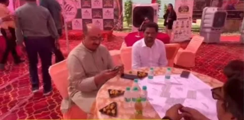

**रुड़की संवाददाता | आसिफ खान**

रुड़की। NH-334 पर कोर कॉलेज के पास इन दिनों ‘एलिस ग्रीन’ ने अपनी मौजूदगी से लोगों का ध्यान अपनी ओर खींच लिया है। प्रोजेक्ट को लेकर आयोजित भव्य आयोजन में शानदार प्रस्तुति के साथ प्लॉट्स, लोकेशन और सुविधाओं को प्रमुखता से सामने रखा गया। आयोजन के दौरान बड़ी संख्या में लोगों ने पहुंचकर प्रोजेक्ट के बारे में जानकारी ली और यहां उपलब्ध कराई जा रही सुविधाओं को करीब से देखा।

कार्यक्रम की खास बात रही विधायक उमेश कुमार की मौजूदगी। विधायक उमेश कुमार ने ‘एलिस ग्रीन’ पहुंचकर प्रोजेक्ट की लोकेशन, व्यवस्थाओं और सुविधाओं की जानकारी ली। उनके साथ मयंक गुप्ता भी मौजूद रहे। दोनों ने ‘एलिस ग्रीन’ की सुविधाओं और प्रोजेक्ट की लोकेशन की सराहना की। आयोजन के दौरान प्रोजेक्ट की खूबियों को लेकर चर्चा भी होती रही।

🔥 **NH-334 पर लोकेशन, प्रोजेक्ट ने बढ़ाया आकर्षण**

कोर कॉलेज के पास NH-334 जैसी प्रमुख कनेक्टिविटी वाली लोकेशन पर स्थित ‘एलिस ग्रीन’ आयोजन के दौरान सबसे ज्यादा चर्चा में रहा। प्रोजेक्ट की ओर से लोगों को प्लॉट्स के साथ बेहतर सुविधाएं और आधुनिक जीवनशैली उपलब्ध कराने पर जोर दिया जा रहा है।

प्रोजेक्ट को देखने पहुंचे लोगों के लिए इसकी लोकेशन और सुविधाओं की जानकारी विशेष आकर्षण बनी। आयोजन में प्रोजेक्ट की प्रस्तुति इस अंदाज में की गई कि विजिटर्स को यहां उपलब्ध विकल्पों और सुविधाओं की विस्तृत जानकारी मिल सके।

🔥 **सिर्फ प्लॉट नहीं, लाइफस्टाइल का पूरा कॉन्सेप्ट**

‘एलिस ग्रीन’ को केवल प्लॉट्स के प्रोजेक्ट के तौर पर पेश नहीं किया जा रहा, बल्कि इसके साथ विलास, सुविधा और आधुनिक जीवनशैली को भी जोड़ा गया है। यही वजह रही कि आयोजन में पहुंचे लोगों के बीच प्रोजेक्ट की सुविधाओं और भविष्य की संभावनाओं को लेकर खासा आकर्षण देखने को मिला।

NH-334 से जुड़ी लोकेशन और कोर कॉलेज के समीप होने के कारण प्रोजेक्ट की कनेक्टिविटी को भी प्रमुखता से सामने रखा गया। आयोजन के दौरान लोगों को प्रोजेक्ट की लोकेशन और उपलब्ध सुविधाओं से जुड़ी जानकारी दी गई।

🔥 **नफीस शाह की अगुवाई में भव्य आयोजन**

‘एलिस ग्रीन’ के मैनेजिंग डायरेक्टर नफीस शाह आयोजन के दौरान पूरी तरह सक्रिय नजर आए। प्रोजेक्ट की व्यवस्थाओं से लेकर विजिटर्स को सुविधाओं की जानकारी देने तक उन्होंने आयोजन की कमान संभाली।

नफीस शाह की अगुवाई में ‘एलिस ग्रीन’ को एक ऐसे प्रोजेक्ट के रूप में सामने लाने की कोशिश की जा रही है, जहां लोकेशन, प्लॉट्स और बेहतर सुविधाओं को एक साथ जोड़ा गया है। भव्य आयोजन ने प्रोजेक्ट की प्रस्तुति को और प्रभावशाली बनाया।

🔥 **विधायक की मौजूदगी ने बढ़ाया आयोजन का कद**

विधायक उमेश कुमार का ‘एलिस ग्रीन’ पहुंचना आयोजन की प्रमुख खबरों में रहा। प्रोजेक्ट की सुविधाओं और लोकेशन की सराहना किए जाने से आयोजन को लेकर चर्चा और तेज हुई। वहीं मयंक गुप्ता की मौजूदगी ने भी कार्यक्रम को खास बनाया।

आयोजन के दौरान लोगों की आवाजाही और प्रोजेक्ट को लेकर दिखाई गई रुचि ने इसे NH-334 पर आयोजित प्रमुख प्रॉपर्टी आयोजनों में चर्चा का विषय बना दिया।

**🔥 रुड़की में प्रॉपर्टी सेक्टर में बढ़ा नया आकर्षण**

रुड़की और आसपास के क्षेत्र में तेजी से विकसित हो रहे प्रॉपर्टी बाजार के बीच ‘एलिस ग्रीन’ का आयोजन अपनी अलग प्रस्तुति के कारण लोगों का ध्यान खींचता नजर आया। प्रोजेक्ट की ओर से प्लॉट्स के साथ सुविधाओं और बेहतर लाइफस्टाइल पर जोर दिया जा रहा है।

कुल मिलाकर NH-334 पर कोर कॉलेज के पास ‘एलिस ग्रीन’ का भव्य आयोजन न सिर्फ प्रोजेक्ट की खूबियों को सामने लाया, बल्कि क्षेत्र के प्रॉपर्टी बाजार में इसकी चर्चा को भी तेज कर गया।

**STAR NEWS 11 EXCLUSIVE**
🔥 “NH-334 पर एलिस ग्रीन का जलवा—विधायक उमेश कुमार पहुंचे, मयंक गुप्ता ने सराहा, नफीस शाह की अगुवाई में दिखा भव्य अंदाज!”
