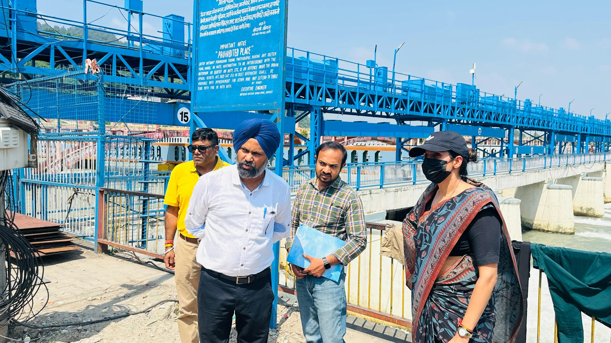
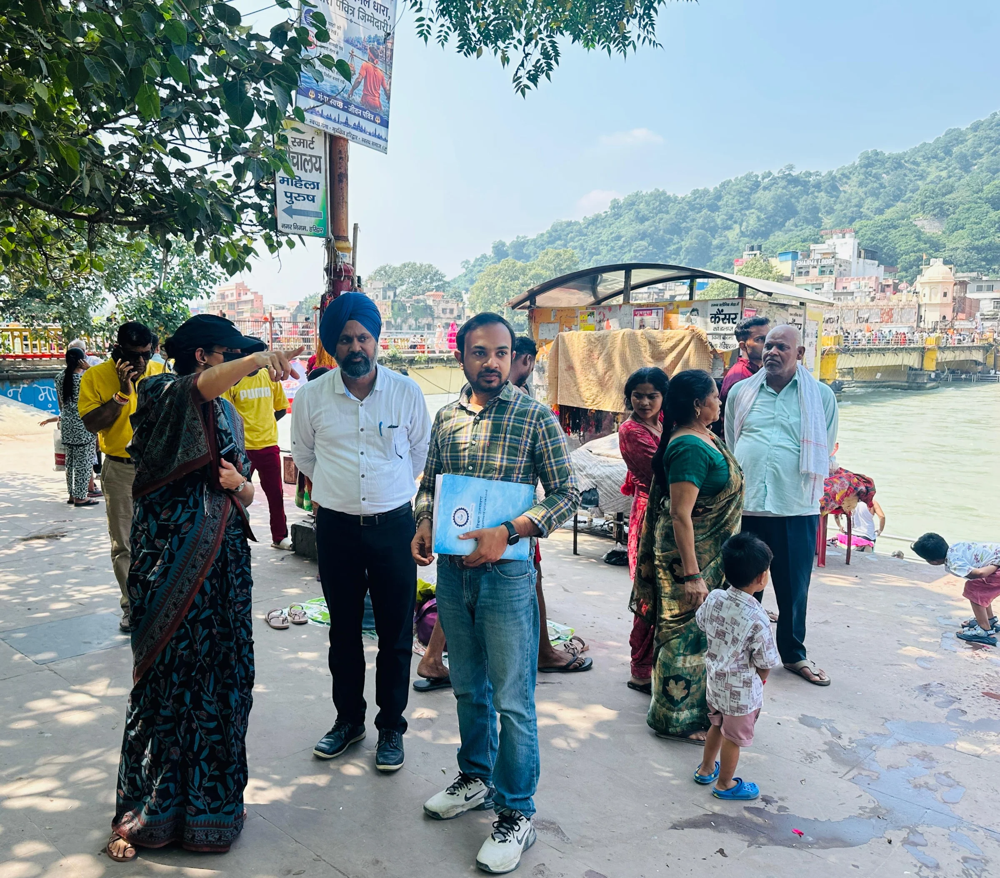

**हरिद्वार संवाददाता | आसिफ खान**

हरिद्वार। कुंभ मेला-2027 को लेकर तैयारियों की रफ्तार और व्यवस्थाओं को परखने के लिए बुधवार को मेलाधिकारी श्रीमती सोनिका ने रोड़ी-बेलवाला और शोल क्षेत्र का स्थलीय निरीक्षण किया। हाथी पुल से शिवसेतु होते हुए धनुष पुल तक पहुंचीं मेलाधिकारी ने निर्माणाधीन कार्यों, घाटों, पुलों, जनसुविधाओं और भीड़ प्रबंधन की तैयारियों का बारीकी से जायजा लिया। निरीक्षण के दौरान अधिकारियों को साफ निर्देश दिए गए कि कुंभ से जुड़े महत्वपूर्ण कार्यों में किसी भी स्तर पर ढिलाई बर्दाश्त नहीं होगी और निर्धारित समयसीमा में काम पूरा करना सुनिश्चित किया जाए।

**भीड़ बढ़ी तो निकासी व्यवस्था बनेगी सबसे बड़ी चुनौती**

कुंभ मेले के दौरान लाखों श्रद्धालुओं की संभावित भीड़ को देखते हुए रोड़ी-बेलवाला और शोल क्षेत्र को बेहद महत्वपूर्ण माना जा रहा है। मेलाधिकारी ने इसी दृष्टि से पुलों एवं घाटों के अनुरक्षण, नए घाटों के निर्माण और भीड़ प्रबंधन से जुड़ी व्यवस्थाओं की जानकारी ली। उन्होंने अधिकारियों को निर्देशित किया कि श्रद्धालुओं की सुविधा के साथ-साथ उनकी सुरक्षा और सुगम आवाजाही को प्राथमिकता दी जाए।

**हरकी पैड़ी-रोड़ी बेलवाला के पुनर्विकास में तेजी के निर्देश**

मेलाधिकारी ने कार्यदायी संस्था यूपीडीसीसी के अधिकारियों को यूआईआईडीबी के अंतर्गत हरकी पैड़ी एवं रोड़ी-बेलवाला क्षेत्र के पुनर्विकास से जुड़े प्रमुख कार्यों को कुंभ मेला शुरू होने से पहले हर हाल में पूरा करने के निर्देश दिए। साथ ही मेला क्षेत्र को अतिक्रमणमुक्त और सुव्यवस्थित रखने के लिए प्रभावी व्यवस्था सुनिश्चित करने को कहा।

**शिवसेतु-धनुष पुल के बीच बन रहे घाट पर भी फोकस**

शिवसेतु एवं धनुष पुल के मध्य निर्माणाधीन घाट का निरीक्षण करते हुए मेलाधिकारी ने स्पष्ट किया कि घाट केवल निर्माण तक सीमित न रहे, बल्कि श्रद्धालुओं के लिए आवश्यक सभी सुविधाओं से लैस होना चाहिए। यहां स्वच्छता, पर्याप्त प्रकाश, सुरक्षा और अन्य जनसुविधाओं की समुचित व्यवस्था सुनिश्चित करने के निर्देश दिए गए।

**धनुष पुल से आस्था पथ तक बन रहा पैदल मार्ग बना केंद्र बिंदु**

मेलाधिकारी ने धनुष पुल से आस्था पथ को जोड़ने के लिए शुरू किए गए पैदल मार्ग के निर्माण कार्य का भी निरीक्षण किया। उन्होंने इसे जल्द पूरा करने के निर्देश दिए। उन्होंने कहा कि हरकी पैड़ी से श्रद्धालुओं की निकासी के लिए धनुष पुल से आस्था पथ होते हुए बैरागी कैंप तक जुड़ने वाला यह मार्ग भीड़ प्रबंधन की दृष्टि से बेहद महत्वपूर्ण है।

**आकस्मिक निकासी योजना की प्रमुख कड़ी**

मेलाधिकारी ने अधिकारियों को स्पष्ट किया कि यह मार्ग कुंभ मेले की आकस्मिक निकासी व्यवस्था की प्रमुख कड़ी है। ऐसे में निर्माण कार्य में केवल तेजी ही नहीं, बल्कि गुणवत्ता का भी विशेष ध्यान रखा जाए। किसी भी स्तर पर लापरवाही से भविष्य में भीड़ प्रबंधन प्रभावित न हो, इसके लिए समयबद्ध तरीके से कार्य पूरा करने पर जोर दिया गया।

**शौचालय, रोशनी और जनसुविधाओं पर भी सख्ती**

क्षेत्र में श्रद्धालुओं की सुविधा के लिए आवश्यकता के अनुसार पर्याप्त संख्या में शौचालय स्थापित करने, आकर्षक प्रकाश स्तंभ लगाने तथा अन्य जनसुविधाओं से जुड़े कार्यों को तेजी से पूरा करने के निर्देश भी दिए गए। मेलाधिकारी ने अधिकारियों से कहा कि कुंभ के दौरान श्रद्धालुओं को सुरक्षित, सुगम और सुव्यवस्थित आवागमन उपलब्ध कराने के लिए सभी व्यवस्थाएं पहले से दुरुस्त रहनी चाहिए।

उन्होंने सभी संबंधित विभागों और कार्यदायी संस्थाओं को आपसी समन्वय के साथ काम करने तथा प्रत्येक कार्य में गुणवत्ता और समयबद्धता सुनिश्चित करने के निर्देश दिए।

निरीक्षण के दौरान उप मेलाधिकारी मनजीत सिंह, परियोजना प्रबंधक यूपीडीसीसी सुमित मलवाल सहित संबंधित अधिकारी मौजूद रहे।
