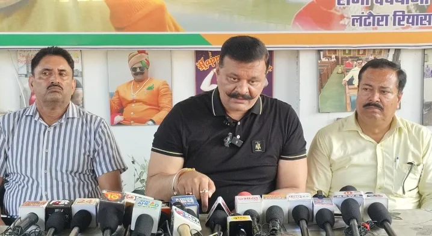

**रुड़की संवाददाता | आसिफ खान**

रुड़की। अमरोहा फार्म हाउस प्रकरण ने अब उत्तराखंड की सियासत में भी तूफान खड़ा कर दिया है। खानपुर के पूर्व विधायक कुंवर प्रणव सिंह चैंपियन ने वर्तमान विधायक उमेश कुमार पर बेहद गंभीर आरोप लगाते हुए सीधे सवाल खड़े कर दिए हैं। चैंपियन का आरोप है कि उमेश कुमार की सह पर ही अमरोहा स्थित फार्म हाउस में महिला के साथ वारदात को अंजाम दिया गया। हालांकि, इस आरोप की स्वतंत्र पुष्टि नहीं हुई है।

नहर किनारा स्थित कैंप कार्यालय में पत्रकार वार्ता के दौरान चैंपियन ने मामले को लेकर कई गंभीर सवाल उठाए। उन्होंने फार्म हाउस को ‘महिलाओं के उत्पीड़न का अड्डा’ बताते हुए कहा कि पूरे परिसर की गतिविधियों और वहां आने-जाने वाले लोगों की जांच बेहद जरूरी है।

⚡ **‘सीडीआर खंगालो, कौन-कौन आया सामने आएगा!’**

चैंपियन ने मांग की कि फार्म हाउस की कॉल डिटेल रिकॉर्ड (सीडीआर), मोबाइल लोकेशन, सीसीटीवी फुटेज, प्रवेश-निकास का रिकॉर्ड और अन्य इलेक्ट्रॉनिक साक्ष्यों की जांच कराई जाए। उनका कहना है कि तकनीकी साक्ष्यों से यह पता लगाया जा सकता है कि घटना के समय फार्म हाउस में कौन मौजूद था और किन लोगों से संपर्क हुआ।

उन्होंने आरोप लगाया कि प्रभावशाली लोगों के रसूख के कारण मामले में कार्रवाई प्रभावित होने की आशंका है। चैंपियन ने कहा कि जांच में किसी भी व्यक्ति के पद या राजनीतिक प्रभाव को आड़े नहीं आने दिया जाना चाहिए।

🚨 **पुराने विवादों की जांच की भी मांग**

पूर्व विधायक ने उमेश कुमार पर महिलाओं से जुड़े पूर्व विवादों को लेकर भी आरोप लगाए और इनकी जांच की मांग की। उन्होंने कहा कि यदि किसी मामले में तथ्य सामने आते हैं तो संबंधित लोगों की भूमिका की निष्पक्ष जांच होनी चाहिए।

चैंपियन ने दोहराया कि पीड़िता को न्याय मिलना चाहिए और वारदात में शामिल प्रत्येक दोषी व्यक्ति पर कानून का शिकंजा कसना चाहिए।

🟥 **EXCLUSIVE  | चैंपियन की 7 बड़ी मांगें**

1. फार्म हाउस की सीडीआर तत्काल जांची जाए।
2. घटना के समय मौजूद लोगों की पहचान हो।
3. मोबाइल लोकेशन और इलेक्ट्रॉनिक साक्ष्य खंगाले जाएं।
4. फार्म हाउस के आने-जाने वाले लोगों का रिकॉर्ड निकाला जाए।
5. प्रभावशाली लोगों के संभावित दबाव की जांच हो।
6. पीड़िता को जल्द न्याय और दोषियों पर कड़ी कार्रवाई हो।
7. फार्म हाउस के खिलाफ नियमानुसार कठोर कार्रवाई की जाए।

💥 **‘मोदी-योगी को पत्र लिखूंगा’**

चैंपियन ने कहा कि वह पूरे मामले को लेकर प्रधानमंत्री नरेंद्र मोदी और उत्तर प्रदेश के मुख्यमंत्री योगी आदित्यनाथ को पत्र लिखेंगे। उन्होंने अमरोहा स्थित फार्म हाउस के खिलाफ कार्रवाई की मांग करते हुए वहां बुलडोजर चलाने की बात कही।

**अब सवाल सिर्फ आरोपों का नहीं—जांच में सामने आएगा सच!**

अमरोहा प्रकरण में पुलिस की जांच आगे बढ़ने के साथ यह स्पष्ट होना बाकी है कि घटना से जुड़े आरोपों में कौन-कौन सी बातें साक्ष्यों से पुष्ट होती हैं। विधायक उमेश कुमार ने घटना की जानकारी पहले से होने से इनकार किया है। मामले में अंतिम निष्कर्ष जांच और न्यायिक प्रक्रिया के आधार पर ही सामने आएगा।
