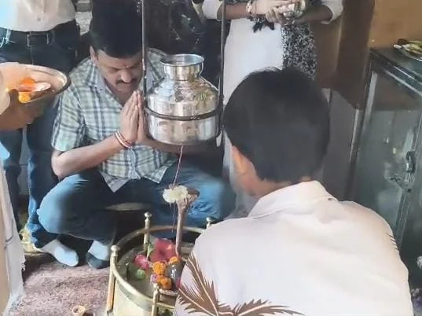

**रूडकी संवाददाता |आसिफ खान** 

रुड़की। मोहनपुरा में रेलवे पटरी के समीप स्थित प्राचीन शिव मंदिर के कायाकल्प और भव्य स्वरूप देने की दिशा में अब कदम आगे बढ़ गया है। लंबे समय से क्षेत्र की धार्मिक आस्था से जुड़े इस प्राचीन मंदिर परिसर में शिव-खाटूश्याम मंदिर के निर्माण कार्य का विधिवत शुभारंभ किया गया। धार्मिक विधि-विधान और पूजा-अर्चना के साथ निर्माण कार्य की शुरुआत हुई तो मौके पर मौजूद श्रद्धालुओं और स्थानीय लोगों में खासा उत्साह दिखाई दिया।

निर्माण कार्य के शुभारंभ अवसर पर कांग्रेस नेता सचिन गुप्ता ने मंदिर परिसर में पूजा-अर्चना कर विधिवत रूप से निर्माण कार्य का शुभारंभ कराया। इस दौरान धार्मिक मंत्रोच्चार और पूजा की गई तथा मंदिर निर्माण के लिए आवश्यक मशीनरी को भी मौके पर लगाया गया। निर्माण कार्य शुरू होने के साथ ही प्राचीन मंदिर को नया और भव्य स्वरूप देने की प्रक्रिया धरातल पर उतरती दिखाई दी।

**प्राचीन मंदिर को मिलेगा नया और भव्य स्वरूप**

मोहनपुरा क्षेत्र में स्थित यह प्राचीन शिव मंदिर लंबे समय से स्थानीय श्रद्धालुओं की आस्था का केंद्र रहा है। मंदिर से जुड़े लोगों के अनुसार, मंदिर को भव्य स्वरूप देने की योजना पर काफी समय से विचार किया जा रहा था। अब निर्माण कार्य प्रारंभ होने के बाद इस योजना को गति मिली है।

प्रस्तावित मंदिर में भगवान शिव के साथ खाटूश्याम जी की प्रतिमा की प्राण-प्रतिष्ठा भी की जाएगी। निर्माण पूरा होने के बाद मंदिर परिसर को धार्मिक दृष्टि से और अधिक आकर्षक एवं व्यवस्थित स्वरूप मिलने की उम्मीद है। इससे क्षेत्र के श्रद्धालुओं को पूजा-अर्चना के लिए एक विस्तृत धार्मिक स्थल उपलब्ध होगा।

**निर्माण शुरू होते ही श्रद्धालुओं में उत्साह**

मंदिर निर्माण कार्य के शुभारंभ की खबर क्षेत्र में पहुंचते ही स्थानीय लोगों और श्रद्धालुओं में उत्साह का माहौल दिखाई दिया। निर्माण कार्य शुरू होने के दौरान बड़ी संख्या में मंदिर से जुड़े लोग मौके पर मौजूद रहे। श्रद्धालुओं ने मंदिर के भव्य निर्माण और क्षेत्र की सुख-समृद्धि की कामना की।

स्थानीय लोगों का कहना है कि प्राचीन शिव मंदिर को नया स्वरूप मिलने से न केवल मंदिर परिसर का विकास होगा, बल्कि क्षेत्र की धार्मिक पहचान को भी मजबूती मिलेगी। भगवान शिव और खाटूश्याम जी के मंदिर का निर्माण पूर्ण होने के बाद यहां श्रद्धालुओं की आवाजाही बढ़ने की संभावना भी जताई जा रही है।

**धार्मिक आस्था के साथ विकास की नई शुरुआत**

मंदिर निर्माण के शुभारंभ को स्थानीय लोगों ने धार्मिक आस्था से जुड़ी महत्वपूर्ण शुरुआत बताया। पूजा-अर्चना के बाद निर्माण कार्य से जुड़ी गतिविधियां आगे बढ़ाई गईं। मौके पर मौजूद लोगों ने मंदिर निर्माण कार्य के सफल और निर्विघ्न रूप से पूरा होने की कामना की।

मंदिर से जुड़े लोगों के मुताबिक निर्माण पूरा होने के बाद यहां धार्मिक आयोजनों और पूजा-अर्चना के लिए बेहतर व्यवस्थाएं विकसित करने पर भी जोर दिया जाएगा। प्राचीन शिव मंदिर के साथ खाटूश्याम मंदिर का निर्माण क्षेत्र के धार्मिक स्वरूप को नया आयाम देने वाला कदम माना जा रहा है।

निर्माण कार्य शुरू होने के मौके पर स्थानीय लोगों और श्रद्धालुओं ने भी बढ़-चढ़कर भागीदारी की। मंदिर परिसर में पूरे धार्मिक माहौल के बीच शुभारंभ कार्यक्रम संपन्न हुआ। लोगों ने भगवान शिव और खाटूश्याम जी से क्षेत्र में सुख, शांति, समृद्धि और खुशहाली की प्रार्थना की।

इस अवसर पर समाजसेवी अमित दुआ सहित मंदिर से जुड़े श्रद्धालु एवं स्थानीय लोग प्रमुख रूप से मौजूद रहे।
