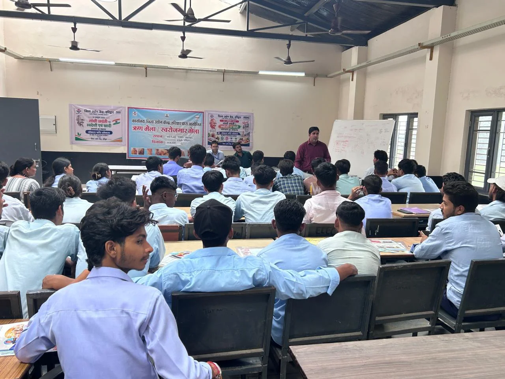
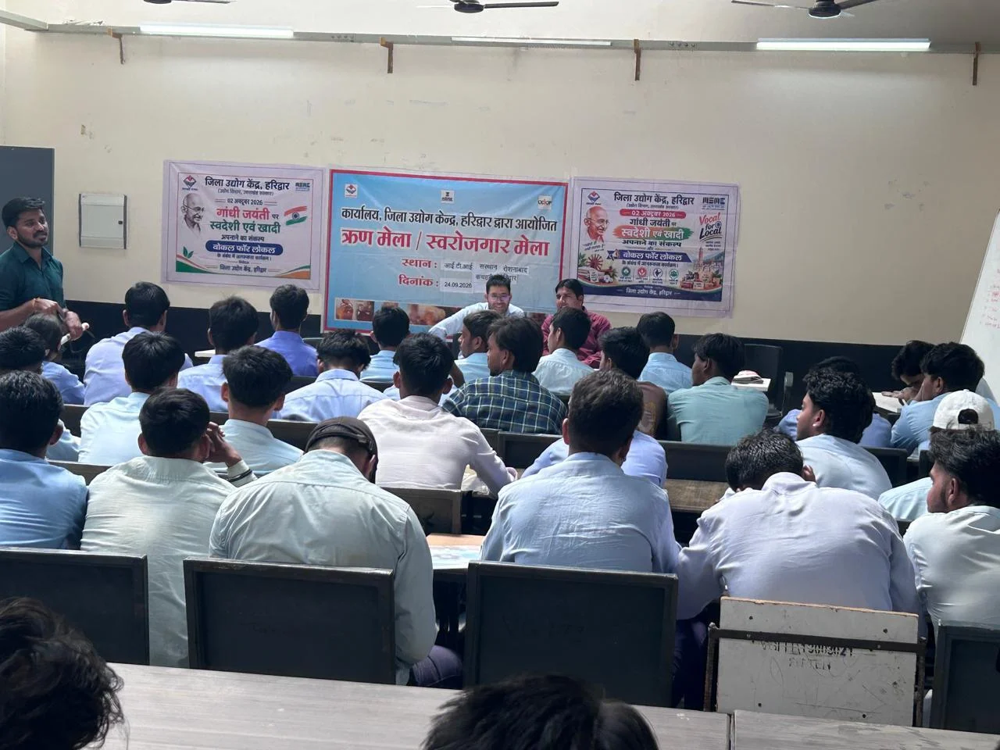

**हरिद्वार संवाददाता | आसिफ खान**

हरिद्वार। रोजगार की तलाश में भटकने के बजाय युवाओं को स्वयं का व्यवसाय खड़ा कर रोजगार सृजक बनने के लिए प्रेरित करने के उद्देश्य से आईटीआई रोशनाबाद में उद्यमिता विकास कार्यक्रम का आयोजन किया गया। जिला उद्योग केंद्र, हरिद्वार एवं मुख्यमंत्री उद्यमशाला योजना (MUY) स्पोक सेंटर, हरिद्वार के संयुक्त तत्वावधान में आयोजित उद्यमिता विकास एवं ‘वोकल फॉर लोकल’ जागरूकता कार्यक्रम में 100 से अधिक विद्यार्थियों ने उत्साहपूर्वक प्रतिभाग किया।

कार्यक्रम में विद्यार्थियों को स्वरोजगार और उद्यमिता की राह से जोड़ते हुए व्यवसाय शुरू करने से लेकर उसे बाजार में स्थापित करने तक की पूरी प्रक्रिया की जानकारी दी गई। जिला उद्योग केंद्र, हरिद्वार के सहायक प्रबंधक दिनेश चन्द्र आर्य ने उद्योग विभाग एवं राज्य सरकार की विभिन्न स्वरोजगार योजनाओं की जानकारी देते हुए मुख्यमंत्री स्वरोजगार योजना, प्रधानमंत्री मुद्रा योजना तथा बैंकों के माध्यम से उपलब्ध कोलेट्रल-फ्री ऋण सुविधा के बारे में विस्तार से बताया।

मुख्यमंत्री उद्यमशाला (MUY) की ओर से इन्क्यूबेशन मैनेजर योगेन्द्र चौहान ने विद्यार्थियों को व्यवसाय की बुनियाद मजबूत करने के लिए ब्रांडिंग, पैकेजिंग, मार्केटिंग, मार्केट लिंकेज और बिजनेस डेवलपमेंट की व्यावहारिक जानकारी दी। उन्होंने बताया कि किसी भी उत्पाद को बाजार में उतारने से पहले उसकी पहचान और बाजार की जरूरत को समझना बेहद जरूरी है।

वहीं बिजनेस प्लानिंग एंड डेवलपमेंट एक्सपर्ट राव आस्कर अली ने विद्यार्थियों को प्रोजेक्ट रिपोर्ट तैयार करने, वित्तीय सहायता प्राप्त करने, उद्यम पंजीकरण, जीएसटी पंजीकरण, ट्रेडमार्क पंजीकरण तथा अन्य कानूनी अनुपालनों की जानकारी दी। साथ ही विद्यार्थियों को MUY योजना के विभिन्न लाभों से भी अवगत कराया गया।

कार्यक्रम के दौरान इस बात पर विशेष जोर दिया गया कि उत्पाद को बाजार में उतारने से पहले प्रभावी ब्रांडिंग, आकर्षक पैकेजिंग और मजबूत मार्केटिंग रणनीति तैयार करना जरूरी है। वहीं व्यवसाय की पहचान और ब्रांड को सुरक्षित रखने के लिए ट्रेडमार्क पंजीकरण के महत्व को भी समझाया गया।

**‘वोकल फॉर लोकल’ से रोजगार सृजन का संदेश**

विद्यार्थियों को स्थानीय स्तर पर तैयार होने वाले उत्पादों को बढ़ावा देने और ‘वोकल फॉर लोकल’ अभियान से जुड़कर खुद रोजगार पाने के साथ दूसरों के लिए भी रोजगार के अवसर पैदा करने के लिए प्रेरित किया गया।

जिला उद्योग केंद्र एवं MUY स्पोक सेंटर की ओर से इससे पूर्व भी उद्यमिता विकास कार्यक्रम (EDP) एवं सॉफ्ट टॉयज निर्माण प्रशिक्षण कार्यक्रम आयोजित किए जाते रहे हैं। कार्यक्रम में संस्थान के प्रधानाचार्य, अध्यापकगण, कर्मचारी एवं बड़ी संख्या में विद्यार्थी मौजूद रहे।
