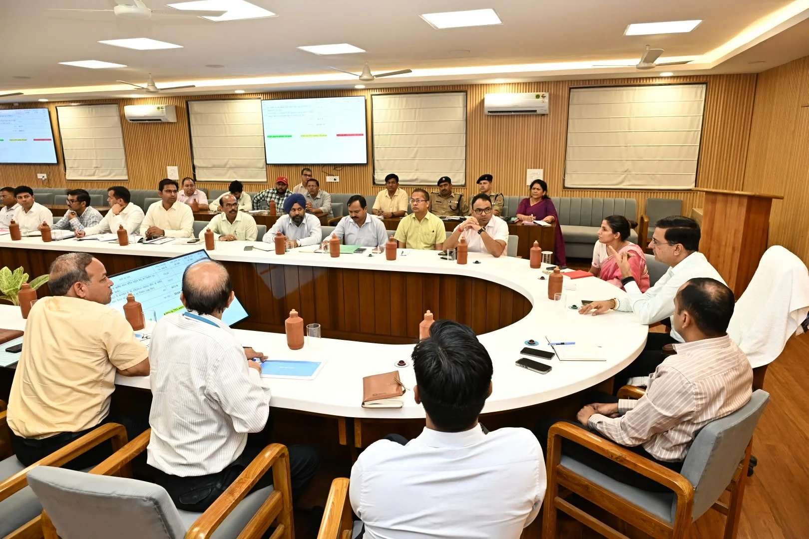
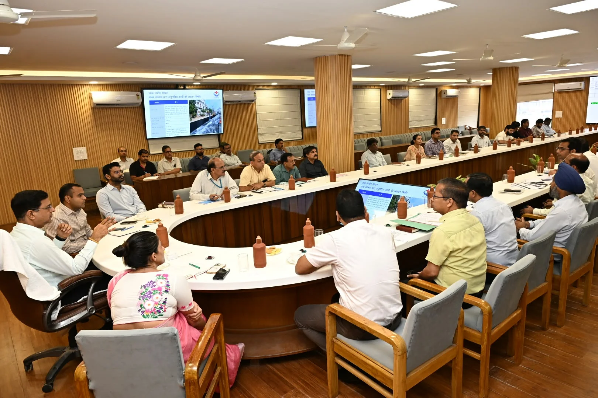
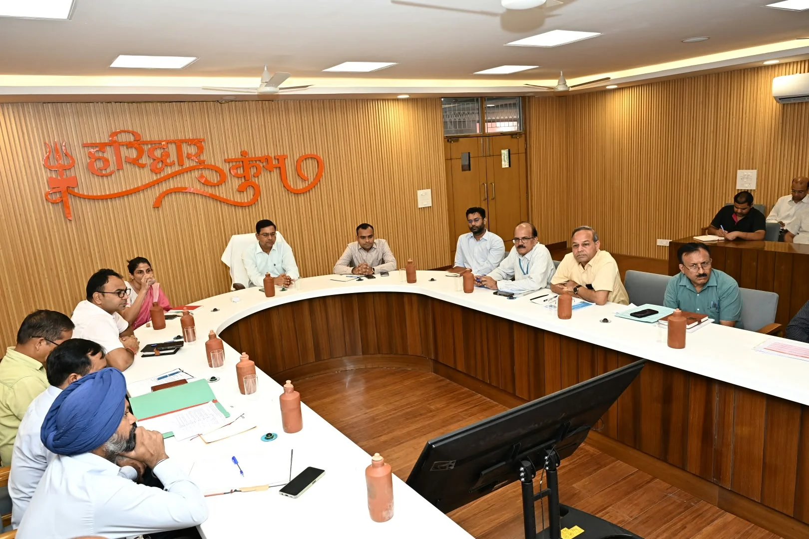
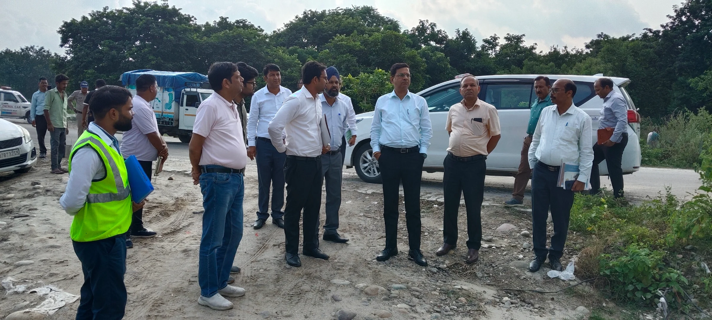
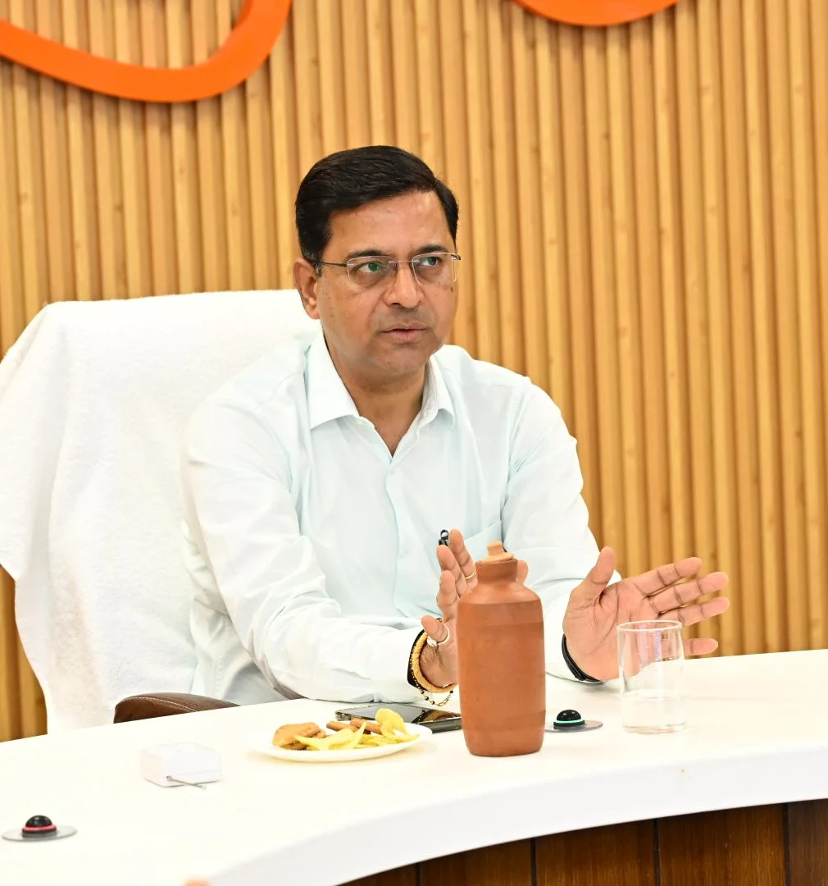

**हरिद्वार संवाददाता | आसिफ खान**

हरिद्वार। कुंभ मेला-2027 की तैयारियों को लेकर अब सड़कों और पुलों के निर्माण पर सरकार ने रफ्तार बढ़ाने के साथ सख्ती भी तेज कर दी है। सचिव लोक निर्माण विभाग डॉ. पंकज कुमार पाण्डेय ने शुक्रवार को हरिद्वार पहुंचकर सड़क एवं पुल निर्माण से जुड़े अधिकारियों की बैठक ली और साफ कर दिया कि कुंभ से पहले महत्वपूर्ण परियोजनाओं को हर हाल में समयसीमा के भीतर पूरा करना होगा। निर्माण में देरी, संसाधनों की कमी या गुणवत्ता से समझौता किसी भी स्तर पर स्वीकार नहीं किया जाएगा।

सीसीआर सभागार में आयोजित समीक्षा बैठक में सचिव लोनिवि ने कुंभ मेला-2027 के लिए महत्वपूर्ण सड़कों, पुलों, अनुरक्षण कार्यों और सड़कों को गड्ढामुक्त करने के अभियान की प्रगति की बारीकी से समीक्षा की। उन्होंने कहा कि कुंभ हरिद्वार की पहचान और प्रतिष्ठा से जुड़ा आयोजन है। ऐसे में हरिद्वार तक आने वाले प्रमुख मार्गों के साथ हरिद्वार और रुड़की की आंतरिक सड़कों तथा पुलों को मजबूत और सुगम बनाना सर्वोच्च प्राथमिकताओं में शामिल है।

**दिन-रात काम करो, संसाधनों की कमी बहाना नहीं चलेगा**

सचिव ने सभी कार्यदायी संस्थाओं को निर्माण कार्यों में तेजी लाने के निर्देश देते हुए कहा कि कार्यस्थलों पर निर्माण सामग्री, श्रमिक, मशीनरी और अन्य आवश्यक संसाधनों की पर्याप्त उपलब्धता पहले से सुनिश्चित की जाए। संसाधनों के अभाव में किसी भी परियोजना की रफ्तार प्रभावित नहीं होनी चाहिए।

उन्होंने अधिकारियों को गुणवत्ता मानकों का कड़ाई से पालन करने के निर्देश दिए। साथ ही स्पष्ट किया कि निर्धारित समयसीमा में कार्य पूरा करना संबंधित एजेंसियों की जिम्मेदारी है। किसी भी प्रकार की देरी अथवा लापरवाही स्वीकार नहीं की जाएगी।

**एनएचएआई को सबसे बड़ा टारगेट—15 दिसंबर की डेडलाइन**

बैठक में सचिव लोनिवि ने एनएचएआई अधिकारियों को कुंभ क्षेत्र से जुड़ी राष्ट्रीय राजमार्ग परियोजनाओं को 15 दिसंबर तक पूरा करने के स्पष्ट निर्देश दिए। उन्होंने हरिद्वार बाईपास, दिल्ली-देहरादून इकोनॉमिक कॉरिडोर के हरिद्वार स्पर तथा एनएच-74 के हरिद्वार-नगीना सेक्शन में चल रहे कार्यों को युद्धस्तर पर आगे बढ़ाने को कहा।

सचिव ने कहा कि कुंभ मेले के दौरान इन मार्गों पर यातायात का भारी दबाव रहेगा। इसलिए मेला शुरू होने से पहले इन परियोजनाओं का पूरा होना बेहद जरूरी है।

**चंडी चौक पर भी फोकस, सर्विस लेन का काम जल्द पूरा करने के निर्देश**

राष्ट्रीय राजमार्गों पर प्रमुख चौराहों के सुधार कार्यों को भी प्राथमिकता देने के निर्देश दिए गए। सचिव ने चंडी चौक चौराहे के सुधार और सर्विस लेन के चौड़ीकरण का कार्य शीघ्र पूरा करने को कहा, ताकि निर्माणाधीन एडमिन रोड की प्रगति प्रभावित न हो।

उन्होंने एनएचएआई अधिकारियों को राष्ट्रीय राजमार्गों से संबंधित सभी कार्यों की स्पष्ट कार्ययोजना तैयार कर शासन, मेलाधिकारी और जिलाधिकारी को उपलब्ध कराने के निर्देश दिए।

**खुद मैदान में उतरे सचिव, सड़क-पुलों का किया स्थलीय निरीक्षण**

बैठक के बाद सचिव डॉ. पंकज कुमार पाण्डेय ने अधिकारियों के साथ कुंभ क्षेत्र में विभिन्न निर्माणाधीन सड़कों और पुलों का स्थलीय निरीक्षण किया। उन्होंने एडमिन रोड और चंडी चौक सर्विस लेन के चौड़ीकरण का जायजा लिया तथा मौके पर अधिकारियों से कार्य की प्रगति की जानकारी ली।

उन्होंने नारसन बॉर्डर से लंढौरा, लक्सर, सोनाली पुल होते हुए रुड़की तक सड़क और राष्ट्रीय राजमार्ग के विभिन्न हिस्सों का भी निरीक्षण किया। मार्गों के निर्माण और अनुरक्षण कार्यों की स्थिति देखते हुए अधिकारियों को आवश्यक दिशा-निर्देश दिए।

**दक्षद्वीप और खड़खड़ी के पुल भी सचिव की निगरानी में**

सचिव ने दक्षद्वीप और खड़खड़ी क्षेत्र में निर्माणाधीन पुलों का भी निरीक्षण किया। उन्होंने अधिकारियों से निर्माण की प्रगति जानी और सभी कार्यों को निर्धारित समयसीमा में पूरा करने के निर्देश दिए। साथ ही गुणवत्ता के साथ सुरक्षा मानकों पर भी विशेष ध्यान देने को कहा।

उन्होंने कहा कि निर्माण एवं अवस्थापना कार्यों के लिए जहां भी सड़कें खोदी गई हैं, संबंधित विभाग उनकी तत्काल मरम्मत सुनिश्चित करें। हरिद्वार और रुड़की की आंतरिक सड़कों को भी प्राथमिकता के आधार पर दुरुस्त किया जाए।

**अफसरों को साफ संदेश—काम की रफ्तार भी चाहिए, गुणवत्ता भी**

सचिव ने अधिकारियों को कार्यों की नियमित निगरानी, स्पष्ट कार्ययोजना और लगातार समीक्षा सुनिश्चित करने के निर्देश दिए। उन्होंने कहा कि निर्माण के दौरान सामने आने वाली किसी भी समस्या या बाधा का तत्काल समाधान किया जाए, ताकि कुंभ से जुड़ी परियोजनाओं की रफ्तार पर असर न पड़े।

बैठक में मेलाधिकारी श्रीमती सोनिका, जिलाधिकारी श्री मयूर दीक्षित, नगर आयुक्त हरिद्वार श्री नंदन कुमार, अपर मेलाधिकारी श्री दयानंद सरस्वती, मुख्य अभियंता लोनिवि श्री दयानंद, एनएचएआई के क्षेत्रीय अधिकारी श्री दिनेश चन्द्र चतुर्वेदी, सिटी मजिस्ट्रेट हर गिरी, नगर आयुक्त रुड़की श्री गोपाल राम बिनवाल, उप मेलाधिकारी कुंभ श्री आकाश जोशी, उप मेलाधिकारी कुंभ श्री मंजीत सिंह, अधीक्षण अभियंता लोनिवि श्री डी.पी. सिंह, अधीक्षण अभियंता टेक्निकल सेल श्री मनोज भट्ट, एनएचएआई के पीडी नजीबाबाद श्री संकेश शर्मा, अधिशासी अभियंता लोनिवि श्री योगेश कुमार, अधिशासी अभियंता पीआईयू श्री प्रवीण कुश, अधिशासी अभियंता राष्ट्रीय राजमार्ग श्री सुरेश तोमर, प्रोजेक्ट मैनेजर पेयजल निगम (गंगा) श्रीमती मीनाक्षी मित्तल, अधिशासी अभियंता ग्रामीण निर्माण विभाग श्री विनोद कुमार जोशी सहित अन्य अधिकारी उपस्थित रहे।
