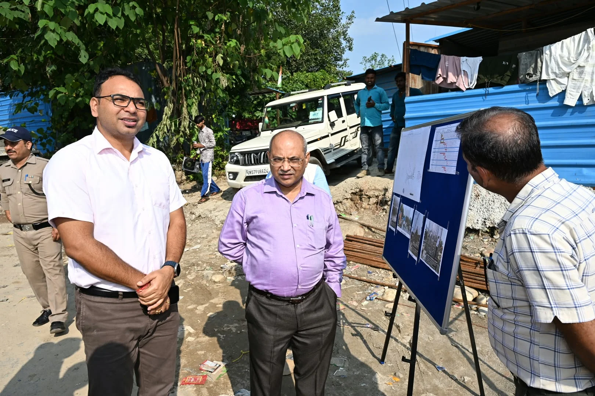
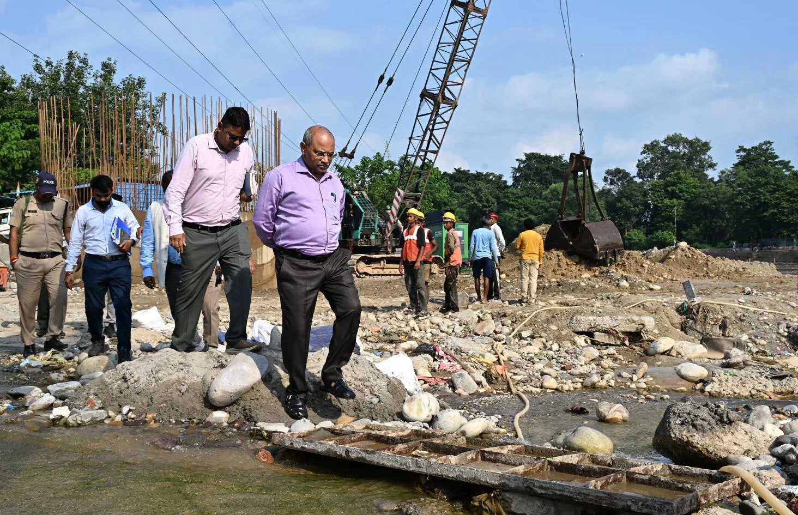
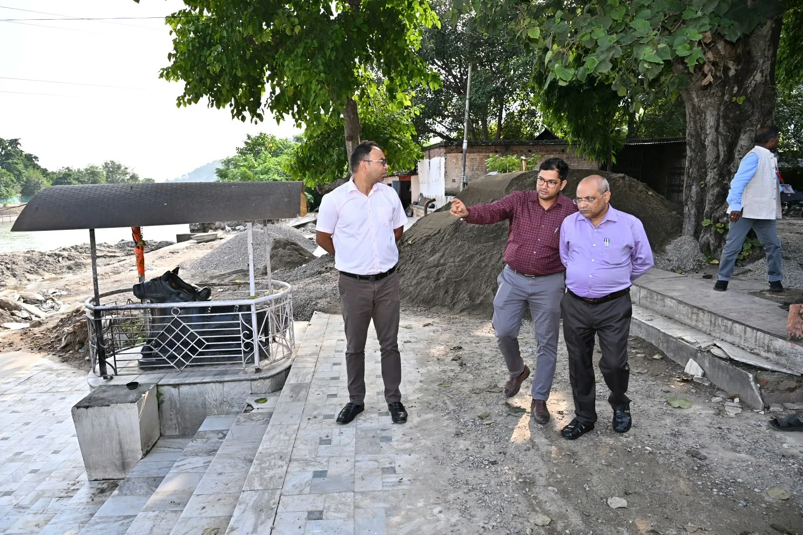

**हरिद्वार संवाददाता | आसिफ खान**

हरिद्वार। कुंभ मेला-2027 की तैयारियों को लेकर प्रशासन ने अब व्यवस्थाओं की रफ्तार बढ़ा दी है। शुक्रवार को मंडलायुक्त श्री आनंद स्वरूप ने भूपतवाला से लेकर बैरागी कैंप तक विभिन्न महत्वपूर्ण क्षेत्रों का स्थलीय निरीक्षण कर निर्माण एवं अवस्थापना कार्यों की जमीनी हकीकत परखी। उन्होंने अधिकारियों से कार्यों की प्रगति का ब्योरा लिया और स्पष्ट निर्देश दिए कि कुंभ से जुड़े सभी कार्य निर्धारित समयसीमा में गुणवत्ता के साथ हर हाल में पूरे किए जाएं।

मंडलायुक्त ने सबसे पहले भूपतवाला स्थित पावन धाम पंपिंग पेयजल योजना के पुनर्गठन कार्य का निरीक्षण किया। जल संस्थान के अभियंताओं ने बताया कि करीब 1.52 करोड़ रुपये की लागत से योजना का पुनर्गठन पूरा किया जा चुका है। योजना के तहत बोरिंग, पंप हाउस की स्थापना और पाइपलाइन बिछाने सहित विभिन्न कार्य किए गए हैं। मंडलायुक्त ने योजना के संचालन एवं अनुरक्षण की व्यवस्थाओं की जानकारी लेते हुए कुंभ मेले के दौरान श्रद्धालुओं को निर्बाध और पर्याप्त पेयजल आपूर्ति सुनिश्चित करने के निर्देश दिए।

इसके बाद मंडलायुक्त ने वेद निकेतन घाट पहुंचकर निर्माण कार्यों का जायजा लिया। उन्होंने निर्माण में निर्धारित गुणवत्ता मानकों का कड़ाई से पालन करने तथा श्रद्धालुओं की सुविधा और सुरक्षा को सर्वोच्च प्राथमिकता देते हुए कार्य समय पर पूरा करने को कहा। सिंचाई विभाग के अधिकारियों ने बताया कि 1.09 करोड़ रुपये की लागत से घाट का निर्माण कराया जा रहा है, जिसकी लंबाई 72 मीटर होगी।

**खड़खड़ी पुल से अतिथि गृह तक निर्माण कार्यों की पड़ताल**

मंडलायुक्त ने खड़खड़ी पुल का निरीक्षण कर संबंधित कार्यों की प्रगति की जानकारी ली। इसके साथ ही उन्होंने श्री अटल बिहारी वाजपेयी अतिथि गृह में चल रहे अनुरक्षण एवं पुनरुद्धार कार्यों का भी जायजा लिया। अधिकारियों को कार्यों में तेजी लाने के साथ-साथ गुणवत्ता से किसी भी प्रकार का समझौता न करने के निर्देश दिए गए।

**बैरागी कैंप में शिविरों की जमीन पर फोकस**

कुंभ की व्यवस्थाओं के लिहाज से महत्वपूर्ण बैरागी कैंप में मंडलायुक्त ने मेला शिविरों एवं अखाड़ों के लिए प्रस्तावित भूमि की ड्रेसिंग और लेवलिंग कार्यों का निरीक्षण किया। उन्होंने स्पष्ट निर्देश दिए कि शिविर स्थापना से पहले भूमि को निर्धारित समय में पूरी तरह तैयार किया जाए।

मंडलायुक्त ने कहा कि भूमि आवंटन से पहले संबंधित क्षेत्रों में सड़क, विद्युत, पेयजल और अन्य जरूरी अस्थायी व्यवस्थाएं पूरी कर ली जाएं, ताकि शिविरों और अखाड़ों की स्थापना के दौरान किसी तरह की बाधा उत्पन्न न हो।

**सती कैंप, दक्षद्वीप और गौरीशंकर की भी ली जानकारी**

मंडलायुक्त ने बैरागी कैंप के साथ सती कैंप, दक्षद्वीप एवं गौरीशंकर क्षेत्र में सेक्टर प्लान तथा अस्थायी कार्यों की स्थिति की भी जानकारी ली। उन्होंने अधिकारियों को क्षेत्रवार कार्यों की नियमित समीक्षा और निगरानी करने के निर्देश दिए।

उन्होंने कहा कि कुंभ मेला-2027 के लिए सभी विभाग आपसी समन्वय के साथ काम करें और जिन व्यवस्थाओं को समय रहते पूरा किया जाना है, उनमें किसी भी स्तर पर लापरवाही न हो। मंडलायुक्त ने अधिकारियों से रफ्तार, गुणवत्ता और समयबद्धता तीनों मोर्चों पर विशेष ध्यान देने को कहा।

निरीक्षण के दौरान अपर मेलाधिकारी श्री दयानंद सरस्वती सहित संबंधित विभागों के अधिकारी मौजूद रहे।
