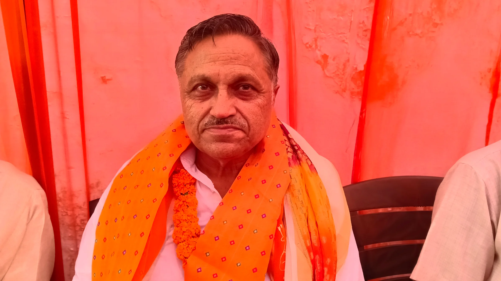

**रुड़की संवाददाता | आसिफ खान**

रुड़की। किसान आयोग के अध्यक्ष पद की कमान संभालते ही चौधरी राजेंद्र सिंह सक्रिय हो गए हैं। शुक्रवार को सिविल लाइंस स्थित कैंप कार्यालय पहुंचने पर समर्थकों ने उनका जोरदार स्वागत किया। इस दौरान मुकेश अग्रवाल ने भी चौधरी राजेंद्र सिंह का स्वागत करते हुए उन्हें नई जिम्मेदारी के लिए शुभकामनाएं दीं। समर्थकों ने फूल-मालाएं पहनाईं और मिठाई खिलाकर खुशी जताई।

चौधरी राजेंद्र सिंह को दूसरी बार किसान आयोग के अध्यक्ष की जिम्मेदारी मिली है। नई जिम्मेदारी संभालने के बाद उन्होंने किसानों के हितों को सर्वोच्च प्राथमिकता देने का स्पष्ट संदेश दिया। उन्होंने कहा कि किसानों की समस्याओं को गंभीरता से समझकर उनके समाधान की दिशा में प्रभावी और लगातार प्रयास किए जाएंगे।

**पदभार संभालते ही पहली बैठक, किसानों के मुद्दों पर मंथन**

अध्यक्ष पद संभालने के साथ ही आयोग की पहली बैठक भी आयोजित की गई। बैठक में किसानों से जुड़ी विभिन्न समस्याओं पर विस्तार से चर्चा की गई। चौधरी राजेंद्र सिंह ने कहा कि किसानों की समस्याओं का समयबद्ध तरीके से समाधान कराने के साथ उनकी आवाज को संबंधित स्तर तक मजबूती से पहुंचाना आयोग की प्राथमिकता रहेगी।

उन्होंने कहा कि किसानों से जुड़े मामलों को लेकर लगातार संवाद और आवश्यक कार्रवाई पर विशेष जोर दिया जाएगा, ताकि समस्याओं का समाधान प्रभावी तरीके से कराया जा सके।

**मुकेश अग्रवाल समेत समर्थकों ने जताया भरोसा**

स्वागत कार्यक्रम में मुकेश अग्रवाल की मौजूदगी विशेष रूप से रही। उन्होंने चौधरी राजेंद्र सिंह को किसान आयोग के अध्यक्ष पद की दूसरी बार जिम्मेदारी मिलने पर बधाई दी और किसानों के हित में प्रभावी कार्य किए जाने की उम्मीद जताई। इस दौरान समर्थकों में भी खासा उत्साह दिखाई दिया।

कैंप कार्यालय पर बड़ी संख्या में पहुंचे समर्थकों ने चौधरी राजेंद्र सिंह के समर्थन में शुभकामनाएं दीं और किसानों से जुड़े मुद्दों को प्राथमिकता के साथ उठाने की अपेक्षा जताई।

इस अवसर पर मुकेश अग्रवाल, प्रताप चौधरी, सुदेश चौधरी, धीर सिंह, प्रमोद जौहर, रश्मि चौधरी, मनीष प्रधान, निपेन्दर सिंह, निर्दोष प्रधान, सुनील सहित बड़ी संख्या में समर्थक और क्षेत्रीय लोग मौजूद रहे।
