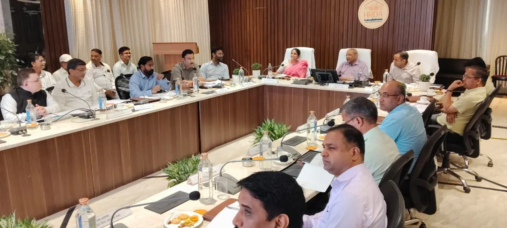
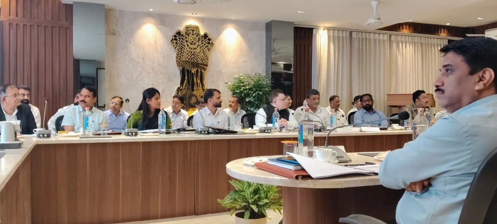
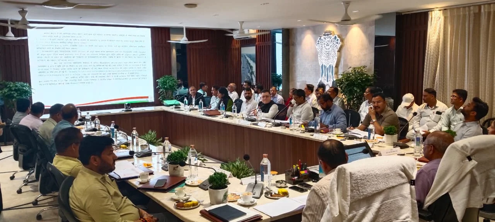

**हरिद्वार संवाददाता | आसिफ खान**

हरिद्वार । हरिद्वार-रूड़की विकास प्राधिकरण (एचआरडीए) की 86वीं बोर्ड बैठक शुक्रवार को अपराह्न 4 बजे आयुक्त, गढ़वाल मंडल, पौड़ी आनंद स्वरूप की अध्यक्षता में संपन्न हुई। बैठक में प्राधिकरण के समक्ष प्रस्तुत विभिन्न महत्वपूर्ण मदों पर विस्तार से समीक्षा की गई और कई अहम विषयों पर आवश्यक दिशा-निर्देश जारी किए गए। बैठक में विकास प्राधिकरण की वित्तीय व्यवस्था, भवनों के विक्रय, मानचित्र स्वीकृति से जुड़ी समस्याओं तथा वर्तमान एवं भावी विकास कार्यों को लेकर गंभीरता से मंथन किया गया।

बैठक में सबसे महत्वपूर्ण विषयों में वित्तीय वर्ष 2026-27 के प्रस्तावित बजट पर चर्चा रही। बोर्ड के समक्ष प्रस्तुत बजट की समीक्षा के बाद आवश्यक दिशा-निर्देशों के साथ उसे अनुमोदन प्रदान किया गया। बजट को मंजूरी मिलने के बाद प्राधिकरण के आगामी वित्तीय वर्ष के विकास एवं अन्य निर्धारित कार्यों को आगे बढ़ाने का रास्ता साफ हुआ।

**रिक्त भवनों के विक्रय को लेकर दिशा-निर्देश**

बैठक में प्राधिकरण की विभिन्न संचालित योजनाओं में मौजूद रिक्त भवनों के विक्रय के संबंध में भी विस्तार से चर्चा की गई। बोर्ड द्वारा इस संबंध में आवश्यक दिशा-निर्देश देते हुए निर्णय पारित किया गया। प्राधिकरण की योजनाओं में उपलब्ध भवनों के बेहतर उपयोग एवं विक्रय की प्रक्रिया को लेकर आगे की कार्यवाही निर्धारित दिशा-निर्देशों के अनुरूप किए जाने पर जोर दिया गया।

**मानचित्रों की दिक्कतों के समाधान पर फोकस**

एचआरडीए में मानचित्रों से संबंधित मामलों में सामने आ रही विभिन्न कठिनाइयों को भी बोर्ड बैठक में प्रमुखता से उठाया गया। प्रस्तुत प्रकरणों की समीक्षा करते हुए आवश्यक दिशा-निर्देश दिए गए, ताकि मानचित्र संबंधी मामलों के निस्तारण में आ रही व्यावहारिक समस्याओं का समाधान किया जा सके और संबंधित कार्यवाही को निर्धारित प्रक्रिया के तहत आगे बढ़ाया जा सके।

**संचालित योजनाओं और विकास कार्यों की भी हुई समीक्षा**

बोर्ड बैठक समाप्त होने के बाद प्राधिकरण की ओर से संचालित विभिन्न योजनाओं एवं विकास कार्यों की भी समीक्षा की गई। अधिकारियों के समक्ष वर्तमान कार्यों की प्रगति और आगे की कार्ययोजना को लेकर जानकारी रखी गई। इसके साथ ही प्राधिकरण के भावी विकास कार्यों पर भी विस्तार से चर्चा हुई।

बैठक में स्पष्ट रूप से जोर दिया गया कि जिन विकास कार्यों को आगे बढ़ाया जाना है, उनमें आवश्यक कार्यवाही समयबद्ध तरीके से पूरी की जाए। अधिकारियों को निर्धारित समयसीमा के भीतर कार्य पूर्ण करने तथा विकास कार्यों की प्रगति पर लगातार नजर बनाए रखने के निर्देश दिए गए।

**कुंभ सहित भविष्य की विकास जरूरतों को लेकर भी अहम संकेत**

हरिद्वार क्षेत्र में लगातार बढ़ रही विकास संबंधी जरूरतों और आगामी योजनाओं को देखते हुए एचआरडीए की बोर्ड बैठक को महत्वपूर्ण माना जा रहा है। प्राधिकरण की वर्तमान योजनाओं के साथ-साथ भविष्य में किए जाने वाले विकास कार्यों की समीक्षा से यह स्पष्ट हुआ कि लंबित एवं प्रस्तावित कार्यों को गति देने पर विशेष ध्यान दिया जा रहा है।

बैठक में अधिकारियों एवं संबंधित विभागों के प्रतिनिधियों के बीच समन्वय के साथ कार्यों को आगे बढ़ाने तथा तय समयसीमा में आवश्यक कार्रवाई सुनिश्चित करने पर भी जोर रहा।

**ये अधिकारी रहे मौजूद**

86वीं बोर्ड बैठक में सोनिका, उपाध्यक्ष, हरिद्वार-रूड़की विकास प्राधिकरण, मयूर दीक्षित, जिलाधिकारी हरिद्वार, नन्दन कुमार, नगर आयुक्त, नगर निगम हरिद्वार, राजीव शर्मा, अध्यक्ष, नगर पालिका शिवालिकनगर, सहित विभिन्न विभागों के प्रतिनिधि उपस्थित रहे।

बैठक का संचालन प्रत्यूष सिंह, सचिव, हरिद्वार-रूड़की विकास प्राधिकरण द्वारा किया गया। बैठक में प्रस्तुत विभिन्न मदों पर चर्चा और निर्णय के उपरांत सचिव द्वारा उपस्थित सभी माननीयों एवं अधिकारियों का धन्यवाद ज्ञापित किया गया।

एचआरडीए की 86वीं बोर्ड बैठक में बजट से लेकर भवनों के विक्रय, मानचित्रों की समस्याओं और विकास कार्यों तक कई अहम मुद्दों पर निर्णय एवं दिशा-निर्देश दिए गए। अब इन निर्देशों को धरातल पर कितनी तेजी से लागू किया जाता है, यह प्राधिकरण की आगामी कार्यवाही से स्पष्ट होगा।
