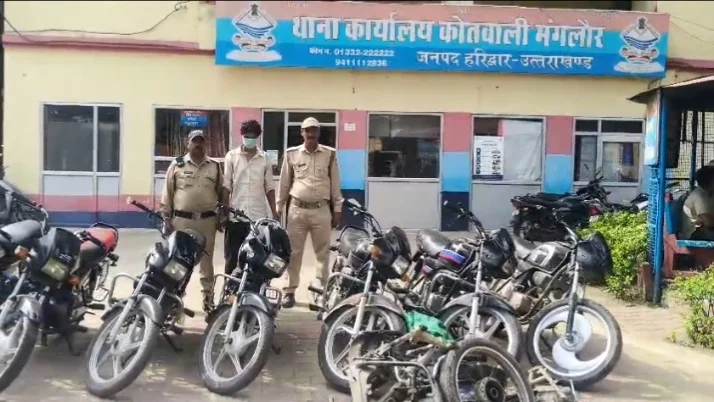
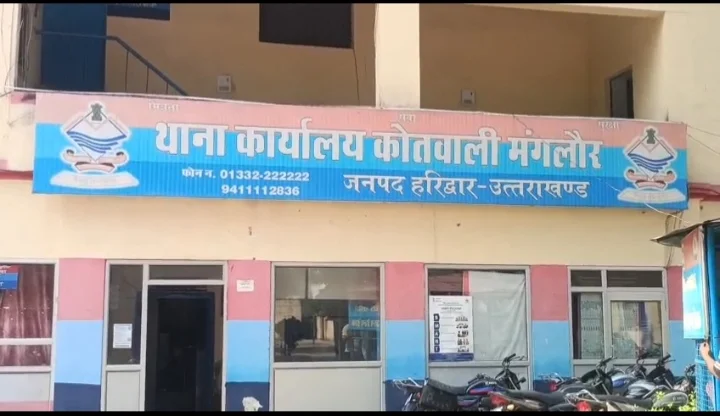

**हरिद्वार/रूडकी संवाददाता | आसिफ खान** 

मंगलौर/रुड़की। मंगलौर पुलिस ने वाहन चोरी के खिलाफ बड़ी कार्रवाई करते हुए 8 चोरी की मोटरसाइकिल बरामद कर एक आरोपी को गिरफ्तार किया है। गिरफ्तार आरोपी रुड़की कोतवाली क्षेत्र के ढंढेरा का रहने वाला बताया गया है। पुलिस की कार्रवाई के बाद वाहन चोरी से जुड़े नेटवर्क को लेकर पूछताछ तेज कर दी गई है।

मंगलौर क्षेत्र में हुई एक वाहन चोरी की घटना की जांच के दौरान पुलिस ने सीसीटीवी कैमरों की फुटेज खंगाली। फुटेज के आधार पर पुलिस को संदिग्ध वाहन चोर के बारे में अहम सुराग हाथ लगा। इसके बाद पुलिस ने आरोपी को चिन्हित कर दबोच लिया। पूछताछ और जांच के दौरान पुलिस ने आरोपी के कब्जे से कुल आठ चोरी की मोटरसाइकिलें बरामद कीं।

पुलिस के मुताबिक बरामद मोटरसाइकिलों में से एक बाइक के स्पेयर पार्ट तक निकाल दिए गए थे। जांच में यह बात सामने आई कि आरोपी कथित तौर पर चोरी की मोटरसाइकिलों के पार्ट्स निकालकर उन्हें बेचते थे और पहचान छिपाने के लिए वाहनों की नंबर प्लेट भी बदल दी जाती थी।

**नारसन बॉर्डर से लेकर मुजफ्फरनगर-सहारनपुर तक फैला चोरी का नेटवर्क**

मंगलौर सीओ अभिनय चौधरी के अनुसार, पूछताछ में सामने आया है कि आरोपी कथित तौर पर मंगलौर-नारसन बॉर्डर, पुरकाजी, मुजफ्फरनगर और सहारनपुर समेत अलग-अलग क्षेत्रों से मोटरसाइकिल चोरी करते थे। पुलिस अब बरामद वाहनों के संबंध में उनके वास्तविक मालिकों की जानकारी जुटाने में लगी है।

**पार्ट्स खरीदने वालों तक पहुंचेगी पुलिस की जांच**

पुलिस की जांच अब सिर्फ वाहन चोर तक सीमित नहीं है। पुलिस यह भी पता लगा रही है कि चोरी की मोटरसाइकिलों से निकाले गए स्पेयर पार्ट्स किन-किन लोगों को बेचे जाते थे और इस पूरे मामले में आरोपी के साथ और कौन-कौन लोग जुड़े हुए हैं।

पुलिस अधिकारियों का कहना है कि मामले में अन्य संभावित आरोपियों की तलाश जारी है। पूछताछ और जांच के आधार पर वाहन चोरी से जुड़े नेटवर्क के अन्य सदस्यों के खिलाफ भी कार्रवाई की जा सकती है।
