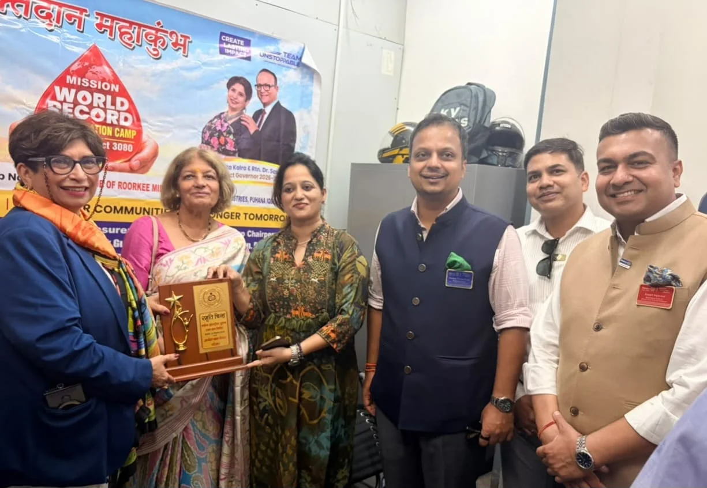
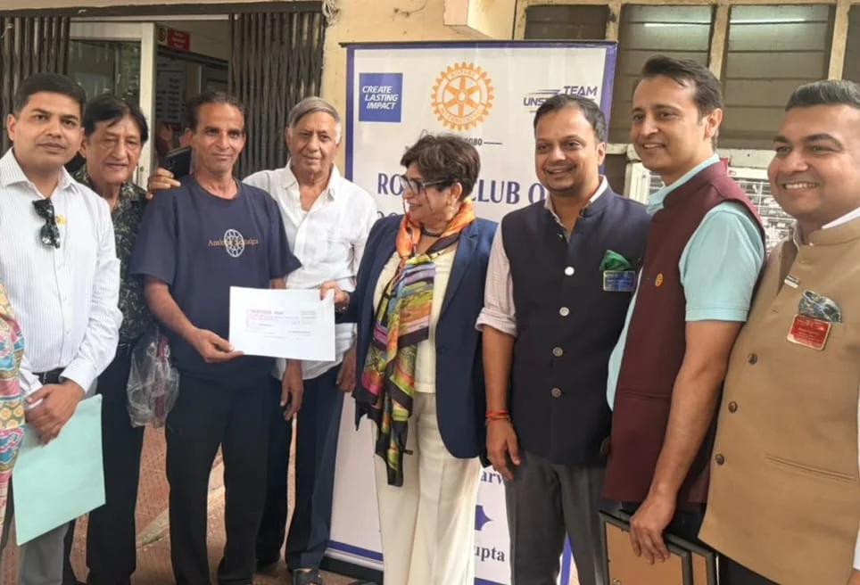
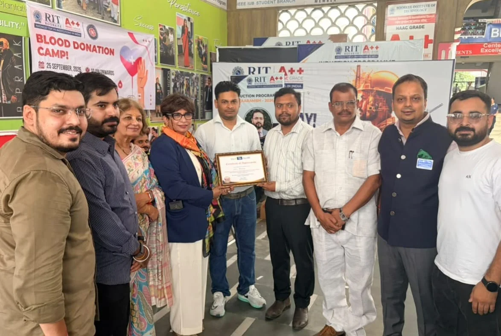

**रूडकी संवाददाता | आसिफ खान** 

रुड़की। सेवा, संवेदनशीलता और सामाजिक जिम्मेदारी को लेकर रोटरी क्लब रुड़की मिडटाउन ने एक साथ कई मोर्चों पर प्रभावी पहल करते हुए समाज के अलग-अलग वर्गों तक अपनी पहुंच बनाई। अंतरराष्ट्रीय सांकेतिक भाषा दिवस एवं अंतरराष्ट्रीय बधिरजन सप्ताह के अवसर पर क्लब ने करीब 110 मूक-बधिर एवं श्रवण बाधित बच्चों के लिए फिल्म ‘हनुमान अंश’ की विशेष स्क्रीनिंग आयोजित की। इस पहल के जरिए विशेष बच्चों को मनोरंजन के साथ समाज की मुख्यधारा से जोड़ने, समानता और सहभागिता का संदेश दिया गया।

**रक्तदान में भी दिखाई सेवा की ताकत**

रोटरी क्लब ने “रक्तदान-महादान” के संदेश को धरातल तक पहुंचाते हुए पृथ्वीराज इंडस्ट्रीज, क्लीना इंडस्ट्रीज एवं आईएमएस रुड़की में रक्तदान शिविर आयोजित किए। शिविरों में रक्तदाताओं ने उत्साहपूर्वक भाग लेते हुए 100 से अधिक यूनिट रक्तदान किया। एकत्रित रक्त को विभिन्न ब्लड बैंकों को उपलब्ध कराया गया।

क्लब पदाधिकारियों ने कहा कि रक्तदान केवल सामाजिक जिम्मेदारी नहीं, बल्कि जरूरत के समय किसी अनजान व्यक्ति के लिए जीवन बचाने का माध्यम भी बन सकता है।

**मेधावी मेडिकल छात्रा की पढ़ाई में बनी मददगार**

सेवा का यह अभियान शिक्षा के क्षेत्र तक भी पहुंचा। आर्थिक रूप से कमजोर परिवार से आने वाली मेधावी छात्रा मिस्बाह, जो सरकारी मेडिकल कॉलेज में अध्ययनरत हैं और अपने शैक्षणिक प्रदर्शन में डिस्टिंक्शन प्राप्त कर रही हैं, को पढ़ाई जारी रखने के लिए 50 हजार रुपये की आर्थिक सहायता प्रदान की गई।

यह सहायता रोटरी डिस्ट्रिक्ट गवर्नर रोटेरियन रीटा कालरा के करकमलों द्वारा क्लब सदस्यों की मौजूदगी में प्रदान की गई।

**“सेवा को समाज की जरूरतों से जोड़ना हमारा लक्ष्य”**

रोटरी क्लब रुड़की मिडटाउन के अध्यक्ष रोटेरियन अक्षय प्रताप सिंह ने कहा कि क्लब का उद्देश्य सेवा को केवल औपचारिक कार्यक्रमों तक सीमित रखना नहीं, बल्कि समाज की वास्तविक जरूरतों से जोड़ना है। विशेष बच्चों के साथ समय बिताना समावेशिता और संवेदनशीलता का संदेश देता है। रक्तदान किसी जरूरतमंद के लिए जीवन बचाने का माध्यम है, जबकि प्रतिभाशाली विद्यार्थी की शिक्षा में सहयोग करना समाज के भविष्य को मजबूत करने की दिशा में निवेश है।

उन्होंने कहा कि क्लब के सदस्यों की सामूहिक सेवा भावना से एक ही दिन में समाज के विभिन्न वर्गों तक पहुंचकर सकारात्मक प्रभाव पैदा करने का प्रयास किया गया है।

इस अवसर पर क्लब के सचिव रोटेरियन अरपित अग्रवाल, कोषाध्यक्ष रोटेरियन विवेक गुप्ता, रोटेरियन रवि प्रकाश, हेमंत अरोड़ा, राजेश गुप्ता, कैनेथ सैमुअल, संजीव कौशल, सुधीर चौधरी, गौरव गिरी, डॉ. मधुलिका, डॉ. विपुल, रमेश रावल, अभिषेक चंद्रा, राम अग्रवाल, श्वेता, अक्षरा, नेहा, हिमांशु पुंडीर सहित क्लब के अनेक सदस्य एवं सहयोगी मौजूद रहे।

क्लब सदस्यों ने संकल्प लिया कि भविष्य में भी स्वास्थ्य, शिक्षा, समावेशिता और मानव सेवा से जुड़े कार्यक्रमों को लगातार आगे बढ़ाया जाएगा।
