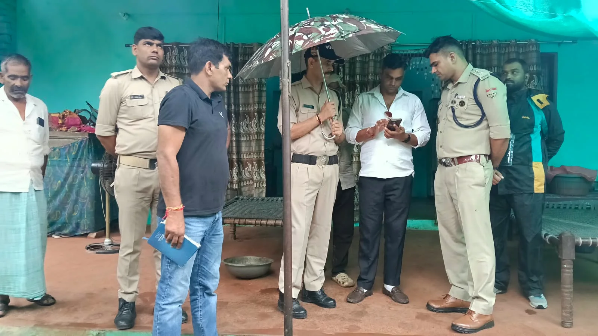
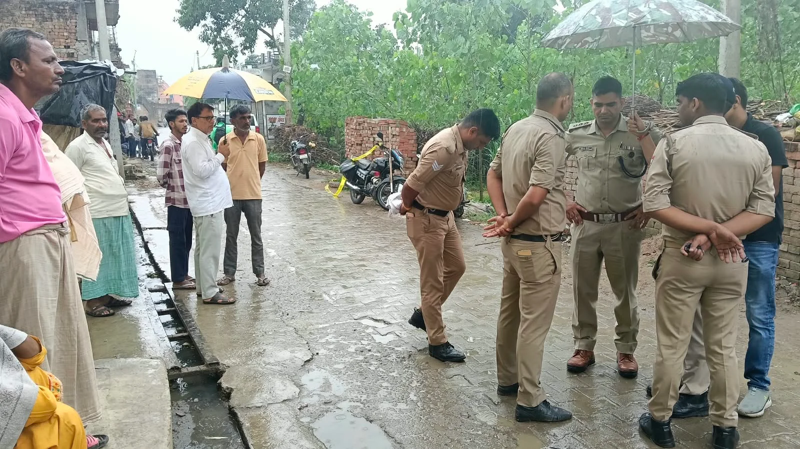
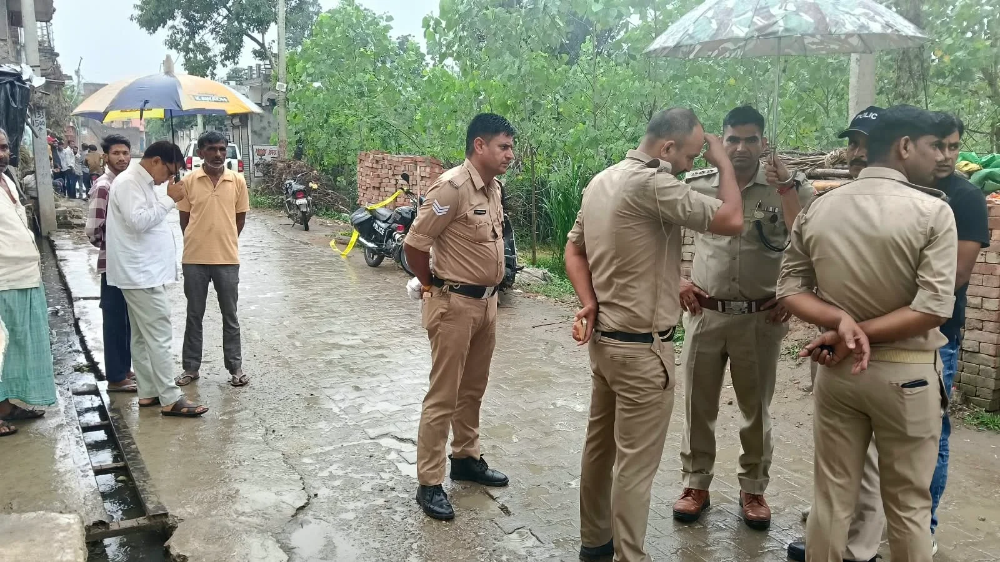

**झबरेड़ा संवाददाता | आसिफ खान**

झबरेड़ा। थाना झबरेड़ा क्षेत्र का झबरेड़ी कलां गांव शनिवार सुबह गोलियों की तड़तड़ाहट से दहल उठा। देखते ही देखते एक सनसनीखेज वारदात ने पूरे इलाके को हिलाकर रख दिया। एक युवक पर अपनी ही बहन और पड़ोसी युवक को गोली मारकर मौत के घाट उतारने का आरोप है। वारदात के बाद गांव में अफरा-तफरी मच गई और देखते ही देखते मौके पर लोगों की भीड़ जमा हो गई। दोनों को अस्पताल ले जाया गया, लेकिन डॉक्टरों ने उन्हें मृत घोषित कर दिया।

**सुबह 8:30 बजे गोलियों से गूंज उठा गांव**

प्रारंभिक जानकारी के अनुसार शनिवार सुबह करीब 8:30 बजे अमन उर्फ भरोसी सिंह (20) ने अपनी बहन रूपा (22) और पड़ोसी युवक सूरज उर्फ मुन्ना (24) को गोली मार दी। बताया जा रहा है कि दोनों के सीने में गोली लगी। गोलीकांड के बाद परिजनों में चीख-पुकार मच गई। आनन-फानन में दोनों को झबरेड़ा के एक नर्सिंग होम ले जाया गया, जहां चिकित्सकों ने दोनों को मृत घोषित कर दिया।

एक ही वारदात में दो मौतों की खबर फैलते ही पूरे झबरेड़ा क्षेत्र में सनसनी फैल गई।

**दोहरे हत्याकांड से गांव में तनाव, पुलिस ने संभाला मोर्चा**

घटना की सूचना मिलते ही झबरेड़ा पुलिस तत्काल मौके पर पहुंची और स्थिति को संभाला। पुलिस ने दोनों शवों को कब्जे में लेकर पंचनामा भरने के बाद पोस्टमार्टम के लिए भेज दिया। घटनास्थल से महत्वपूर्ण साक्ष्य जुटाए जा रहे हैं और पुलिस वारदात की कड़ियों को जोड़ने में जुटी है।

मामले की गंभीरता को देखते हुए एसपी देहात अभय कुमार सिंह, सीओ मंगलौर अभिनय चौधरी, एसएचओ मंगलौर भगवान मेहर, एसएसआई दीप कुमार तथा झबरेड़ा थाना प्रभारी विजय सिंह सहित पुलिस अधिकारियों ने घटनास्थल का निरीक्षण किया।

**प्रेम प्रसंग से गैंग कनेक्शन तक, पुलिस खंगाल रही हर कड़ी**

पुलिस के अनुसार अमन उर्फ भरोसी सिंह की भूमिका वारदात में सामने आई है। स्थानीय स्तर पर आरोपी के किसी गैंग से जुड़े होने की जानकारी भी सामने आने की बात पुलिस की ओर से कही जा रही है, हालांकि इसकी आधिकारिक पुष्टि अभी जांच का विषय है।

दूसरी ओर पुलिस इस बात की भी जांच कर रही है कि वारदात के पीछे प्रेम प्रसंग, पारिवारिक विवाद, पुरानी रंजिश या कोई अन्य कारण तो नहीं था। ऑनर किलिंग की आशंका से भी मामले को जोड़कर देखा जा रहा है, लेकिन इसकी पुष्टि जांच पूरी होने के बाद ही हो सकेगी।

**पहले भी दर्ज हो चुका है अपराध का मुकदमा**

झबरेड़ा थाना प्रभारी निरीक्षक विजय सिंह ने बताया कि मामले की जांच सभी संभावित पहलुओं को ध्यान में रखकर की जा रही है। प्रेम प्रसंग सहित अन्य बिंदुओं की भी पड़ताल की जा रही है। उन्होंने बताया कि आरोपी के खिलाफ झबरेड़ा थाने में पूर्व में भी एक अपराध की प्राथमिकी दर्ज होने की जानकारी सामने आई है।

पुलिस आरोपी की गिरफ्तारी के लिए प्रयास कर रही है। दोहरे हत्याकांड के बाद झबरेड़ी कलां में तनाव और मातम का माहौल है। अब पुलिस जांच पर निगाहें टिकी हैं कि आखिर एक ही वारदात में दो जिंदगियां क्यों खत्म हुईं और इस खूनी खेल के पीछे असली वजह क्या थी।
