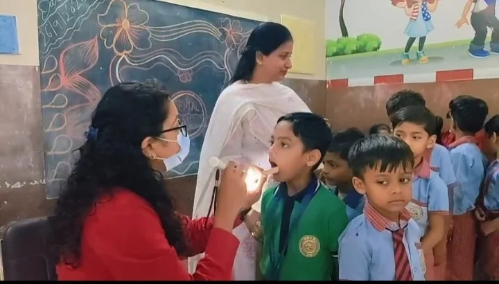
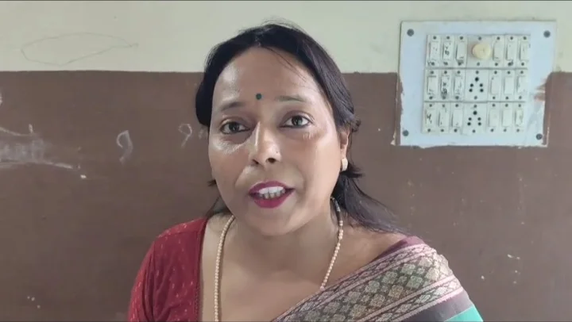

**रुड़की/खंजरपुर संवाददाता | आसिफ खान**

बच्चों में बढ़ती मीठे खाद्य पदार्थों और शर्करा युक्त पेय पदार्थों की आदत अब उनके दांतों के स्वास्थ्य को लेकर चिंता बढ़ा रही है। इसी को लेकर खंजरपुर स्थित कृष्णा पब्लिक स्कूल में बच्चों के दंत स्वास्थ्य को लेकर निःशुल्क दंत चिकित्सा जांच शिविर का आयोजन किया गया। कांग्रेस नेत्री पूजा गुप्ता के सौजन्य से आयोजित इस शिविर में चिकित्सकों की टीम ने बच्चों के दांतों की जांच कर उन्हें जरूरी चिकित्सकीय सलाह दी।

शिविर में बच्चों को विशेष रूप से कोल्ड ड्रिंक, चॉकलेट, टॉफी और अत्यधिक मीठे खाद्य पदार्थों के सेवन को सीमित करने के लिए जागरूक किया गया। चिकित्सकों ने बताया कि शर्करा युक्त खाद्य पदार्थों और पेय पदार्थों का बार-बार सेवन दांतों में कैविटी समेत अन्य समस्याओं का जोखिम बढ़ा सकता है। बच्चों को नियमित रूप से ब्रश करने, दांतों की सही तरीके से सफाई करने और आवश्यकता पड़ने पर समय से दंत चिकित्सक से परामर्श लेने की सलाह दी गई।

**बच्चों के दांतों की जांच के साथ दिया जागरूकता का संदेश**

निःशुल्क शिविर के दौरान बच्चों की दंत जांच के साथ उन्हें मौखिक स्वच्छता के महत्व के बारे में भी समझाया गया। चिकित्सकों ने बच्चों को बताया कि केवल दांतों में दर्द होने के बाद ही जांच कराने के बजाय समय-समय पर दांतों की जांच कराना और शुरुआत से ही उनकी देखभाल करना जरूरी है।

बच्चों ने भी शिविर में उत्साहपूर्वक भाग लिया और चिकित्सकों से दांतों से संबंधित सवाल पूछे। चिकित्सकीय टीम ने बच्चों को उनकी उम्र के अनुसार दांतों की देखभाल और साफ-सफाई से जुड़े जरूरी सुझाव दिए।

**रूचि पुंडीर ने पूजा गुप्ता और चिकित्सकों की टीम को सराहा**

कृष्णा पब्लिक स्कूल की संचालिका रूचि पुंडीर ने निःशुल्क दंत चिकित्सा शिविर के आयोजन की सराहना करते हुए कांग्रेस नेत्री पूजा गुप्ता और चिकित्सकों की पूरी टीम का आभार व्यक्त किया।

रूचि पुंडीर ने कहा कि बच्चों की शिक्षा के साथ-साथ उनके स्वास्थ्य पर ध्यान देना भी बेहद जरूरी है। स्कूल में इस तरह के स्वास्थ्य जागरूकता कार्यक्रम बच्चों को छोटी उम्र से ही अपनी सेहत के प्रति जिम्मेदार बनाने में महत्वपूर्ण भूमिका निभाते हैं।

उन्होंने कहा कि बच्चों को नियमित दांतों की सफाई, संतुलित खान-पान और स्वास्थ्य संबंधी अच्छी आदतों के लिए प्रेरित किया जाना चाहिए। उन्होंने शिविर में सहयोग करने वाली चिकित्सकीय टीम और पूजा गुप्ता की पहल की सराहना की।

**पूजा गुप्ता बोलीं—बच्चों के स्वास्थ्य को लेकर जागरूकता जरूरी**

कांग्रेस नेत्री पूजा गुप्ता ने कहा कि बच्चों के स्वास्थ्य को लेकर जागरूकता फैलाना इस शिविर का प्रमुख उद्देश्य है। उन्होंने कहा कि आज बच्चों में मीठे खाद्य पदार्थों और शर्करा युक्त पेय पदार्थों का सेवन बढ़ रहा है, इसलिए अभिभावकों को भी बच्चों के खान-पान पर विशेष ध्यान देने की जरूरत है।

उन्होंने कहा कि स्वस्थ दांत बच्चों की स्वस्थ मुस्कान का आधार हैं और छोटी उम्र से ही दांतों की देखभाल की आदत विकसित की जानी चाहिए। उन्होंने भविष्य में भी जरूरत के अनुसार स्वास्थ्य जागरूकता से जुड़े कार्यक्रमों को आगे बढ़ाने की बात कही।

**अभिभावकों से भी सतर्क रहने की अपील**

शिविर में चिकित्सकों ने अभिभावकों से अपील की कि बच्चों को अत्यधिक मीठे और शर्करा युक्त पेय पदार्थों की आदत से बचाने का प्रयास करें। साथ ही बच्चों को नियमित ब्रशिंग और दांतों की स्वच्छता के लिए प्रेरित करें।

इस अवसर पर विद्यालय की शिक्षिकाएं, अभिभावक, चिकित्सकीय टीम और अन्य लोग मौजूद रहे। शिविर ने बच्चों के बीच दंत स्वास्थ्य, स्वच्छता और संतुलित खान-पान को लेकर जागरूकता का महत्वपूर्ण संदेश दिया।

**संवाददाता | आसिफ खान**
**स्टार न्यूज़ 11**
