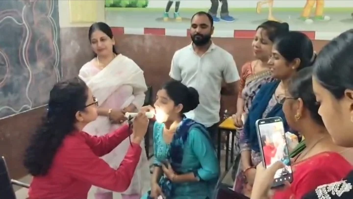
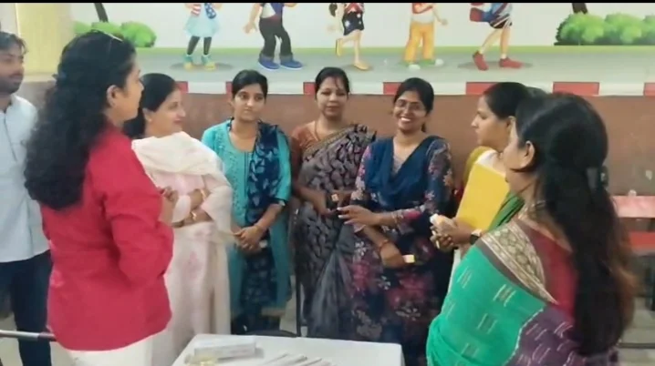
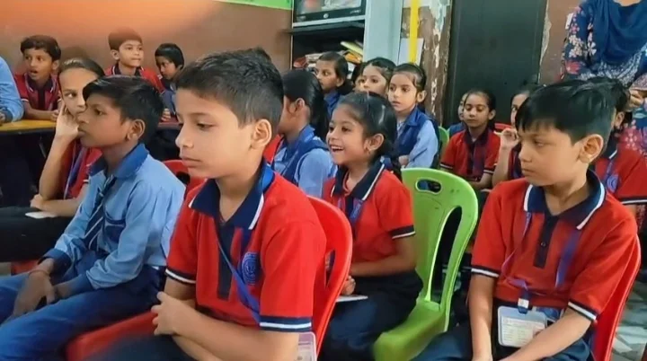
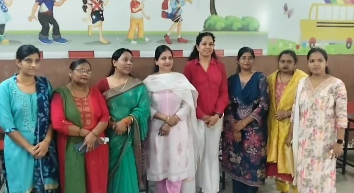

**रूडकी/खंजरपुर संवाददाता | आसिफ खान**

बच्चों की सेहत से खिलवाड़ करने वाली खान-पान की आदतों को लेकर अब जागरूक होने का समय आ गया है। खासकर कोल्ड ड्रिंक, चॉकलेट, टॉफी और जरूरत से ज्यादा मीठे खाद्य पदार्थों का सेवन बच्चों के दांतों के लिए परेशानी का कारण बन सकता है। इसी गंभीर विषय को लेकर खंजरपुर स्थित कृष्णा पब्लिक स्कूल में कांग्रेस नेत्री पूजा गुप्ता के सौजन्य से निःशुल्क दंत चिकित्सा जांच शिविर आयोजित किया गया।

शिविर में बड़ी संख्या में बच्चों की दंत जांच की गई। चिकित्सकों ने बच्चों के दांतों की स्थिति का परीक्षण करते हुए उन्हें दांतों की नियमित सफाई, सही तरीके से ब्रश करने और खान-पान में सावधानी बरतने के बारे में विस्तार से जानकारी दी। वहीं अभिभावकों को भी चेताया गया कि बच्चों की मीठे और शर्करा युक्त पेय पदार्थों की आदत पर नियंत्रण रखना जरूरी है।

**मीठे का बढ़ता शौक, दांतों के लिए बन सकता है मुसीबत**

शिविर के दौरान बच्चों को बताया गया कि अत्यधिक शर्करा वाले खाद्य पदार्थों और पेय पदार्थों का बार-बार सेवन दांतों में कैविटी समेत अन्य समस्याओं का जोखिम बढ़ा सकता है। आजकल बच्चों में कोल्ड ड्रिंक, पैकेज्ड जूस, चॉकलेट, टॉफी और अन्य मीठे खाद्य पदार्थों का आकर्षण तेजी से बढ़ रहा है। ऐसे में अभिभावकों की जिम्मेदारी और भी बढ़ जाती है।

चिकित्सकों ने बच्चों को समझाया कि सिर्फ दांतों में दर्द होने के बाद डॉक्टर के पास पहुंचना पर्याप्त नहीं है। दांतों की नियमित जांच और सही समय पर देखभाल से कई समस्याओं को शुरुआती स्तर पर पहचाना जा सकता है।

**पूजा गुप्ता की पहल से बच्चों में स्वास्थ्य जागरूकता का संदेश**

कांग्रेस नेत्री पूजा गुप्ता ने कहा कि बच्चों के स्वास्थ्य को लेकर किसी भी तरह की लापरवाही नहीं होनी चाहिए। बच्चों के शारीरिक विकास के साथ-साथ उनके दांतों और मौखिक स्वास्थ्य पर भी बराबर ध्यान दिया जाना जरूरी है।

उन्होंने कहा कि आज के समय में बच्चों की खान-पान की आदतें तेजी से बदल रही हैं। बाजार में उपलब्ध मीठे खाद्य पदार्थों और शर्करा युक्त पेय पदार्थों की अधिकता के बीच अभिभावकों को विशेष सतर्कता बरतनी चाहिए। बच्चों को सिर्फ स्वाद के पीछे भागने के बजाय स्वास्थ्य के महत्व को समझाना होगा।

पूजा गुप्ता ने कहा कि निःशुल्क दंत चिकित्सा शिविर का उद्देश्य केवल दांतों की जांच करना नहीं, बल्कि बच्चों और उनके अभिभावकों को जागरूक करना भी है। उन्होंने कहा कि यदि छोटी उम्र से ही बच्चों में दांतों की देखभाल की आदत विकसित की जाए तो भविष्य में कई परेशानियों से बचने में मदद मिल सकती है।

**दांतों की सफाई को लेकर बच्चों को दिए गए जरूरी टिप्स**

शिविर में बच्चों को दिन में नियमित रूप से ब्रश करने, ब्रश करने की सही तकनीक अपनाने और भोजन के बाद मुंह की सफाई का ध्यान रखने की सलाह दी गई। चिकित्सकों ने बच्चों को यह भी समझाया कि मीठा खाने के बाद दांतों की सफाई पर विशेष ध्यान देना चाहिए।

अभिभावकों से कहा गया कि बच्चों के खान-पान पर निगरानी रखें और उन्हें संतुलित आहार के लिए प्रेरित करें। साथ ही बच्चों में दांतों से संबंधित किसी भी तरह की परेशानी दिखाई देने पर समय रहते दंत चिकित्सक से परामर्श लेने की सलाह दी गई।

**स्कूल में स्वास्थ्य शिविर बना जागरूकता का बड़ा माध्यम**

कृष्णा पब्लिक स्कूल में आयोजित इस शिविर को बच्चों के लिए स्वास्थ्य जागरूकता की दिशा में महत्वपूर्ण पहल के रूप में देखा गया। स्कूल में दंत जांच के साथ बच्चों को मौखिक स्वच्छता के प्रति जागरूक किया गया। बच्चों ने भी चिकित्सकों से दांतों से संबंधित सवाल पूछकर अपनी जिज्ञासाओं का समाधान किया।

विद्यालय प्रबंधन की ओर से भी इस पहल की सराहना की गई। वक्ताओं ने कहा कि स्कूलों में पढ़ाई के साथ-साथ स्वास्थ्य जागरूकता कार्यक्रमों का आयोजन बच्चों के बेहतर भविष्य के लिए बेहद जरूरी है।

**पूजा गुप्ता बोलीं—स्वस्थ बच्चे ही मजबूत समाज की नींव**

पूजा गुप्ता ने कहा कि बच्चों का स्वास्थ्य समाज के भविष्य से जुड़ा हुआ विषय है। उन्होंने कहा कि स्वास्थ्य संबंधी जागरूकता जितनी कम उम्र में विकसित होगी, उसका लाभ बच्चों को उतना ही लंबे समय तक मिल सकता है।

उन्होंने कहा कि भविष्य में भी जरूरत के अनुसार स्वास्थ्य जागरूकता और जनसेवा से जुड़े कार्यक्रमों को आगे बढ़ाने का प्रयास किया जाएगा, ताकि अधिक से अधिक लोगों तक जरूरी स्वास्थ्य संबंधी जानकारी पहुंच सके।

शिविर के दौरान विद्यालय के शिक्षक-शिक्षिकाएं, चिकित्सकीय टीम, अभिभावक और स्थानीय लोग मौजूद रहे। कार्यक्रम में बच्चों ने उत्साहपूर्वक भाग लिया और दांतों की देखभाल से जुड़े जरूरी टिप्स हासिल किए।

**संवाददाता | आसिफ खान**
