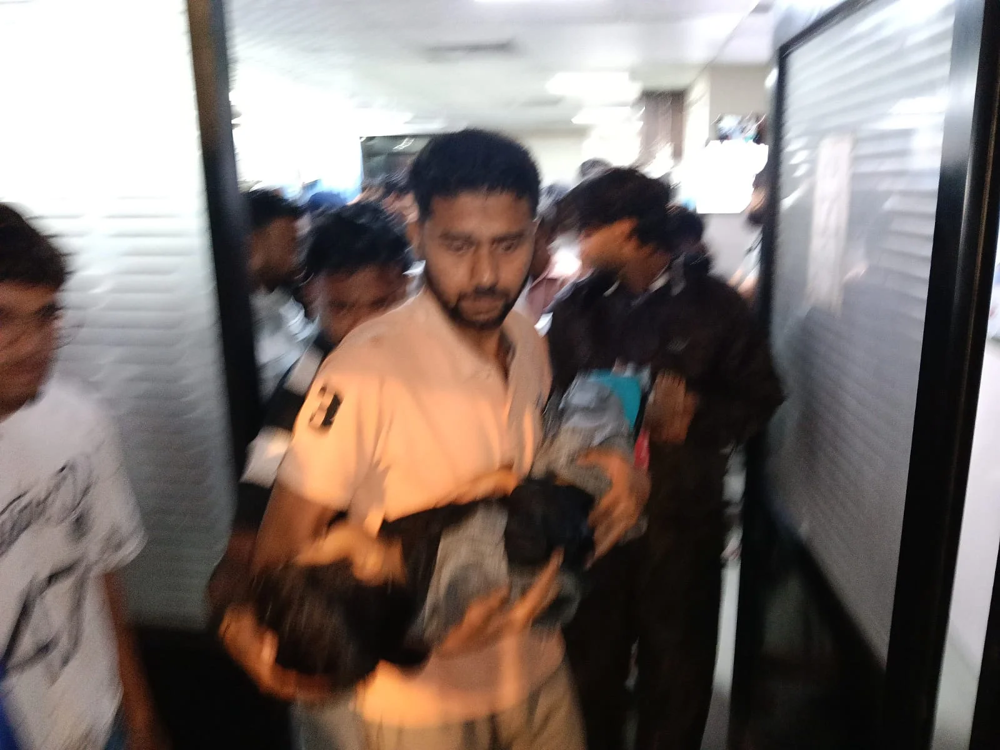
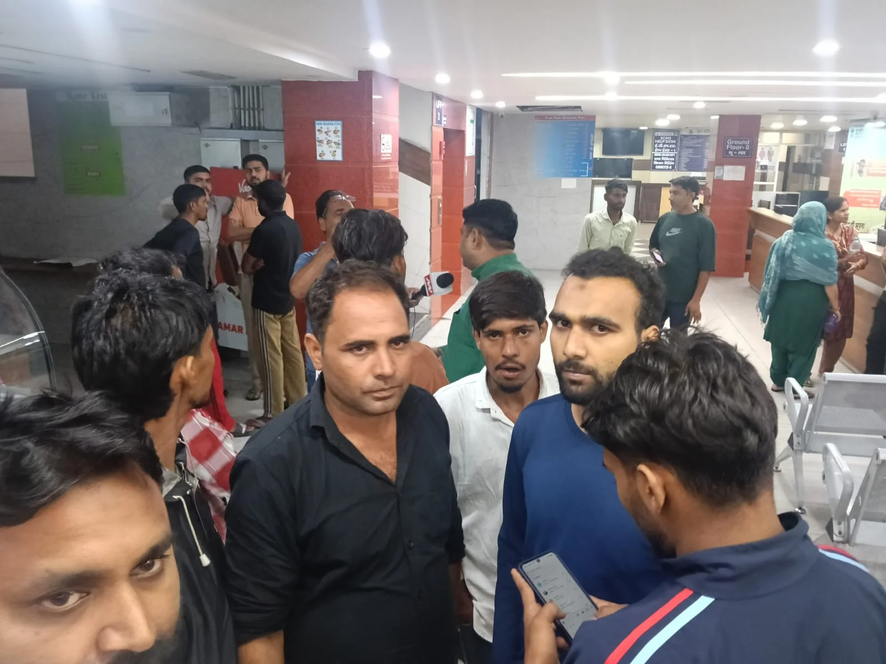
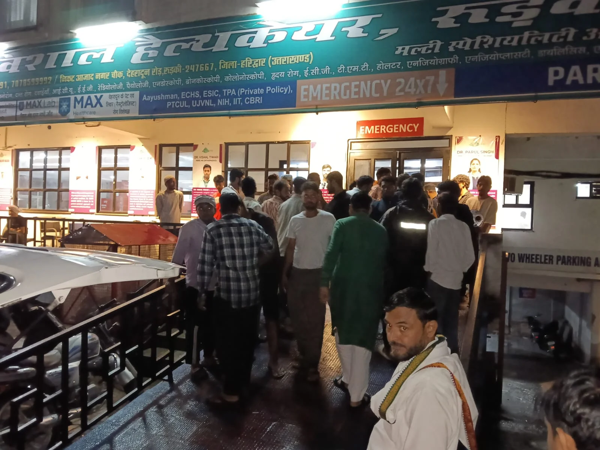
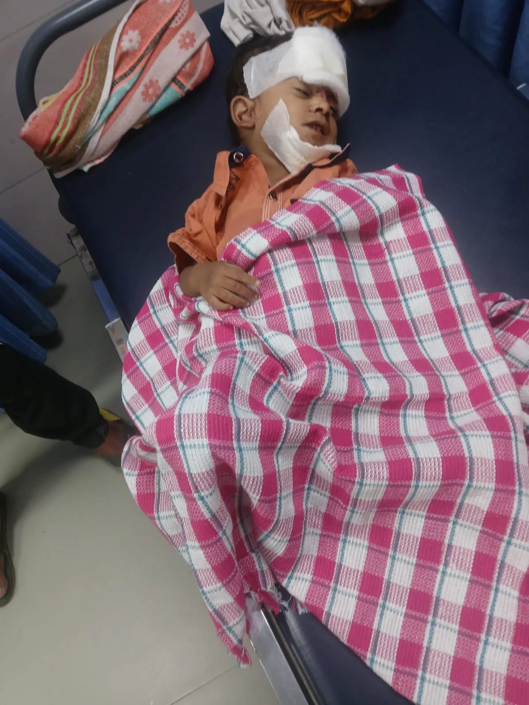

**हरिद्वार/रुड़की संवाददाता | आसिफ खान**

रुड़की। लक्सर-रुड़की मार्ग पर थिथौला गांव के समीप रविवार शाम करीब छह बजे एक दर्दनाक सड़क हादसे में तीन लोगों की मौत हो गई, जबकि छह लोग घायल हो गए। कार और ई-रिक्शा की आमने-सामने हुई जोरदार भिड़ंत के बाद मौके पर चीख-पुकार मच गई। हादसा इतना भीषण था कि ई-रिक्शा बुरी तरह क्षतिग्रस्त हो गया और उसमें सवार लोगों को निकालने के लिए स्थानीय लोगों को काफी मशक्कत करनी पड़ी।

हादसे की सूचना मिलते ही पुलिस मौके पर पहुंची। स्थानीय लोगों की मदद से घायलों को क्षतिग्रस्त ई-रिक्शा से बाहर निकालकर उपचार के लिए अस्पताल भेजा गया। पुलिस ने दुर्घटनाग्रस्त वाहनों को कब्जे में लेकर मामले की जांच शुरू कर दी है।

**दो मृतकों की हुई पहचान, तीसरे की शिनाख्त बाकी**

पुलिस के अनुसार, हादसे में ढंडेरा के मिलापनगर निवासी अरशद (30) और दिलशाद (32) की मौत हो गई। तीसरे मृतक की पहचान अभी नहीं हो सकी है। पुलिस ने तीनों शवों को कब्जे में लेकर पोस्टमार्टम के लिए भेज दिया है। वहीं, हादसे में घायल छह लोगों का अस्पताल में उपचार चल रहा है।

**हादसे के बाद कार छोड़कर भागा चालक**

दुर्घटना के बाद कार चालक वाहन को घटनास्थल पर ही छोड़कर फरार हो गया। पुलिस ने कार को कब्जे में ले लिया है और फरार चालक की तलाश की जा रही है। पुलिस आसपास के क्षेत्र में लगे सीसीटीवी कैमरों की फुटेज समेत अन्य बिंदुओं की जांच कर रही है।

**जोरदार टक्कर से कुछ देर थमा यातायात**

प्रत्यक्ष जानकारी के मुताबिक दोनों वाहन आमने-सामने से आ रहे थे और इसी दौरान जोरदार भिड़ंत हो गई। टक्कर के बाद मार्ग पर कुछ समय के लिए यातायात प्रभावित रहा। पुलिस ने दुर्घटनाग्रस्त वाहनों को सड़क से हटवाकर यातायात सुचारु कराया।

पुलिस का कहना है कि हादसे के वास्तविक कारणों की जांच की जा रही है। फरार कार चालक की तलाश के साथ दुर्घटना से जुड़े सभी पहलुओं की पड़ताल की जा रही है।
