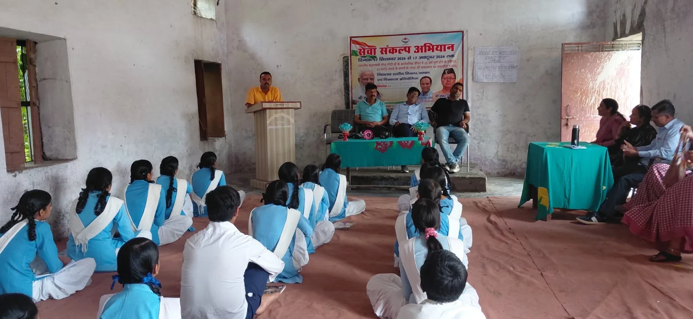
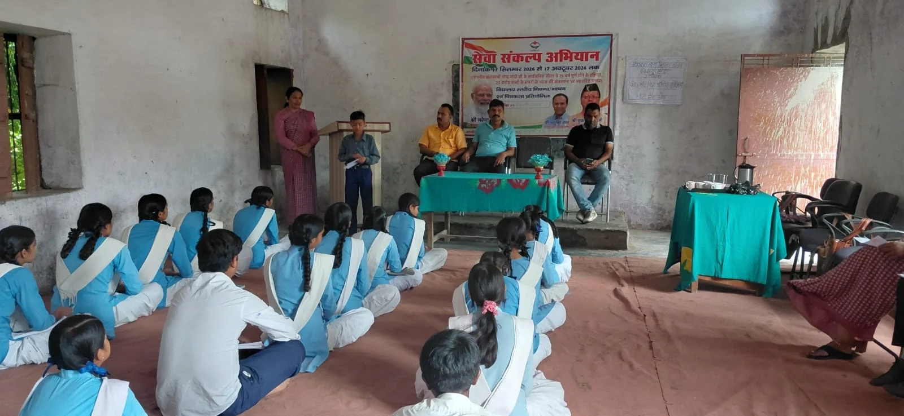

**हरिद्वार/रूडकी संवाददाता | आसिफ खान**

इकबालपुर। महालक्ष्मी शुगर मिल इकबालपुर के सहयोग से महालक्ष्मी इंटर कॉलेज, इकबालपुर में सेवा संकल्प अभियान के अंतर्गत विद्यालय स्तरीय निबंध, भाषण एवं चित्रकला प्रतियोगिताओं का आयोजन उत्साह और उमंग के साथ किया गया। प्रतियोगिताओं में छात्र-छात्राओं ने पूरे जोश के साथ प्रतिभाग करते हुए अपनी प्रतिभा, रचनात्मकता और अभिव्यक्ति क्षमता का शानदार प्रदर्शन किया।

कार्यक्रम में बीडीसी सदस्य बेहेडेकी सैदाबाद अंकित त्यागी मुख्य अतिथि के रूप में शामिल हुए। उनके साथ संजीव शर्मा एवं पत्रकार लियाकत कुरैशी भी मौजूद रहे। मुख्य अतिथि ने विद्यार्थियों से संवाद करते हुए उनका उत्साहवर्धन किया और प्रतियोगिताओं में उनकी सक्रिय भागीदारी की सराहना की।

**भाषण प्रतियोगिता में विद्यार्थियों ने दिखाया आत्मविश्वास**

भाषण प्रतियोगिता में हिमांशी कक्षा 8, अवन कक्षा 6, अन्नू, नाबिया, लाईबा, साक्षी कक्षा 11, निधि कक्षा 12 एवं खुशबू कक्षा 12 ने प्रतिभाग किया। विद्यार्थियों ने अपने विचारों को प्रभावशाली ढंग से प्रस्तुत करते हुए मंच पर आत्मविश्वास का परिचय दिया।

वहीं चित्रकला प्रतियोगिता में खुशी कक्षा 7, गरिमा कक्षा 7 एवं परिवैष्णवी कक्षा 7 ने हिस्सा लेकर अपनी कल्पनाशीलता और कलात्मक प्रतिभा को कागज पर उकेरा।

**“प्रतिभा को मंच और प्रोत्साहन मिलना जरूरी”**

मुख्य अतिथि अंकित त्यागी ने विद्यार्थियों को संबोधित करते हुए कहा कि बच्चों की प्रतिभा को निखारने के लिए उन्हें उचित मंच और निरंतर प्रोत्साहन मिलना बेहद जरूरी है। ऐसे कार्यक्रम विद्यार्थियों के आत्मविश्वास को मजबूत करने के साथ उनके व्यक्तित्व विकास में भी महत्वपूर्ण भूमिका निभाते हैं।

उन्होंने विद्यार्थियों को मेहनत, अनुशासन और आत्मविश्वास के साथ आगे बढ़ने के लिए प्रेरित किया। उन्होंने कहा कि शिक्षा जीवन की सबसे मजबूत नींव है और प्रतिभा को सही दिशा मिले तो विद्यार्थी भविष्य में समाज और देश के निर्माण में महत्वपूर्ण योगदान दे सकते हैं।

**जिस स्कूल में कभी विद्यार्थी थे, वहीं आज बने मुख्य अतिथि**

कार्यक्रम का सबसे खास और भावुक पहलू यह रहा कि मुख्य अतिथि अंकित त्यागी ने स्वयं महालक्ष्मी इंटर कॉलेज से शिक्षा ग्रहण की है। जिस विद्यालय की कक्षाओं में कभी वह विद्यार्थी बनकर बैठते थे, उसी विद्यालय में आज विद्यार्थियों के बीच मुख्य अतिथि के रूप में पहुंचना उनके लिए गौरव और विशेष अनुभव का अवसर रहा।

उनकी विद्यालय से जुड़ी इस आत्मीयता ने कार्यक्रम को एक अलग भावनात्मक रंग दिया। उन्होंने विद्यार्थियों को अपने अनुभवों से प्रेरणा लेते हुए लक्ष्य निर्धारित कर आगे बढ़ने का संदेश दिया।

**विद्यालय परिवार ने निभाई महत्वपूर्ण भूमिका**

कार्यक्रम में महालक्ष्मी इंटर कॉलेज के प्रबंधक अंकित कुमार एवं प्रधानाचार्य अजय कुमार सहित विद्यालय के शिक्षकगण मौजूद रहे। कार्यक्रम को सफल बनाने में श्रीमती ममता रानी, श्रीमती अलका रानी, श्रीमती भावना सिंघल, श्रीमती काजल रानी, श्री मनोज कुमार, श्री सतीश कुमार एवं श्री पंकज त्यागी सहित समस्त विद्यालय परिवार का महत्वपूर्ण सहयोग रहा।

कार्यक्रम के समापन पर विद्यालय परिवार की ओर से सभी अतिथियों का आभार व्यक्त किया गया। प्रतियोगिताओं में प्रतिभाग करने वाले सभी विद्यार्थियों की सराहना करते हुए उनके उज्ज्वल भविष्य की कामना की गई।
