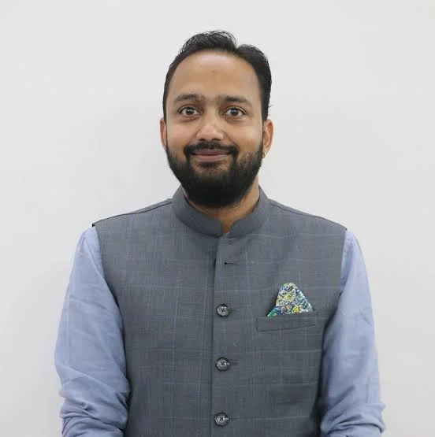
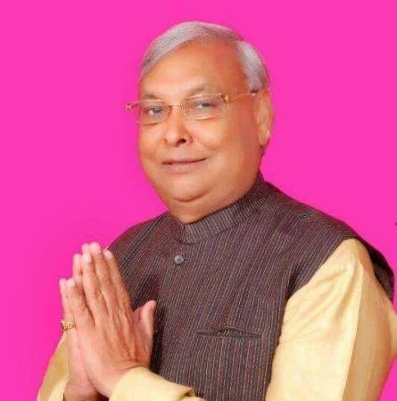
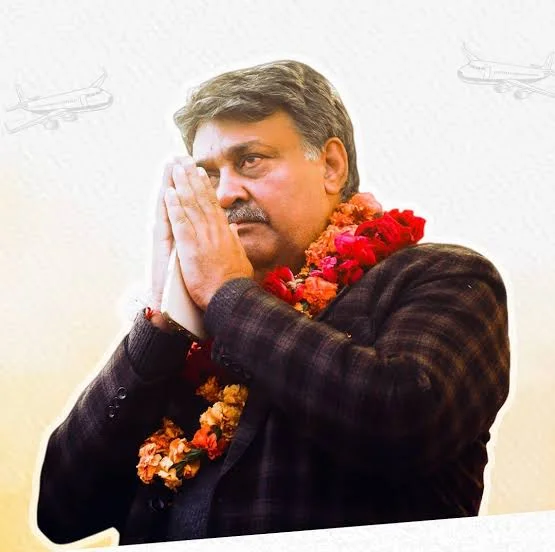
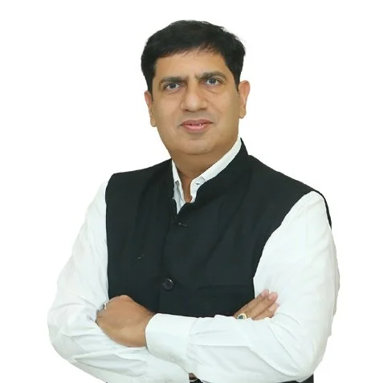

**रुड़की विशेष संवाददाता | आसिफ खान**

रुड़की विधानसभा में 2027 के चुनाव की सरगर्मी अभी से तेज होती दिखाई दे रही है। प्रदीप बत्रा के कैबिनेट मंत्री बनने के बाद जहां उनका राजनीतिक कद बढ़ा है, वहीं भाजपा के अंदर संभावित चेहरों और भविष्य के समीकरणों को लेकर चर्चाओं ने भी जोर पकड़ लिया है। इन चर्चाओं के बीच चैरब जैन का नाम तेजी से सुर्खियों में है।

सवाल अब सिर्फ 2027 के चुनाव का नहीं है, बल्कि यह भी है कि रुड़की में भाजपा की अगली राजनीतिक दिशा क्या होगी? मौजूदा विधायक और कैबिनेट मंत्री प्रदीप बत्रा के साथ पार्टी आगे बढ़ेगी या संगठन के भीतर सामने आ रहे दूसरे नामों पर भी गंभीर मंथन होगा—इस पर राजनीतिक नजरें टिक गई हैं।

**चैरब जैन की चर्चा ने बढ़ाई हलचल**

रुड़की की भाजपा राजनीति में चैरब जैन का नाम इस समय चर्चा के केंद्र में है। पूर्व विधायक सुरेश चंद्र जैन के परिवार से आने वाले चैरब जैन को लेकर स्थानीय राजनीतिक हलकों में संभावित भविष्य की भूमिका पर चर्चा हो रही है।

हालांकि भाजपा ने 2027 के लिए अभी कोई टिकट घोषित नहीं किया है, लेकिन चुनाव से काफी पहले किसी युवा चेहरे का नाम राजनीतिक चर्चाओं में आना अपने आप में रुड़की के बदलते समीकरणों की ओर इशारा करता है।

युवा चेहरा, पुराना राजनीतिक परिवार और भाजपा का संगठनात्मक आधार—चैरब जैन को लेकर यही तीन बिंदु सबसे ज्यादा चर्चा में हैं।

**सुरेश चंद्र जैन की सियासी विरासत फिर चर्चा में**

रुड़की की राजनीति में सुरेश चंद्र जैन का नाम नया नहीं है। वह 2002 और 2007 में रुड़की विधानसभा क्षेत्र से विधायक रहे। 2012 के चुनाव में प्रदीप बत्रा ने उन्हें चुनाव में हराया।

इसके बाद रुड़की की राजनीति में बड़ा बदलाव आया। प्रदीप बत्रा ने 2016 में भाजपा का दामन थामा और 2017 तथा 2022 में भाजपा के टिकट पर चुनाव जीतकर अपनी राजनीतिक पकड़ कायम रखी।

अब जब 2027 का चुनाव सामने है, तो सुरेश चंद्र जैन की राजनीतिक विरासत से जुड़े चैरब जैन के नाम की चर्चा ने पुराने राजनीतिक समीकरणों को फिर बहस के केंद्र में ला दिया है।

**यशपाल राणा भी तस्वीर से बाहर नहीं**

दूसरी तरफ कांग्रेस की राजनीति में यशपाल राणा का नाम भी रुड़की के संदर्भ में महत्वपूर्ण है। 2022 के विधानसभा चुनाव में वह कांग्रेस प्रत्याशी के तौर पर प्रदीप बत्रा के सामने चुनाव मैदान में थे।

इसलिए 2027 की संभावित राजनीतिक तस्वीर में भाजपा के अंदर चल रही चर्चाओं के साथ कांग्रेस की रणनीति पर भी नजर रहेगी।

**कैबिनेट मंत्री बनने के बाद बत्रा के सामने बड़ा सवाल**

प्रदीप बत्रा अब सिर्फ रुड़की के विधायक नहीं, बल्कि धामी सरकार में कैबिनेट मंत्री हैं। ऐसे में 2027 की राजनीति में उनके मंत्री पद की जिम्मेदारियां, क्षेत्रीय विकास, संगठनात्मक सक्रियता और जनता से जुड़े मुद्दे भी चर्चा का हिस्सा बनेंगे।

मंत्री बनने के बाद उनका राजनीतिक कद जरूर बढ़ा है, लेकिन चुनावी राजनीति में अंतिम फैसला पार्टी के टिकट और जनता के वोट से ही होगा।

**रुड़की भाजपा में कौन बनेगा अगला चेहरा?**

2027 से पहले रुड़की में सबसे बड़ा राजनीतिक सवाल यही बनता जा रहा है—

क्या भाजपा प्रदीप बत्रा के साथ ही चुनावी मैदान में उतरेगी?

क्या संगठन के भीतर किसी नए चेहरे पर भी विचार होगा?

**और सबसे अहम—**

क्या चैरब जैन का नाम आने वाले समय में सिर्फ चर्चा तक रहेगा या भाजपा की 2027 की रणनीति में उनकी भूमिका भी सामने आएगी?

फिलहाल किसी भी नाम पर भाजपा की आधिकारिक मुहर नहीं लगी है। लेकिन चैरब जैन के नाम की बढ़ती चर्चा ने रुड़की की भाजपा राजनीति में 2027 को लेकर बहस जरूर तेज कर दी है।

रुड़की की सियासत अब शांत नहीं—2027 की बिसात पर पुराने चेहरे, मौजूदा सत्ता और नई पीढ़ी के नाम आमने-सामने चर्चा में हैं।
