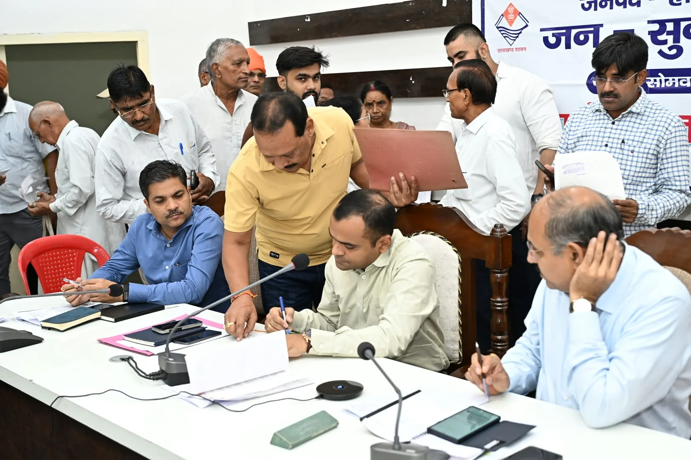
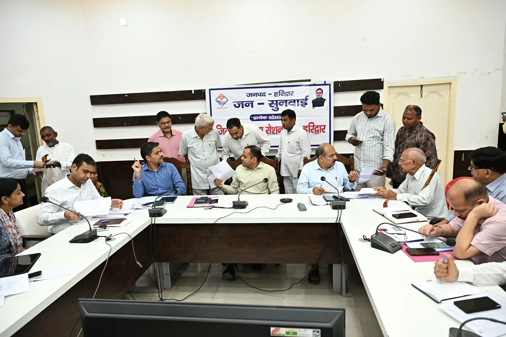
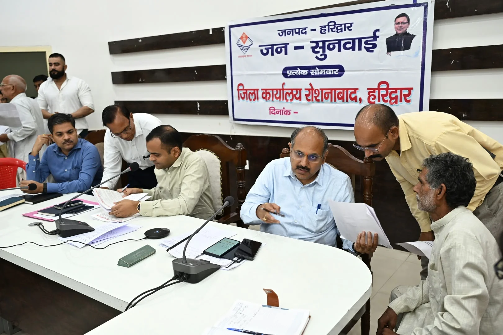
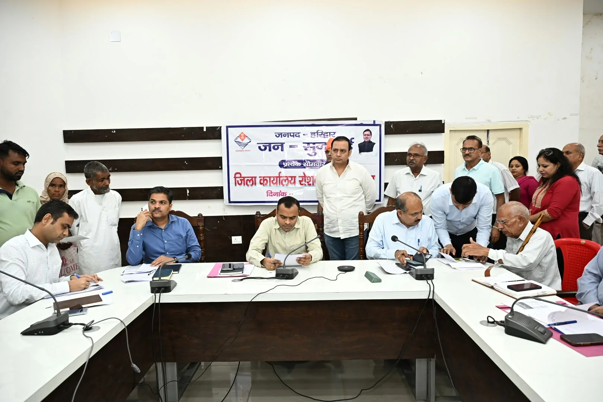

**हरिद्वार संवाददाता | आसिफ खान**

हरिद्वार। जनपदवासियों की समस्याओं के त्वरित और समयबद्ध निस्तारण को लेकर जिला प्रशासन ने सख्त रुख अपनाया है। जिलाधिकारी मयूर दीक्षित की अध्यक्षता में जिला कार्यालय सभागार में आयोजित जनसुनवाई कार्यक्रम में विभिन्न विभागों से जुड़ी 65 शिकायतें और समस्याएं दर्ज की गईं। इनमें से 32 मामलों का मौके पर ही निस्तारण किया गया, जबकि शेष शिकायतों को संबंधित विभागों के अधिकारियों के पास तत्काल कार्रवाई के लिए भेजा गया।

जनसुनवाई में राजस्व, भूमि विवाद, विद्युत, अतिक्रमण, जलभराव, पेयजल, राशन कार्ड और सड़क जैसी समस्याएं प्रमुख रूप से सामने आईं। बड़ी संख्या में फरियादियों ने अधिकारियों के समक्ष अपनी समस्याएं रखते हुए शीघ्र समाधान की मांग की।

**सार्वजनिक रास्ते पर कब्जे की शिकायत**

पीतपुर निवासी ईसमपाल पुत्र नेकीराम ने शिकायत दर्ज कराई कि उनके घर के सामने स्थित सार्वजनिक रास्ते पर पड़ोस के कुछ लोगों द्वारा कथित रूप से दीवार खड़ी कर कब्जे का प्रयास किया जा रहा है। शिकायतकर्ता ने निर्माण रोकने और मामले में आवश्यक कार्रवाई की मांग की।

**दीप गंगा अपार्टमेंट की समस्याएं भी पहुंचीं जनसुनवाई में**

सत्यवचन सचान और सुनील दत्त ने दीप गंगा रेसिडेंशियल कॉम्प्लेक्स प्लॉट-1 वेलफेयर सोसाइटी की नव निर्वाचित प्रबंध कार्यकारिणी को कार्यभार हस्तांतरित कराने की मांग रखी। वहीं सीनियर सिटीजन वेलफेयर एसोसिएशन, दीप गंगा अपार्टमेंट, सिडकुल के निवासियों ने बिल्डर द्वारा आवंटियों से किए गए वादों के अनुरूप मंदिर, कम्युनिटी सेंटर, स्विमिंग पूल, पार्क और अन्य मूलभूत सुविधाएं उपलब्ध कराने के संबंध में कार्रवाई की मांग की।

**जलभराव और जर्जर सड़क ने बढ़ाई लोगों की परेशानी**

ज्ञानलोक कॉलोनी गली नंबर-10 के निवासियों ने शिकायत की कि समीप की कॉलोनी से उचित जल निकासी नहीं होने के कारण उनके घरों के पीछे गंदा पानी जमा हो जाता है। लोगों ने जल निकासी की समस्या का स्थायी समाधान कराने की मांग की।

वहीं सलेमपुर क्षेत्रवासियों ने मुख्य सड़क की जर्जर और बदहाल स्थिति का मुद्दा उठाते हुए जल्द सड़क निर्माण कराने की मांग की।

**सोलर पैनल सब्सिडी के भुगतान की मांग**

तिरुपति इंक्लेव निवासी शिवानी पत्नी भारत भूषण ने घरेलू कनेक्शन पर लगाए गए सोलर पैनल की उत्तराखंड सरकार द्वारा देय सब्सिडी का शीघ्र भुगतान कराने की मांग को लेकर प्रार्थना पत्र दिया।

**डीएम की दो टूक—लापरवाही हुई तो होगी कार्रवाई**

जिलाधिकारी मयूर दीक्षित ने अधिकारियों को स्पष्ट निर्देश दिए कि जनसुनवाई में दर्ज प्रत्येक शिकायत का समयबद्ध और प्राथमिकता के आधार पर निस्तारण सुनिश्चित किया जाए। उन्होंने कहा कि शिकायतों के निस्तारण में किसी भी प्रकार की लापरवाही या शिथिलता बर्दाश्त नहीं की जाएगी। लापरवाही सामने आने पर संबंधित अधिकारी के विरुद्ध आवश्यक कार्रवाई सुनिश्चित की जाएगी।

डीएम ने यह भी निर्देश दिए कि जिन शिकायतों में स्थलीय निरीक्षण आवश्यक है, उनमें संबंधित अधिकारी आपसी समन्वय के साथ मौके पर पहुंचकर समस्या का समाधान सुनिश्चित करें।

उन्होंने अधिकारियों से कहा कि जनता की शिकायतों को केवल कागजी कार्रवाई तक सीमित न रखा जाए, बल्कि संवेदनशीलता के साथ उनकी वास्तविक समस्या का समाधान किया जाए।

**सीएम हेल्पलाइन की लंबित शिकायतों पर भी प्रशासन सख्त**

बैठक में सीएम हेल्पलाइन पर दर्ज शिकायतों की भी समीक्षा की गई। मुख्य विकास अधिकारी ने अधिकारियों को निर्देश दिए कि हेल्पलाइन पर दर्ज शिकायतों का गंभीरता से संज्ञान लेते हुए उनका त्वरित निस्तारण किया जाए।

उन्होंने अधिकारियों को शिकायतकर्ताओं से दूरभाष पर संपर्क करने, आवश्यकता पड़ने पर स्थलीय निरीक्षण करने और शिकायतकर्ता से स्वयं मिलकर समस्या का समाधान सुनिश्चित करने के निर्देश दिए।

बैठक में सामने आया कि 36 दिन से अधिक समय से लंबित शिकायतों के निस्तारण पर विशेष ध्यान देने की जरूरत है। समीक्षा के दौरान एल-1 स्तर पर 259 और एल-2 स्तर पर 97 शिकायतें लंबित पाई गईं। अधिकारियों को इन शिकायतों के शीघ्र निस्तारण के निर्देश दिए गए।

जनसुनवाई में अधिकारियों को साफ संदेश दिया गया कि जनता की शिकायतों का समाधान प्राथमिकता है और लंबित मामलों को अनावश्यक रूप से खींचने की गुंजाइश नहीं है।

बैठक में मुख्य विकास अधिकारी डॉ. लालित नारायण मिश्र, अपर जिलाधिकारी वित्त एवं राजस्व वैभव गुप्ता, अपर जिलाधिकारी प्रशासन जितेंद्र कुमार, जिला विकास अधिकारी कमलेश कुमार पंत, एसीएमओ डॉ. अनिल वर्मा, लोनिवि अधिशासी अभियंता योगेश कुमार, जिला खाद्य सुरक्षा अधिकारी महिमानंद जोशी, महाप्रबंधक जिला उद्योग केंद्र उत्तम कुमार तिवारी, जिला पर्यटन अधिकारी सुशील नौटियाल, जिला आपदा प्रबंधन अधिकारी मीरा रावत, जिला प्रोवेशन अधिकारी अविनाश भदौरिया, जिला अर्थ एवं संख्या अधिकारी नलिनी ध्यानी, अधिशासी अभियंता यूपीसीएल दीपक सैनी, सहायक श्रम आयुक्त प्रशांत कुमार सहित जिला स्तरीय अधिकारी और विभिन्न क्षेत्रों से आए फरियादी मौजूद रहे।
