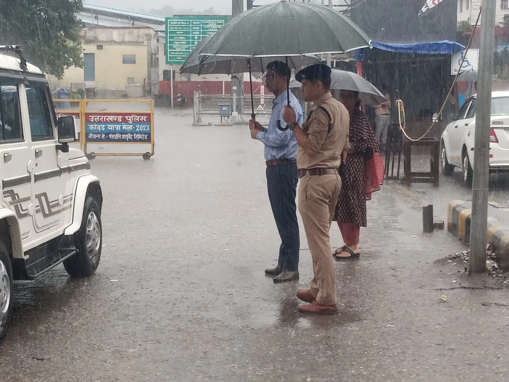
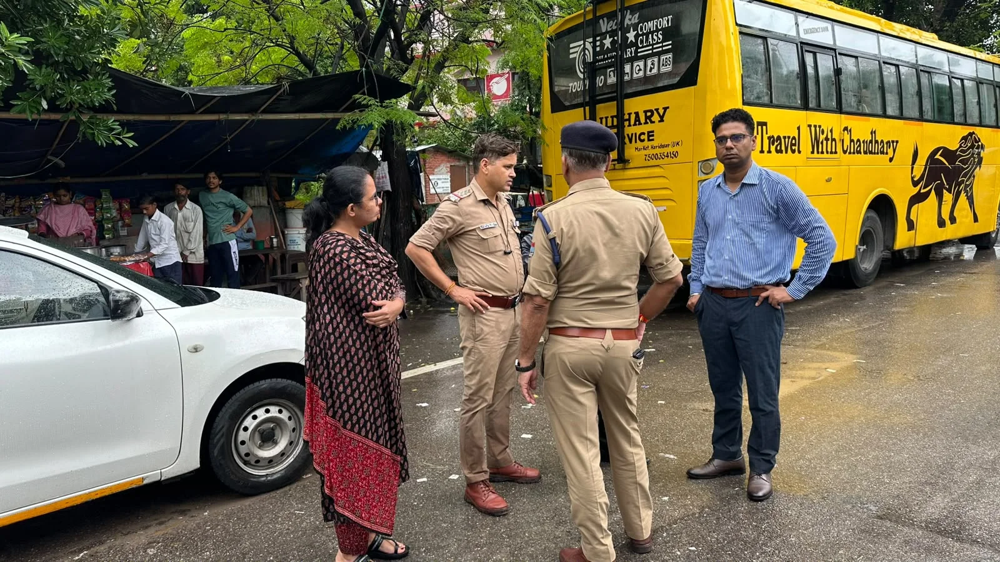
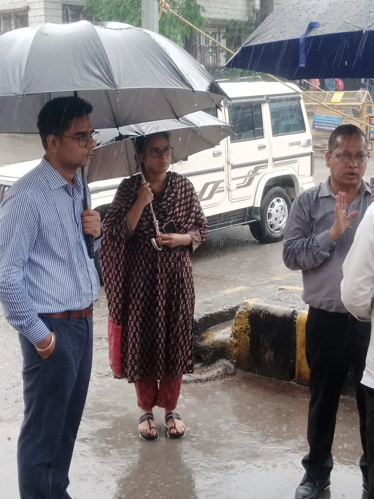

**हरिद्वार संवाददाता | आसिफ खान**

हरिद्वार। रेलवे स्टेशन क्षेत्र में लगातार बढ़ते यातायात दबाव और ऑटो, विक्रम व ई-रिक्शा के अनियंत्रित ठहराव से पैदा होने वाली समस्याओं को लेकर जिला प्रशासन ने अब व्यवस्था को नए सिरे से व्यवस्थित करने की कवायद शुरू कर दी है। जिलाधिकारी मयूर दीक्षित के निर्देश पर सोमवार को प्रशासन, पुलिस और परिवहन विभाग के अधिकारियों ने हरिद्वार रेलवे स्टेशन क्षेत्र का संयुक्त स्थलीय निरीक्षण कर यातायात व्यवस्था का जायजा लिया।

निरीक्षण के दौरान स्टेशन के मुख्य प्रवेश मार्ग, आसपास के क्षेत्रों तथा यात्रियों के आवागमन वाले स्थानों का बारीकी से निरीक्षण किया गया। अधिकारियों ने ऑटो, विक्रम और ई-रिक्शा के ठहराव, यात्रियों की पिक-अप एवं ड्रॉप व्यवस्था तथा भीड़भाड़ के दौरान उत्पन्न होने वाली यातायात समस्याओं को लेकर मौके पर मंथन किया।

**स्टेशन के सामने बेतरतीब खड़े वाहनों पर लगेगी लगाम**

निरीक्षण में सामने आया कि रेलवे स्टेशन के मुख्य प्रवेश मार्ग पर वाहनों के अनावश्यक रूप से खड़े रहने से यातायात प्रभावित होता है। इसे देखते हुए ऑटो, विक्रम और ई-रिक्शा के लिए अलग होल्डिंग एरिया विकसित करने की कार्ययोजना पर चर्चा की गई।

प्रस्तावित व्यवस्था के अनुसार स्टेशन के पिक-अप क्षेत्र में एक समय में आवश्यकता के अनुरूप सीमित संख्या में ही वाहनों को प्रवेश दिया जाएगा। बाकी वाहनों को निर्धारित होल्डिंग एरिया में व्यवस्थित रूप से खड़ा कराया जाएगा। इससे स्टेशन के मुख्य मार्ग पर वाहनों की भीड़ कम करने और यात्रियों के आवागमन को सुगम बनाने में मदद मिलेगी।

**29 सितंबर को यूनियन पदाधिकारियों के साथ होगी निर्णायक बैठक**

स्थलीय निरीक्षण के बाद प्रशासन ने अगला कदम भी तय कर दिया है। 29 सितंबर को ऑटो-विक्रम यूनियन तथा ई-रिक्शा यूनियन के पदाधिकारियों के साथ बैठक आयोजित की जाएगी।

बैठक में यूनियन पदाधिकारियों से सुझाव लिए जाएंगे और उनकी सहमति एवं व्यावहारिक सुझावों के आधार पर होल्डिंग एरिया, पिक-अप/ड्रॉप व्यवस्था तथा वाहनों के संचालन की विस्तृत कार्ययोजना तैयार की जाएगी।

**प्रशासन-पुलिस-परिवहन विभाग का संयुक्त प्लान**

संयुक्त निरीक्षण में नगर मजिस्ट्रेट हरगिरि, एआरटीओ प्रशासन निखिल शर्मा, एआरटीओ प्रवर्तन नेहा झा, क्षेत्राधिकारी नगर शिशुपाल सिंह नेगी तथा यातायात निरीक्षक संदीप नेगी सहित संबंधित अधिकारी मौजूद रहे।

जिला प्रशासन, पुलिस और परिवहन विभाग के बीच समन्वय के साथ तैयार की जा रही इस व्यवस्था का उद्देश्य रेलवे स्टेशन क्षेत्र में यातायात का निर्बाध संचालन, यात्रियों की सुविधा और ऑटो-विक्रम-ई-रिक्शा के व्यवस्थित संचालन को सुनिश्चित करना है।

अब स्टेशन के मुख्य प्रवेश मार्ग पर बेतरतीब वाहनों की भीड़ के बजाय निर्धारित व्यवस्था लागू करने की दिशा में प्रशासन ने कदम बढ़ा दिए हैं। 29 सितंबर की बैठक के बाद इस व्यवस्था को अंतिम रूप दिए जाने की उम्मीद है।
