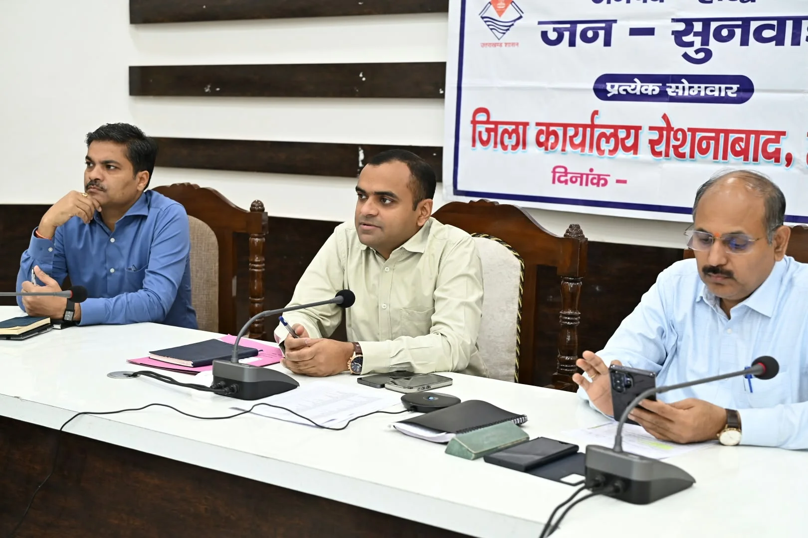
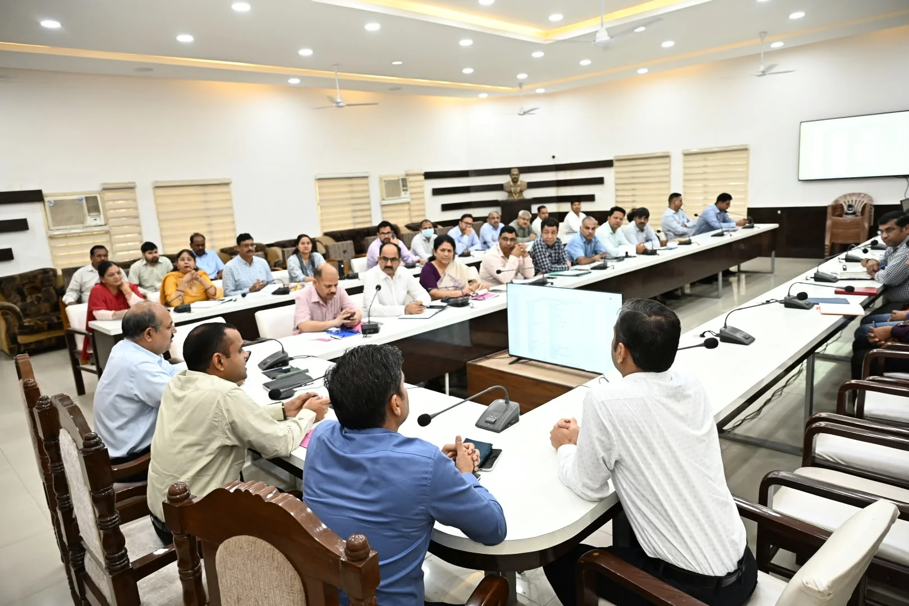
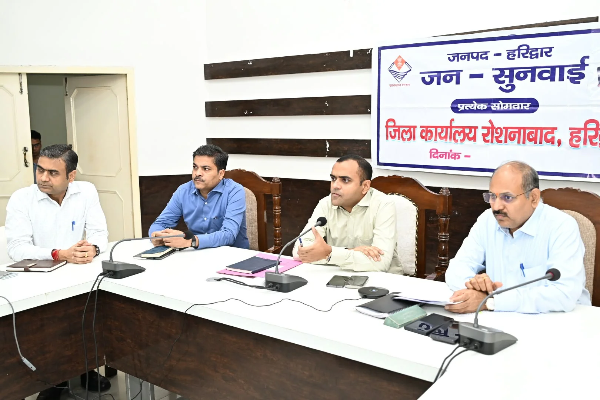

**हरिद्वार संवाददाता | आसिफ खान**

हरिद्वार। जनपद में विकास योजनाओं की रफ्तार और विभागीय कार्यप्रणाली को लेकर जिलाधिकारी मयूर दीक्षित ने सोमवार को जिला कार्यालय सभागार में अधिकारियों की समीक्षा बैठक ली। बैठक में जिला योजना, विभिन्न विभागों की योजनाओं, निर्माण कार्यों और मुख्यमंत्री घोषणाओं की प्रगति की गहन समीक्षा करते हुए डीएम ने अधिकारियों को समयबद्धता, गुणवत्ता और जवाबदेही के साथ काम करने के सख्त निर्देश दिए।

**जिला योजना का पैसा खर्च करने में देरी नहीं चलेगी**

जिलाधिकारी ने स्पष्ट निर्देश दिए कि जिला योजना के अंतर्गत स्वीकृत धनराशि का शत-प्रतिशत व्यय निर्धारित समय सीमा के भीतर सुनिश्चित किया जाए। जिन विभागों में विकास कार्यों की प्रगति धीमी है, वहां तत्काल आवश्यक कदम उठाकर काम में तेजी लाई जाए।

उन्होंने अधिकारियों को प्रत्येक परियोजना की नियमित मॉनिटरिंग करने तथा उसकी भौतिक और वित्तीय प्रगति की अद्यतन रिपोर्ट उपलब्ध कराने के निर्देश दिए। डीएम ने साफ कहा कि जनहित से जुड़ी योजनाओं में अनावश्यक देरी किसी भी स्थिति में स्वीकार नहीं की जाएगी।

**मुख्यमंत्री घोषणाओं पर विशेष फोकस**

बैठक में मुख्यमंत्री द्वारा जनपद के लिए की गई घोषणाओं की विभागवार समीक्षा भी की गई। जिलाधिकारी ने निर्देश दिए कि मुख्यमंत्री घोषणाओं को सर्वोच्च प्राथमिकता देते हुए लंबित कार्यों का शीघ्र निस्तारण कराया जाए और योजनाओं को कागजों से निकालकर धरातल पर उतारा जाए।

**यूकेगेम्स पोर्टल पर परिसंपत्तियों का डिजिटल रिकॉर्ड होगा तैयार**

जिलाधिकारी ने सभी विभागों को उत्तराखंड यूकेगेम्स पोर्टल पर अपनी-अपनी विभागीय परिसंपत्तियों का विवरण शीघ्र अपलोड करने के निर्देश दिए। उन्होंने कहा कि जनपद की परिसंपत्तियों का डिजिटल रिकॉर्ड तैयार करना आवश्यक है, इसलिए सभी विभाग निर्धारित प्रारूप में पूरी और सही जानकारी समय पर उपलब्ध कराएं।

**लापरवाही मिली तो तय होगी जवाबदेही**

बैठक में विभिन्न विभागों की योजनाओं की भौतिक एवं वित्तीय प्रगति, निर्माण कार्यों, आधारभूत सुविधाओं और विकास परियोजनाओं की समीक्षा की गई। जिलाधिकारी ने अधिकारियों को आपसी समन्वय के साथ काम करते हुए योजनाओं का लाभ समय पर आमजन तक पहुंचाने पर जोर दिया।

डीएम ने स्पष्ट शब्दों में कहा कि विकास कार्यों में पारदर्शिता, गुणवत्ता और समयबद्धता से कोई समझौता नहीं होगा। किसी भी स्तर पर लापरवाही या अनावश्यक देरी सामने आने पर संबंधित अधिकारियों की जवाबदेही तय की जाएगी।

**ये अधिकारी रहे मौजूद**

बैठक में मुख्य विकास अधिकारी डॉ. ललित नारायण मिश्र, अपर जिलाधिकारी वित्त एवं राजस्व वैभव गुप्ता, अपर जिलाधिकारी प्रशासन जितेंद्र कुमार, जिला विकास अधिकारी कमलेश कुमार पंत, एसीएमओ डॉ. अनिल वर्मा, लोनिवि अधिशासी अभियंता हरिद्वार योगेश कुमार, जिला अर्थ एवं संख्या अधिकारी नलिनी ध्यानी, जिला खाद्य सुरक्षा अधिकारी महिमानंद जोशी, सहायक श्रम आयुक्त प्रशांत कुमार, महाप्रबंधक जिला उद्योग केंद्र उत्तम कुमार तिवारी, जिला पर्यटन अधिकारी सुशील नौटियाल, जिला आपदा प्रबंधन अधिकारी मीरा रावत, जिला प्रोवेशन अधिकारी अविनाश भदौरिया, अधिशासी अभियंता यूपीसीएल दीपक सैनी सहित संबंधित अधिकारी एवं कर्मचारी मौजूद रहे।
