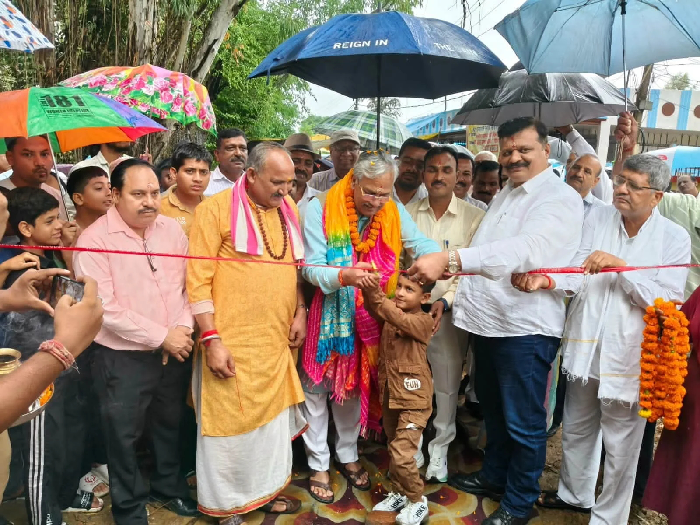
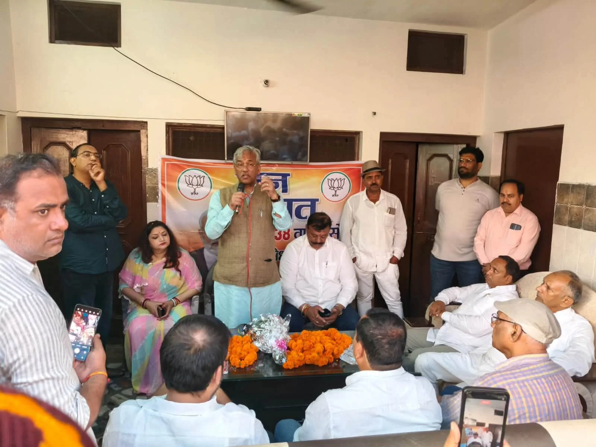
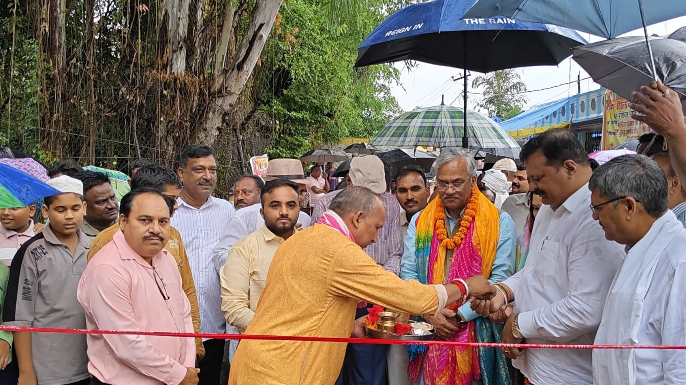

**रुड़की संवाददाता | आसिफ खान**

रुड़की। खानपुर विधानसभा क्षेत्र के ग्राम बैंघेड़ी में रविवार को विकास कार्यों को गति देते हुए सड़क का उद्घाटन किया गया। हरिद्वार सांसद एवं पूर्व मुख्यमंत्री त्रिवेंद्र सिंह रावत ने सड़क का उद्घाटन करते हुए कहा कि ग्रामीण क्षेत्रों में मूलभूत सुविधाओं को मजबूत करना सरकार की प्राथमिकता है। उन्होंने कहा कि बेहतर सड़कें केवल आवागमन आसान नहीं करतीं, बल्कि गांवों के आर्थिक और सामाजिक विकास को भी नई दिशा देती हैं।

सांसद त्रिवेंद्र सिंह रावत ने कहा कि केंद्र और राज्य सरकार जनहित से जुड़े विकास कार्यों को लगातार आगे बढ़ा रही है। ग्रामीण क्षेत्रों में सड़क, बिजली, पानी सहित बुनियादी सुविधाओं को मजबूत करने पर विशेष जोर दिया जा रहा है। उन्होंने कहा कि विकास योजनाओं का लाभ अंतिम व्यक्ति तक पहुंचाना सरकार की प्राथमिकता है।

**चैंपियन बोले—गांवों का विकास सामूहिक जिम्मेदारी**

कार्यक्रम में पूर्व विधायक कुंवर प्रणव सिंह चैंपियन ने कहा कि क्षेत्र के समग्र विकास के लिए सड़क, बिजली, पानी और अन्य मूलभूत सुविधाओं को मजबूत करना बेहद जरूरी है। उन्होंने बैंघेड़ी समेत खानपुर विधानसभा क्षेत्र के गांवों में विकास कार्यों को आगे बढ़ाने के लिए सामूहिक प्रयासों की आवश्यकता बताई। उन्होंने सड़क निर्माण को क्षेत्रवासियों के लिए महत्वपूर्ण सुविधा बताते हुए संबंधित लोगों का आभार जताया।

रानी देवयानी सिंह ने कहा कि ग्रामीण क्षेत्रों में होने वाले विकास कार्यों का सीधा लाभ आमजन को मिलता है। बेहतर सड़क सुविधा से ग्रामीणों का आवागमन सुगम होगा और गांव के विकास को नई गति मिलेगी। उन्होंने जनता की आवश्यकताओं के अनुरूप विकास कार्यों को निरंतर आगे बढ़ाने पर जोर दिया।

**जनप्रतिनिधियों और ग्रामीणों की रही मौजूदगी**

कार्यक्रम में राज्य मंत्री श्यामवीर सैनी, ग्राम प्रधान नरेंद्र सिंह, योगेंद्र सिंह पुंडीर, जिला महामंत्री सागर गोयल, अक्षय प्रताप सिंह, संजय प्रजापति, जिला मीडिया प्रभारी पंकज नंदा, पार्षद मनोज मेहरा, पार्षद यूजुर प्रजापति, डॉ. नवनीत शर्मा, विक्रम गर्ग, सुमन रौतेला, देशपाल रोड, सुबोध शर्मा, अमित चौधरी, भूपेंद्र पुंडीर, महावीर सिंह, गुरजिंदर सिंह, सचिन पंवार, कवित कुमार, लखमीर सिंह, एस.एन. सिंह, बी.के. पांडे, एम. विश्वास, धर्म सिंह पुंडीर, जावेद, बीना नेगी, ललित पाल, विजय सिंह पंवार, लीला धर मंडोली, देवेंद्र त्यागी सहित क्षेत्र के गणमान्य लोग एवं बड़ी संख्या में ग्रामीण मौजूद रहे।

**सड़क उद्घाटन के बाद ‘मन की बात’ का सामूहिक श्रवण**

सड़क उद्घाटन कार्यक्रम के बाद सभी अतिथि एवं कार्यकर्ता भाजपा अल्पसंख्यक मोर्चा के प्रदेश मंत्री अफजल अली के निवास पर पहुंचे, जहां प्रधानमंत्री नरेंद्र मोदी के ‘मन की बात’ कार्यक्रम का सामूहिक रूप से श्रवण किया गया। कार्यक्रम का संचालन अफजल अली ने किया।

उपस्थित लोगों ने प्रधानमंत्री के संबोधन को ध्यानपूर्वक सुना। इस दौरान समाज और राष्ट्र के विकास में जनभागीदारी की भूमिका पर चर्चा हुई। वक्ताओं ने कहा कि ‘मन की बात’ के माध्यम से देशभर में किए जा रहे सकारात्मक कार्यों और जनभागीदारी की प्रेरणादायक पहल लोगों तक पहुंचती है।

कार्यक्रम के दौरान जनप्रतिनिधियों एवं कार्यकर्ताओं ने कहा कि विकास कार्यों के साथ समाज के प्रत्येक वर्ग को साथ लेकर आगे बढ़ना और जनसेवा की भावना को मजबूत करना समय की आवश्यकता है। कार्यक्रम का समापन उपस्थित लोगों के प्रति आभार व्यक्त करते हुए किया गया।
