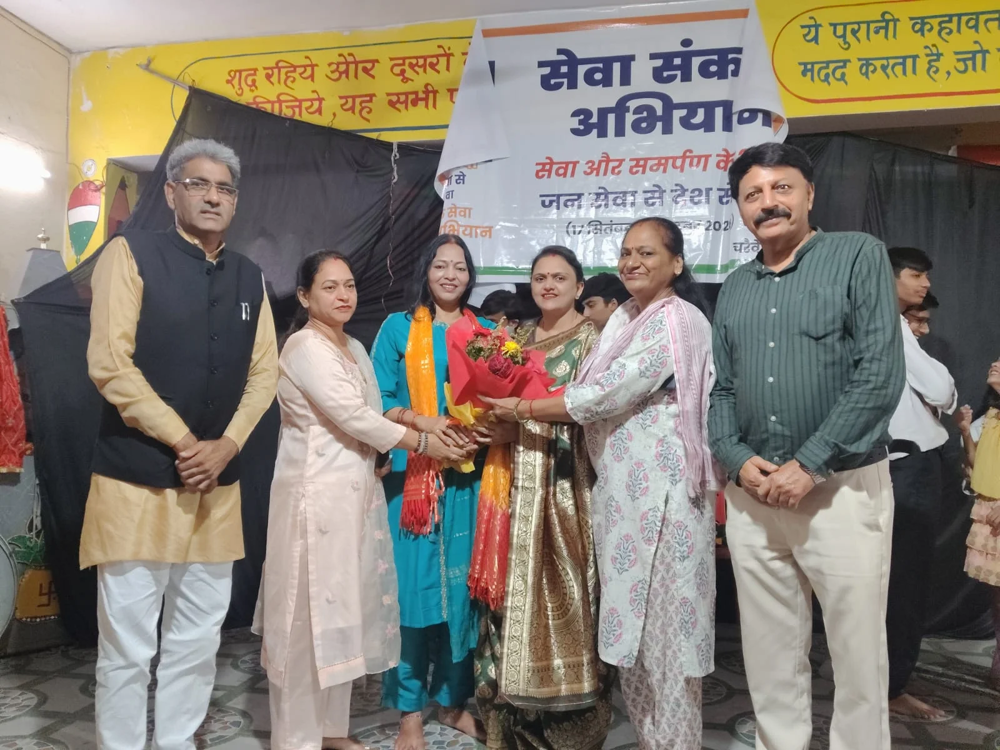
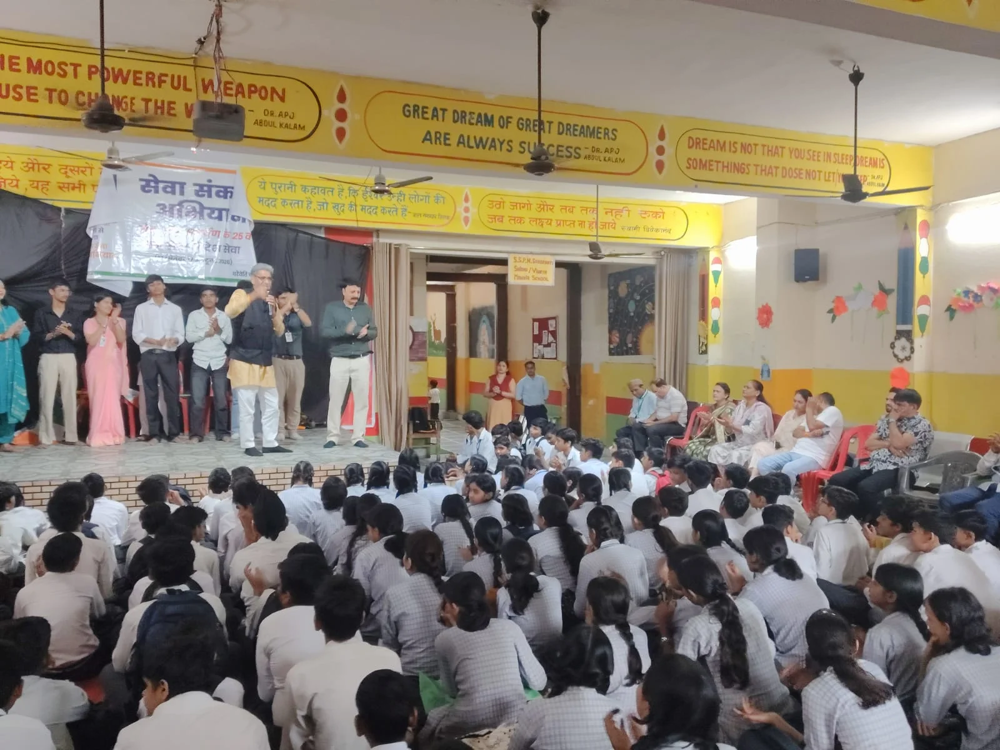
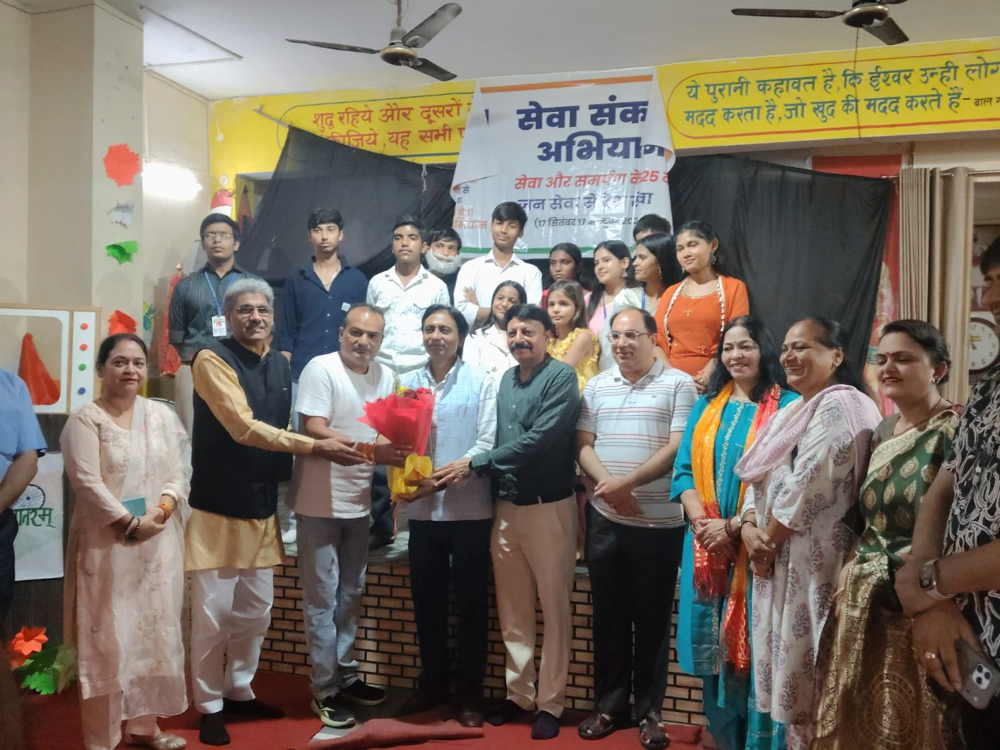

**रुड़की संवाददाता | आसिफ खान**

रुड़की । प्रधानमंत्री नरेंद्र मोदी के सार्वजनिक जीवन में सेवा, समर्पण और सुशासन के 25 वर्ष पूर्ण होने के अवसर पर भाजपा के ‘सेवा संकल्प अभियान’ के अंतर्गत रुड़की में ‘नमो सेवा—अनकही कहानियाँ’ कार्यक्रम का भव्य आयोजन किया गया। सरस्वती शिशु विद्यालय में आयोजित नाट्य प्रस्तुति में कलाकारों ने नरेंद्र मोदी के जीवन संघर्ष, सेवा भावना और सार्वजनिक जीवन से जुड़े विभिन्न प्रसंगों को अभिनय और संवादों के माध्यम से मंच पर जीवंत किया।

कार्यक्रम के दौरान विद्यालय परिसर में उत्साह का माहौल रहा। छात्र-छात्राओं ने नाट्य प्रस्तुति को उत्साहपूर्वक देखा और कलाकारों का उत्साहवर्धन किया। प्रस्तुति के माध्यम से प्रधानमंत्री मोदी के सार्वजनिक जीवन की यात्रा और सेवा से जुड़े संदेशों को दर्शकों तक पहुंचाने का प्रयास किया गया।

**राज्य मंत्री शोभाराम प्रजापति ने बताया प्रेरणादायक**

कार्यक्रम के मुख्य अतिथि राज्य मंत्री शोभाराम प्रजापति ने कहा कि प्रधानमंत्री नरेंद्र मोदी का जीवन युवाओं और विद्यार्थियों के लिए प्रेरणा का विषय है। उन्होंने कहा कि कठिन परिस्थितियों के बीच सार्वजनिक जीवन में आगे बढ़ते हुए नरेंद्र मोदी ने सेवा और राष्ट्रहित को अपने जीवन का प्रमुख उद्देश्य बनाया।

उन्होंने विद्यार्थियों से आह्वान किया कि वे अपने लक्ष्य के प्रति समर्पित रहें और देश एवं समाज के प्रति अपनी जिम्मेदारियों को समझें।

**नाट्य प्रस्तुति ने खींचा ध्यान**

भाजपा नेता अनिल शर्मा ने नाट्य प्रस्तुति की सराहना करते हुए कहा कि प्रधानमंत्री नरेंद्र मोदी के जीवन से जुड़े महत्वपूर्ण प्रसंगों को नाटक के माध्यम से प्रभावी ढंग से प्रस्तुत किया गया। उन्होंने नाटक के निर्देशक एवं भाजपा सांस्कृतिक प्रकोष्ठ के जिला संयोजक नरेंद्र आहूजा की भूमिका की सराहना की।

उन्होंने कहा कि इस तरह की सांस्कृतिक प्रस्तुतियां विद्यार्थियों तक किसी विषय को रोचक तरीके से पहुंचाने का माध्यम बनती हैं और उनमें देश एवं समाज के प्रति जिम्मेदारी की भावना विकसित करने में मदद कर सकती हैं।

**समापन पर गूंजे नारे**

नाट्य प्रस्तुति के समापन पर विद्यालय के छात्र-छात्राओं में खासा उत्साह दिखाई दिया। कार्यक्रम स्थल पर “मोदी है तो मुमकिन है” के नारे भी लगाए गए। आयोजकों ने नाट्य दल और कार्यक्रम में भाग लेने वाले विद्यार्थियों का उत्साहवर्धन किया।

**ये रहे मौजूद**

इस अवसर पर विद्यालय के उप प्रबंधक विवेक कंबोज, मंडल अध्यक्ष सुमित अग्रवाल, पार्षद नीतू शर्मा, भाजपा जिला मीडिया प्रभारी पंकज नंदा, सावित्री मंगला, पूजा नंदा, प्रमोद चौधरी, हरीश शर्मा, अवनीश त्यागी, राजकुमार उपाध्याय, विद्यालय के प्रधानाचार्य, शिक्षकगण तथा बड़ी संख्या में छात्र-छात्राएं उपस्थित रहे।
