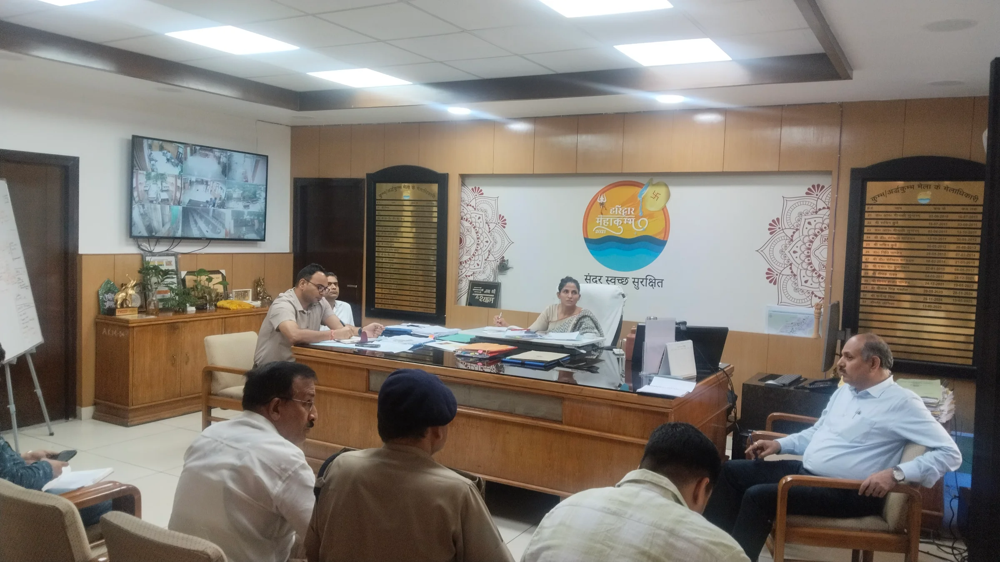
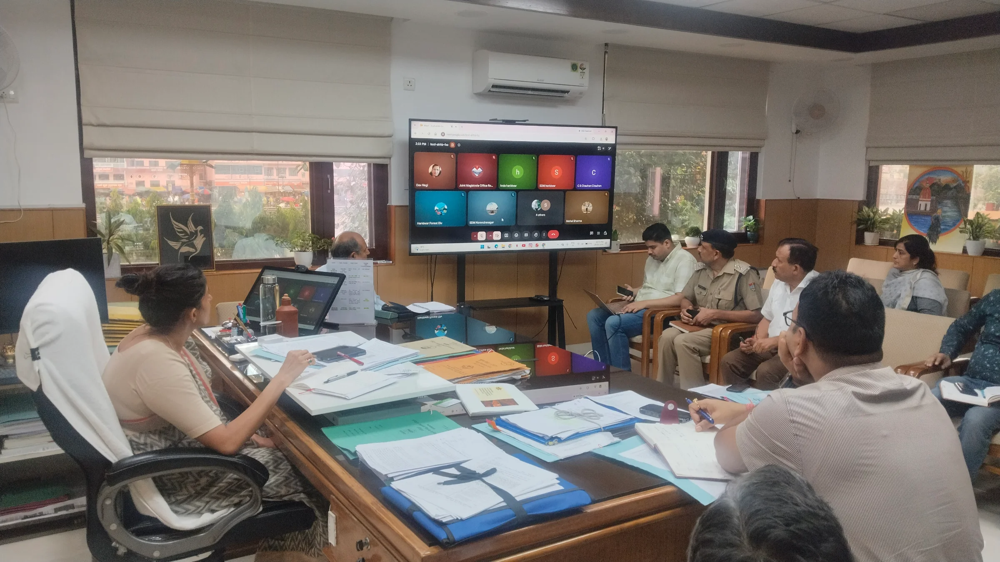
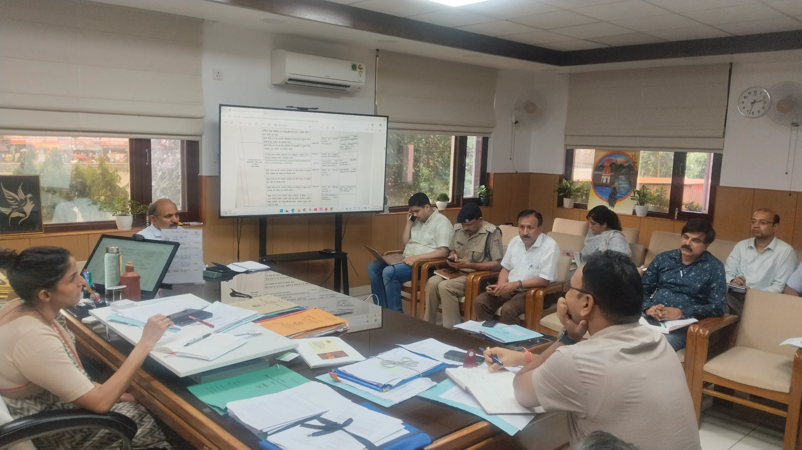

**हरिद्वार संवाददाता | आसिफ खान**

हरिद्वार। कुंभ मेला-2027 की तैयारियों को लेकर मेला प्रशासन अब किसी भी स्तर पर ढिलाई के मूड में नहीं है। करोड़ों रुपये की योजनाओं और दर्जनों निर्माण कार्यों के बीच समयबद्धता, गुणवत्ता और मौके पर वास्तविक प्रगति की निगरानी को लेकर प्रशासन ने सख्त रुख अपनाया है। अधिकारियों को साफ निर्देश दिए गए हैं कि फाइलों में प्रगति दिखाने के बजाय जमीन पर काम की हकीकत परखी जाए।

मेला नियंत्रण भवन में सोमवार को मेलाधिकारी सोनिका ने कुंभ से जुड़े कार्यों की निगरानी के लिए नियुक्त अधिकारियों की बैठक लेकर एक-एक व्यवस्था की समीक्षा की। उन्होंने अधिकारियों को नियमित स्थलीय निरीक्षण करने, कार्यों की प्रगति और गुणवत्ता की रिपोर्ट तत्काल मेला नियंत्रण कक्ष को उपलब्ध कराने तथा निगरानी व्यवस्था को और प्रभावी बनाने के निर्देश दिए।

**सीसीटीवी बंद मिला तो सवाल तय**

कुंभ क्षेत्र में चल रहे कार्यस्थलों पर निगरानी के लिए लगाए गए सीसीटीवी कैमरों को लगातार चालू रखने के निर्देश दिए गए हैं। मेला प्रशासन का जोर अब ऐसी निगरानी व्यवस्था पर है, जिससे निर्माण स्थलों की गतिविधियों और कार्यों की प्रगति पर लगातार नजर रखी जा सके।

मेलाधिकारी ने स्पष्ट किया कि स्वीकृत कार्यों को निर्धारित समयसीमा के भीतर पूरा करना होगा। बड़ी योजनाओं में जरूरत पड़ने पर दिन-रात काम कराकर समय पर कार्य पूरा कराने के निर्देश दिए गए हैं।

**गुणवत्ता जांच में खामी मिली तो सुधार भी, कार्रवाई भी**

कुंभ की तैयारियों में गुणवत्ता को लेकर भी प्रशासन ने निगरानी का दायरा बढ़ाया है। सभी कार्यों की नियमित थर्ड पार्टी गुणवत्ता जांच कराने के निर्देश दिए गए हैं। जांच में कमी मिलने पर उसे तत्काल दूर कराने के साथ नियमानुसार कार्रवाई सुनिश्चित करने को कहा गया है।

अधिकारियों को यह भी देखना होगा कि मौके पर हो रहा काम स्वीकृत डीपीआर के अनुरूप है या नहीं। थर्ड पार्टी जांच में सामने आई कमियों के बाद संबंधित कार्यदायी संस्था ने क्या सुधार किया, इसका भी मौके पर सत्यापन कराया जाएगा।

**फाइल नहीं, मौके की रिपोर्ट बनेगी आधार**

हरिद्वार, देहरादून, पौड़ी गढ़वाल और टिहरी गढ़वाल के जिला स्तरीय अधिकारियों एवं उप जिलाधिकारियों को नियमित निरीक्षण की जिम्मेदारी दी गई है। प्रशासन का फोकस सिर्फ निर्माण की रफ्तार पर नहीं, बल्कि काम की गुणवत्ता और स्वीकृत मानकों के पालन पर भी रहेगा।

जरूरत पड़ने पर संबंधित कार्यदायी संस्था से अलग अन्य विभागों के अभियंताओं की तकनीकी मदद लेकर स्वतंत्र गुणवत्ता परीक्षण कराने के निर्देश भी दिए गए हैं।

**ड्रोन से होगी पहले और बाद की निगरानी**

कुंभ क्षेत्र में शिविर, पार्किंग और अन्य अस्थायी व्यवस्थाओं के लिए मेला भूमि की सफाई एवं समतलीकरण के कार्यों में तेजी लाने के निर्देश दिए गए हैं। खास बात यह है कि इन कार्यों से पहले और कार्य पूरा होने के बाद संबंधित स्थलों की ड्रोन वीडियोग्राफी अनिवार्य होगी।

यानी अब केवल कागजी रिकॉर्ड नहीं, बल्कि मौके की स्थिति का दृश्य प्रमाण भी प्रशासन के पास रहेगा।

**शहर के अंदर पार्किंग पर भी बड़ा प्लान**

हरिद्वार नगर के आंतरिक क्षेत्रों में पार्किंग स्थलों के चिन्हीकरण को लेकर अपर मेलाधिकारी, अपर जिलाधिकारी और एचआरडीए सचिव की समिति गठित कर आवश्यक कार्रवाई के निर्देश दिए गए हैं। कुंभ के दौरान बढ़ने वाले यातायात दबाव को देखते हुए यह व्यवस्था महत्वपूर्ण मानी जा रही है।

**अधिकारियों की जिम्मेदारी तय, निगरानी का दायरा बढ़ा**

बैठक में मुख्य विकास अधिकारी डॉ. ललित नारायण मिश्र, अपर मेलाधिकारी दयानंद सरस्वती, अपर जिलाधिकारी वित्त एवं राजस्व वैभव गुप्ता, अपर जिलाधिकारी प्रशासन जितेन्द्र कुमार, एचआरडीए सचिव प्रत्यूष सिंह, उप मेलाधिकारी आकाश जोशी एवं मनजीत सिंह, अधीक्षण अभियंता टेक्निकल सेल मनोज भट्ट, मुख्य अग्निशमन अधिकारी वंश बहादुर यादव, अधिशासी अभियंता पीआईयू प्रवीण कुश सहित अन्य अधिकारी मौजूद रहे।

वहीं, ज्वाइंट मजिस्ट्रेट रुड़की दीपक रामचंद्र सेठ, एसडीएम हरिद्वार योगेश मेहरा, एसडीएम भगवानपुर देवेंद्र सिंह नेगी, एसडीएम ऋषिकेश कुमकुम जोशी, एसडीएम यमकेश्वर चतर सिंह चौहान, एसडीएम नरेंद्रनगर आशीष घिल्डियाल, उप प्रभागीय वनाधिकारी पूनम कैंथोला सहित विभिन्न कार्यदायी संस्थाओं के अधिकारी वीडियो कॉन्फ्रेंसिंग के माध्यम से बैठक में शामिल हुए।

कुल मिलाकर कुंभ-2027 की तैयारियों में अब प्रशासन का संदेश साफ है—काम समय पर हो, गुणवत्ता तय मानकों के मुताबिक हो और हर महत्वपूर्ण गतिविधि की निगरानी जमीन से लेकर कैमरे और ड्रोन तक के जरिए हो।
