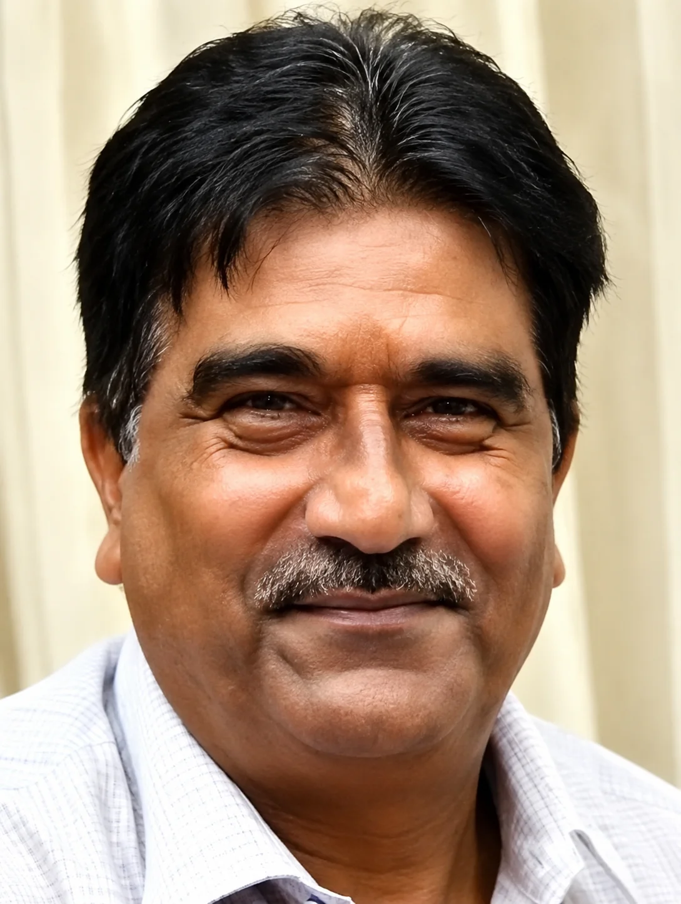
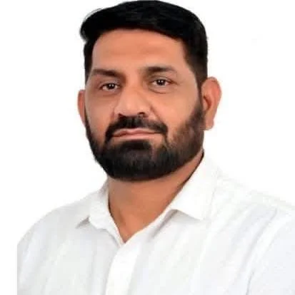
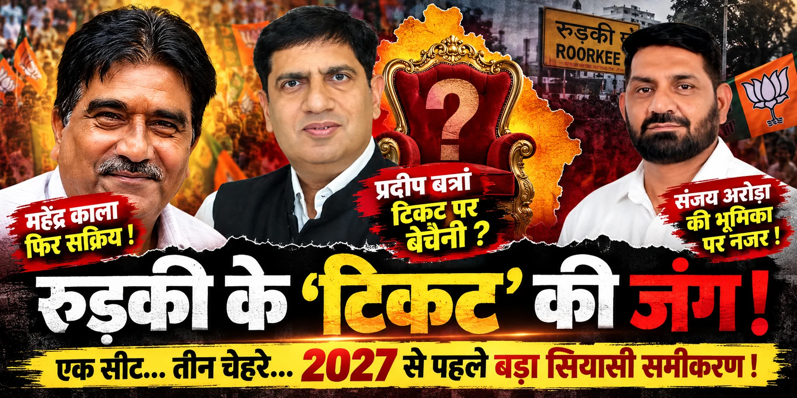

**रुड़की संवाददाता | आसिफ खान**

रुड़की। कैबिनेट मंत्री बनने के बाद भले ही प्रदीप बत्रा का राजनीतिक कद और मजबूत हुआ हो, लेकिन रुड़की की जमीन पर 2027 की सियासत ने उनके सामने नए सवाल खड़े कर दिए हैं। सत्ता के गलियारों में मजबूत पकड़ और कैबिनेट की कुर्सी के बावजूद विधानसभा टिकट को लेकर तस्वीर अभी पूरी तरह साफ नहीं है। इसी बीच भाजपा नेता महेंद्र काला की बढ़ती सक्रियता ने रुड़की की राजनीति में पुरानी फाइलें खोल दी हैं।

अब सवाल सिर्फ इतना नहीं है कि 2027 में चुनाव कौन लड़ेगा। असली सवाल यह है कि भाजपा रुड़की में पुराने चेहरे पर भरोसा कायम रखेगी या राजनीतिक समीकरण बदलकर किसी नए चेहरे को मैदान में उतारेगी?

**यही सवाल इन दिनों रुड़की की सियासत में सबसे ज्यादा चर्चा बटोर रहा है।**

**कैबिनेट की कुर्सी बड़ी, लेकिन टिकट का फैसला उससे भी बड़ा!**

प्रदीप बत्रा आज विधायक होने के साथ कैबिनेट मंत्री भी हैं। राजनीतिक हैसियत के लिहाज से यह उनके लिए बड़ा मुकाम है। लेकिन चुनावी राजनीति में मंत्री पद अपने आप टिकट की गारंटी नहीं बनता।

भाजपा का टिकट संगठन, स्थानीय समीकरण, चुनावी रणनीति और पार्टी नेतृत्व के फैसले से तय होता है।

यही कारण है कि बत्रा की सत्ता में बढ़ी ताकत के समानांतर रुड़की में टिकट को लेकर बढ़ती चर्चाएं राजनीतिक रूप से बेहद महत्वपूर्ण हो गई हैं।

एक तरफ बत्रा के पास सत्ता की ताकत है, दूसरी तरफ संभावित दावेदार अपनी जमीन मजबूत करने में जुटे हैं।

यानी असली मुकाबला चुनाव मैदान में उतरने से पहले ही राजनीतिक जमीन पर शुरू होता दिखाई दे रहा है।

**महेंद्र काला—पुराना नाम, लेकिन क्या नई पारी की तैयारी?**

महेंद्र काला का नाम रुड़की की राजनीति के लिए नया नहीं है। 2003 में उन्होंने नगर पालिका परिषद के सभासद का चुनाव जीता था। इसके बाद 2013 में भाजपा ने उन्हें मेयर पद का प्रत्याशी बनाया।

इसके बाद रुड़की की राजनीति में प्रदीप बत्रा का प्रभाव लगातार बढ़ता गया। नगर पालिका अध्यक्ष से विधायक और फिर कैबिनेट मंत्री तक पहुंचकर बत्रा ने लंबी राजनीतिक यात्रा तय की।

**लेकिन अब राजनीतिक कहानी में नया अध्याय जुड़ता दिखाई दे रहा है।**

**महेंद्र काला फिर सक्रिय हैं।**

उनकी गतिविधियों ने स्थानीय राजनीतिक हलकों में यह सवाल पैदा कर दिया है कि क्या वह 2027 के लिए अपनी राजनीतिक जमीन दोबारा तैयार कर रहे हैं?

इस सवाल का स्पष्ट जवाब अभी उनके या भाजपा संगठन की ओर से सामने नहीं आया है, लेकिन उनकी सक्रियता ने चर्चाओं को जरूर हवा दे दी है।

**बत्रा के सामने सिर्फ काला नहीं, पूरा राजनीतिक समीकरण चुनौती!**

रुड़की की राजनीति को यदि केवल प्रदीप बत्रा बनाम महेंद्र काला के रूप में देखा जाए तो तस्वीर अधूरी होगी।

भाजपा के भीतर समय-समय पर कई नाम संभावित दावेदारों के रूप में चर्चा में रहे हैं। ऐसे में 2027 की टिकट की लड़ाई किसी एक व्यक्ति से नहीं, बल्कि पूरे राजनीतिक समीकरण से जुड़ी होगी।

**यही वह मोड़ है जहां बत्रा के सामने सबसे बड़ा राजनीतिक सवाल खड़ा होता है—**

क्या मौजूदा राजनीतिक प्रभाव टिकट तक उसी मजबूती से पहुंचेगा?

या फिर भाजपा नेतृत्व रुड़की के लिए कोई नया प्रयोग करेगा?

**कल तक शांत नाम, आज सियासी चर्चा के केंद्र में!**

राजनीति में सबसे महत्वपूर्ण चीज समय और परिस्थितियों का बदलना है।

जो चेहरा लंबे समय तक राजनीतिक चर्चा से बाहर दिखाई देता है, वही परिस्थितियां बदलते ही अचानक महत्वपूर्ण हो सकता है।

**महेंद्र काला के मामले में भी यही तस्वीर दिखाई दे रही है।**

उनकी बढ़ती सक्रियता ने रुड़की की भाजपा राजनीति में यह संदेश जरूर दिया है कि 2027 के लिए दावेदारी का मैदान अभी खुला है और कोई भी राजनीतिक चेहरा अपनी जमीन छोड़ने के मूड में नहीं है।

**संजय अरोड़ा की चर्चा से आगे निकला नया समीकरण?**

कुछ समय पहले तक रुड़की में भाजपा के संभावित चेहरों को लेकर अलग-अलग नामों की चर्चा होती रही। लेकिन राजनीतिक परिस्थितियां तेजी से बदलती हैं।

स्थानीय स्तर पर नेताओं के बीच समीकरण बदलते हैं, सक्रियता बदलती है और संगठन के भीतर राजनीतिक वजन भी बदलता रहता है।

ऐसे में महेंद्र काला की सक्रियता ने उन सभी चर्चाओं को एक बार फिर हवा दे दी है।

यानी 2027 की पटकथा अभी लिखी नहीं गई है—लेकिन किरदार मैदान में उतरने लगे हैं।

**प्रदीप बत्रा के लिए सबसे बड़ा सवाल—‘टिकट पक्का’ मानकर चलना कितना सुरक्षित?**

बत्रा के सामने सबसे महत्वपूर्ण चुनौती यही है कि क्या वर्तमान राजनीतिक स्थिति को 2027 के टिकट का भरोसा माना जाए या अभी से जमीन पर अपनी स्थिति मजबूत करने की जरूरत है।

कैबिनेट मंत्री बनने के बाद उनका राजनीतिक कद निश्चित रूप से बढ़ा है, लेकिन चुनावी राजनीति में जनता और संगठन के बीच लगातार सक्रिय रहना अलग चुनौती है।

इसीलिए रुड़की की राजनीति में अब यह सवाल तेजी से उठ रहा है कि क्या बत्रा सत्ता की ताकत के भरोसे रहेंगे या संभावित दावेदारों के बीच अपनी राजनीतिक जमीन और मजबूत करने के लिए सीधे मैदान में उतरेंगे?

**रुड़की में टिकट का खेल अभी बाकी है!**

2027 विधानसभा चुनाव में अभी समय है, लेकिन टिकट की राजनीति ने उससे पहले ही करवट लेनी शुरू कर दी है।

महेंद्र काला की सक्रियता, दूसरे संभावित दावेदारों की हलचल और प्रदीप बत्रा का बढ़ता राजनीतिक कद—इन तीनों को साथ रखकर देखा जाए तो रुड़की में आने वाले महीनों में सियासत और गरमाने के संकेत मिल रहे हैं।

**सवाल अब यह नहीं कि बत्रा मजबूत हैं या नहीं। सवाल यह है कि भाजपा की रणनीति क्या होगी?

क्या पार्टी मौजूदा विधायक और कैबिनेट मंत्री पर ही दांव लगाएगी?**

**क्या किसी नए चेहरे के लिए रास्ता खोला जाएगा?**

या फिर टिकट की दौड़ में कई दावेदारों को पीछे छोड़कर बत्रा एक बार फिर भाजपा का चेहरा बनेंगे?

इन सवालों का जवाब भाजपा नेतृत्व देगा। लेकिन इतना जरूर है कि रुड़की में 2027 की सियासी जंग की आहट सुनाई देने लगी है और महेंद्र काला की सक्रियता ने इस जंग के तापमान को और बढ़ा दिया है।

“कैबिनेट की कुर्सी मजबूत, लेकिन टिकट पर सस्पेंस बरकरार!”

“महेंद्र काला की सक्रियता से रुड़की भाजपा में फिर उबाल!”

“2027 की पटकथा शुरू—बत्रा के सामने दावेदारों की बढ़ती कतार!”
