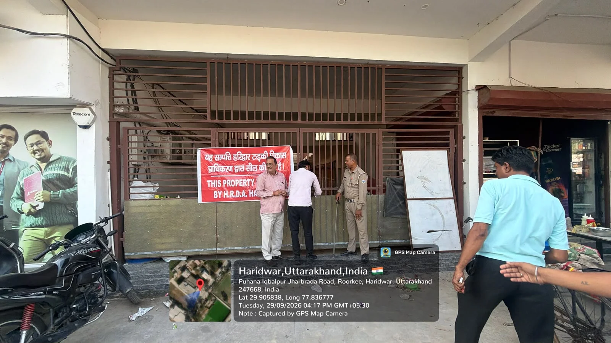
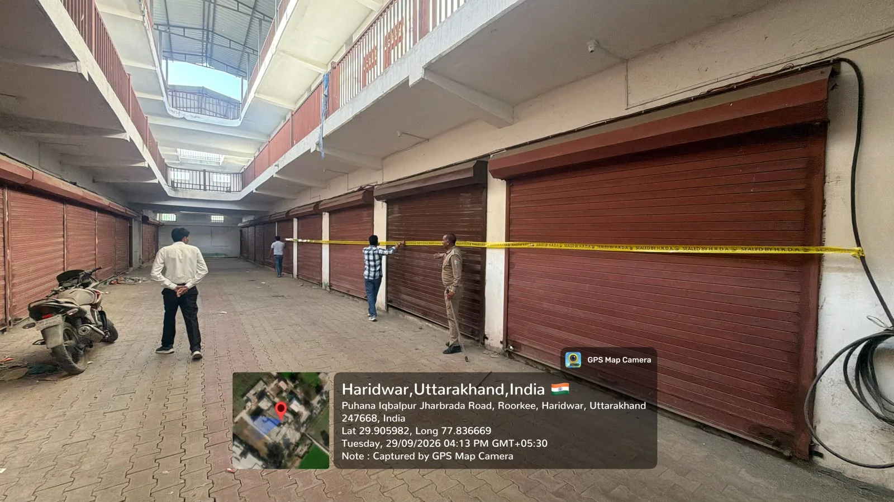
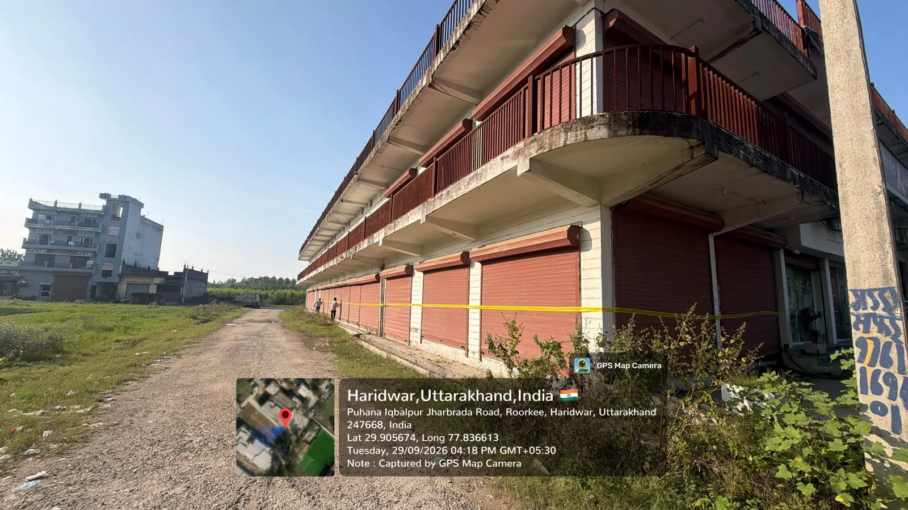
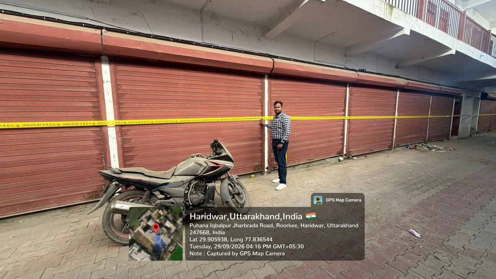

**रुड़की संवाददाता | आसिफ खान**

पुहाना–इकबालपुर रोड पर RIT कॉलेज के सामने बनी विशाल व्यावसायिक मार्केट आखिरकार हरिद्वार-रुड़की विकास प्राधिकरण (HRDA) के शिकंजे में आ गई। जिस मार्केट को लेकर STAR NEWS 11 ने प्राधिकरण की निगरानी और निर्माण की स्वीकृति को लेकर लगातार सवाल उठाए थे, उस मामले में अब प्राधिकरण ने बड़ी कार्रवाई करते हुए बनी हुई मार्केट को सील कर दिया है।

प्राधिकरण के अनुसार राकेश मित्तल द्वारा लगभग 70×90 फीट क्षेत्रफल में भूतल पर व्यावसायिक निर्माण किया गया था। प्राधिकरण का कहना है कि आवश्यक स्वीकृति के बिना निर्माण किया जा रहा था। स्थल पर निर्माण बंद करने के निर्देश दिए जाने के बावजूद कार्य जारी रहने पर प्राधिकरण की टीम ने कार्रवाई करते हुए पूरे निर्माण को सील कर दिया।

🚨 **मार्केट बनकर तैयार… फिर HRDA का बड़ा एक्शन!**

यह कोई छोटा-मोटा निर्माण नहीं था। मौके पर विशाल व्यावसायिक ढांचा तैयार हो चुका था, बड़ी संख्या में शटर लगाए जा चुके थे और मार्केट का स्वरूप पूरी तरह सामने आ चुका था।

ऐसे में सबसे बड़ा सवाल यही है कि इतना बड़ा निर्माण तैयार होने तक निगरानी व्यवस्था कितनी सक्रिय रही?

अब प्राधिकरण की कार्रवाई के बाद इस मामले में तस्वीर का एक हिस्सा जरूर साफ हो गया है—HRDA ने मौके पर पहुंचकर बनी हुई मार्केट को सील कर दिया है।

🔥 **STAR NEWS 11 की खबर का असर—मौके पर पहुंची HRDA टीम**

STAR NEWS 11 ने इस मामले में सवाल उठाया था कि बिना आवश्यक स्वीकृति इतनी बड़ी व्यावसायिक मार्केट कैसे तैयार हो गई और प्राधिकरण की निगरानी के बावजूद कार्रवाई में देरी क्यों हुई?

**इसके बाद अब HRDA की टीम ने मौके पर पहुंचकर सीलिंग की कार्रवाई की।**

कार्रवाई के दौरान **अवर अभियंता प्रभात सिंह, अवर अभियंता पंकज शर्मा, टेक्निकल सुपरवाइजर प्रखर अग्रवाल** समेत प्राधिकरण के अधिकारी एवं कर्मचारी मौजूद रहे। कार्रवाई को व्यवस्थित रूप से संपन्न कराने के लिए पुलिस बल भी मौके पर तैनात रहा।

मौके पर टीम ने निर्माण स्थल की स्थिति का जायजा लिया और प्राधिकरण की कार्रवाई के तहत मार्केट को सील किया।

⚠️ **निर्देशों के बावजूद निर्माण जारी रहने पर कार्रवाई**

HRDA के अनुसार निर्माणकर्ता को स्थल पर निर्माण कार्य बंद करने के निर्देश दिए गए थे। इसके बावजूद निर्माण कार्य जारी रहने के कारण प्राधिकरण ने अनधिकृत निर्माण के विरुद्ध अधिनियम की सुसंगत धाराओं के तहत वाद योजित किया।

इसके बाद मौके पर पहुंची टीम ने सीलिंग की कार्रवाई की और निर्माणकर्ता को निर्देशित किया कि स्वीकृति प्राप्त किए बिना आगे किसी भी प्रकार का निर्माण कार्य न किया जाए।

🔴 **सीलिंग के बाद भी कई सवाल बरकरार**

HRDA की कार्रवाई जरूर हुई है, लेकिन इसके साथ ही कुछ सवाल अभी भी जवाब मांग रहे हैं—

इतनी बड़ी मार्केट तैयार होने तक प्राधिकरण की निगरानी कहां थी?

निर्माण के दौरान कितनी बार निरीक्षण हुआ?

निर्माणकर्ता को पहले कब-कब निर्देश दिए गए?

अगर निर्माण अनधिकृत था तो शुरुआती चरण में ही इसे क्यों नहीं रोका गया?

**और सबसे अहम—**

क्या अब इस पूरे निर्माण की स्वीकृति, मौके की स्थिति और पूर्व निरीक्षण रिकॉर्ड की भी जांच होगी?
🔥 छोटे निर्माणों पर कार्रवाई, बड़ी मार्केट पर अब सील—निगरानी पर सवाल क्यों?

स्थानीय स्तर पर यह सवाल भी उठ रहा है कि छोटे निर्माणों पर कार्रवाई अपेक्षाकृत जल्दी दिखाई देती है, जबकि यहां लगभग 70×90 फीट का विशाल व्यावसायिक निर्माण तैयार हो गया।

अब HRDA की सीलिंग कार्रवाई के बाद लोगों की नजर आगे की कार्रवाई पर है।

यदि निर्माण में नियमों का उल्लंघन पाया गया है तो आगे की नियमानुसार कार्रवाई क्या होगी?

क्या सिर्फ सीलिंग तक मामला रहेगा या निर्माण की वैधता और स्वीकृति की भी विस्तृत जांच होगी?

🚨 STAR NEWS 11 का सीधा सवाल
“मार्केट बनकर तैयार होने के बाद कार्रवाई हुई—अब जवाबदेही किसकी?”

फिलहाल HRDA ने कार्रवाई करते हुए बिना आवश्यक स्वीकृति किए गए निर्माण को सील कर दिया है।

अवर अभियंता प्रभात सिंह, अवर अभियंता पंकज शर्मा, टेक्निकल सुपरवाइजर प्रखर अग्रवाल सहित प्राधिकरण के अधिकारी-कर्मचारी और पुलिस बल की मौजूदगी में कार्रवाई पूरी की गई।

**अब देखना यह होगा कि सीलिंग के बाद प्राधिकरण इस मामले में अगला कदम क्या उठाता है।**

🔥 **खबर का असर साफ—
STAR NEWS 11 ने उठाए सवाल, HRDA ने पहुंचकर मार्केट की सीलिंग की!
अब अगला सवाल—सील के बाद आगे क्या कार्रवाई करेगा प्राधिकरण?**

**STAR NEWS 11 इस मामले पर अपना फॉलोअप जारी रखेगा।**
