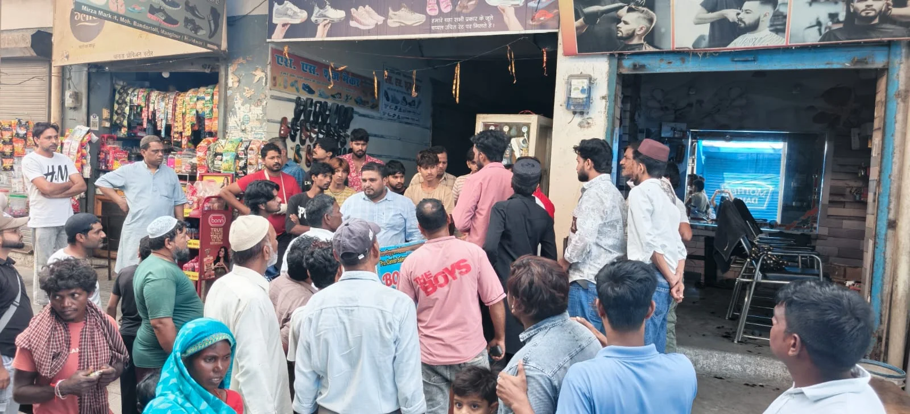
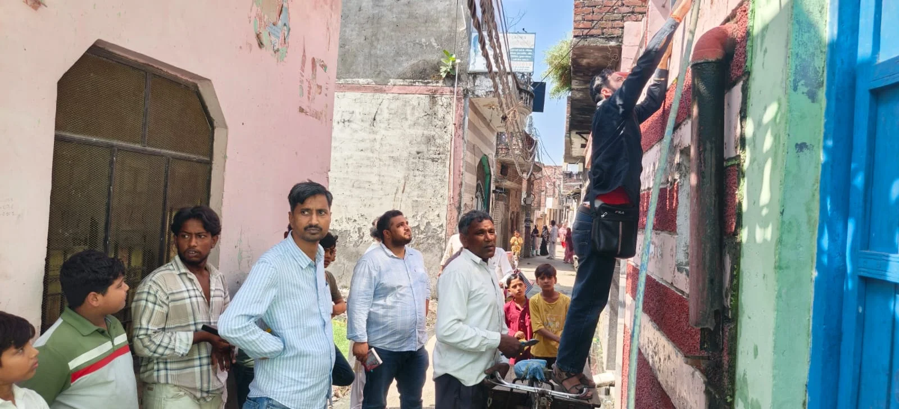
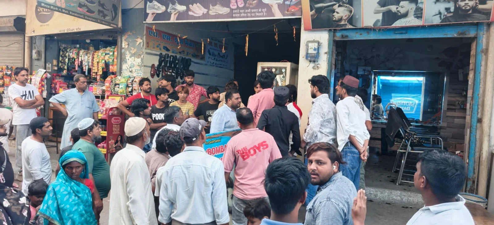

**रूडकी/मंगलौर संवाददाता | आसिफ खान**

बिजली चोरी के खिलाफ विद्युत विभाग ने मंगलौर क्षेत्र में एक बार फिर बड़ा अभियान चलाते हुए कथित विद्युत चोरी के 23 मामलों को पकड़ा। विभाग की संयुक्त टीम ने मंगलौर के लालबाड़ा, बंदरटोल, मालनपुरा, पठानपुरा और बस अड्डा क्षेत्र में सघन चेकिंग अभियान चलाया। कार्रवाई के दौरान मौके पर विद्युत केबल उतरवाकर उन्हें सील किया गया।

विद्युत चोरी की शिकायतों के आधार पर उपखण्ड मंगलौर, उपखण्ड पुहाना और सहायक अभियंता मापक भगवानपुर की संयुक्त टीम ने विभिन्न स्थानों पर जांच की। विभाग के अनुसार, चेकिंग के दौरान बिजली चोरी के मामले सामने आने पर संबंधित लोगों के खिलाफ विभागीय कार्रवाई की जा रही है और नियमानुसार एफआईआर दर्ज कराने की प्रक्रिया अपनाई जाएगी।

**23 मामलों से मचा हड़कंप**

एक साथ बड़ी संख्या में मामले सामने आने के बाद बिजली चोरी करने वालों में हड़कंप की स्थिति बनी रही। विभाग ने स्पष्ट किया है कि विद्युत चोरी किसी भी स्थिति में बर्दाश्त नहीं की जाएगी। आने वाले दिनों में भी संयुक्त टीमें बनाकर लगातार सघन चेकिंग अभियान चलाया जाएगा।

अभियान का नेतृत्व अनुभव सैनी, उपखण्ड अधिकारी मंगलौर ने किया। टीम में अनजीव राणा, उपखण्ड अधिकारी पुहाना, अरुण कुमार, सहायक अभियंता मापक भगवानपुर, विकास कुमार, अवर अभियंता मंगलौर सहित विद्युत विभाग के लाइनमैन एवं अन्य कर्मचारी शामिल रहे।

**अब लगातार चलेगा चेकिंग अभियान**

विद्युत विभाग ने कहा कि पकड़े गए मामलों में नियमानुसार विभागीय कार्रवाई के साथ संबंधित धाराओं में मुकदमा दर्ज कराया जाएगा। विभाग की संयुक्त टीमें भविष्य में भी विद्युत चोरी वाले संभावित क्षेत्रों में सघन अभियान चलाएंगी।

**भीषण गर्मी में उपभोक्ताओं से सहयोग की अपील**

विद्युत विभाग ने आम उपभोक्ताओं से बिजली का उपयोग आवश्यकता के अनुसार और सावधानीपूर्वक करने की अपील की है। विभाग के मुताबिक भीषण गर्मी के कारण बिजली का लोड बढ़ने से विद्युत व्यवस्था पर अतिरिक्त दबाव बना हुआ है।

विभाग ने उपभोक्ताओं से अपील की है कि घर में इस्तेमाल होने वाले अधिक बिजली खपत वाले उपकरणों को एक साथ न चलाएं और शाम के पीक समय में बिजली का सीमित उपयोग करें। विभाग का कहना है कि उपभोक्ताओं के सहयोग से ही विद्युत व्यवस्था को सुचारू बनाए रखने में मदद मिलेगी।

**विद्युत विभाग का साफ संदेश—बिजली चोरी पर लगातार कार्रवाई, शिकायत मिली तो होगी सघन जांच।**
