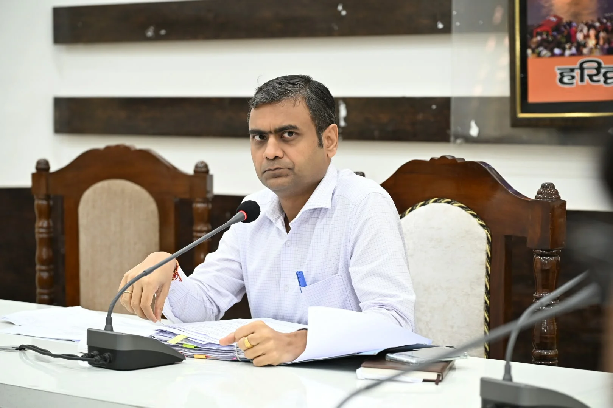
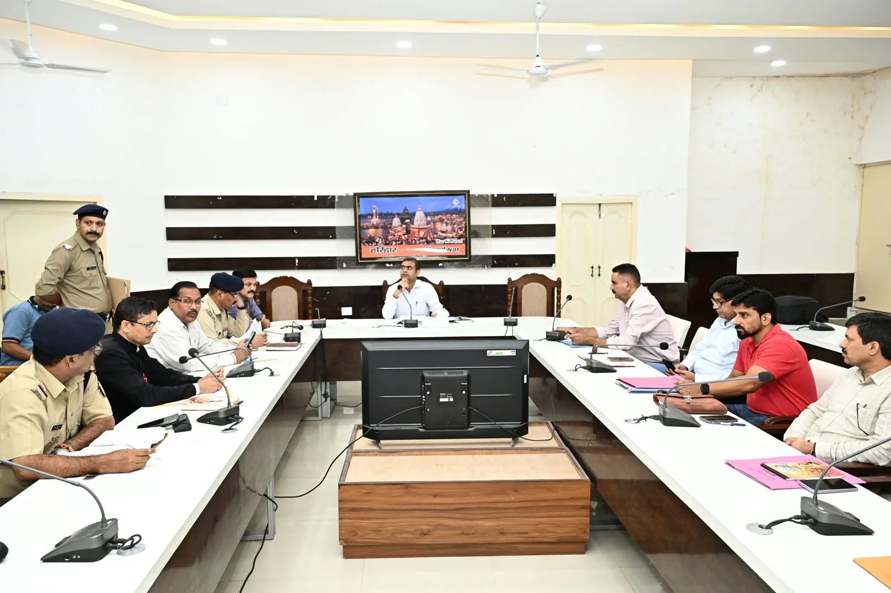
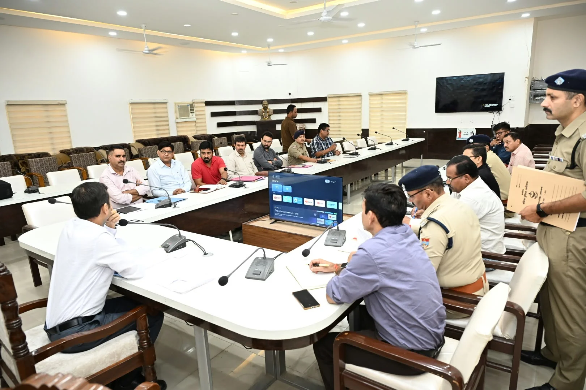
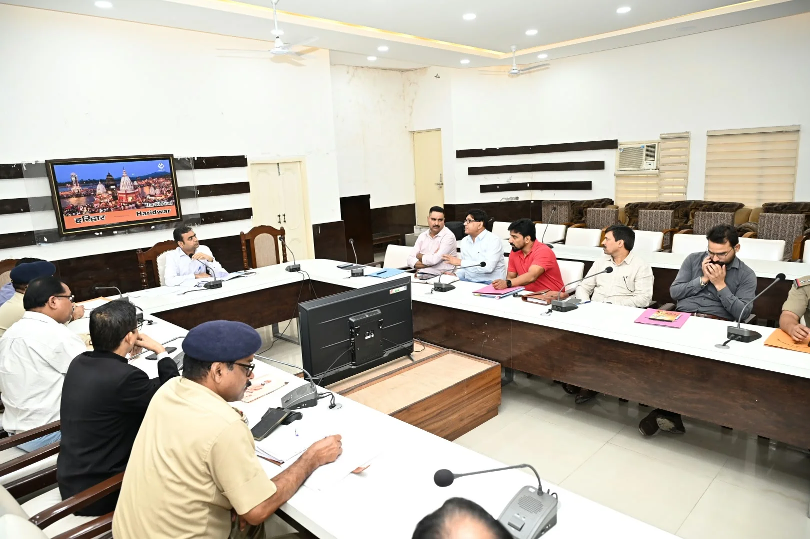

**हरिद्वार संवाददाता | आसिफ खान**

हरिद्वार। जनपद में नशे के बढ़ते खतरे पर प्रशासन ने अब कार्रवाई और निगरानी तेज करने की दिशा में कदम बढ़ाए हैं। जिला कार्यालय सभागार में आयोजित नारकोटिक्स कोऑर्डिनेशन मैकेनिज्म (एनकॉर्ड/NCORD) की बैठक में मादक पदार्थों की तस्करी पर प्रभावी कार्रवाई के साथ बच्चों और युवाओं को नशे से बचाने के लिए कई महत्वपूर्ण निर्देश जारी किए गए।

बैठक की अध्यक्षता अपर जिलाधिकारी वित्त एवं राजस्व वैभव गुप्ता ने की। उन्होंने संबंधित विभागों को नशे के अवैध कारोबार पर कार्रवाई के साथ-साथ जन-जागरूकता और नशामुक्ति उपचार व्यवस्था को मजबूत करने के निर्देश दिए।

**स्कूल-कॉलेजों में मेडिकल टेस्ट पर सख्ती**

बैठक में निजी एवं सरकारी शिक्षण संस्थानों में अध्ययनरत बच्चों और युवाओं के मेडिकल टेस्ट को लेकर अब तक हुई कार्रवाई की समीक्षा की गई। अपर जिलाधिकारी ने शिक्षा विभाग, स्वास्थ्य विभाग और प्रभारी एनटीएफ हरिद्वार को आपसी समन्वय से कार्रवाई पूरी करने तथा दो दिन के भीतर रिपोर्ट सीईओ ऑपरेशन को भेजने के निर्देश दिए।

साथ ही यह भी जानकारी मांगी गई कि जिले में कितने स्कूल-कॉलेजों को नशामुक्त परिसर घोषित किया जा चुका है और भविष्य में किन शिक्षण संस्थानों को इस अभियान से जोड़ा जाना है।

**मेडिकल स्टोर भी आएंगे निगरानी के दायरे में**

बैठक में जिले में संचालित मेडिकल स्टोरों की संख्या और उनमें लगे सीसीटीवी कैमरों की स्थिति की भी समीक्षा की गई। अधिकारियों से पूछा गया कि कितने मेडिकल स्टोरों में सीसीटीवी लगाए जा चुके हैं और कितने अभी निगरानी व्यवस्था से बाहर हैं।

स्वास्थ्य विभाग, ड्रग्स इंस्पेक्टर और एनटीएफ को इस संबंध में नियमित रिपोर्ट प्रस्तुत करने के निर्देश दिए गए।

**तस्करों की कमर तोड़ने पर जोर**

बैठक में केवल छोटे स्तर की कार्रवाई तक सीमित न रहकर मादक पदार्थों के तस्करी नेटवर्क की वित्तीय जांच पर भी जोर दिया गया। एनडीपीएस अधिनियम के तहत Financial Investigation कर अवैध कारोबार से अर्जित संपत्ति की पहचान और नियमानुसार कुर्की की कार्रवाई सुनिश्चित करने के निर्देश पुलिस विभाग को दिए गए।

**जागरूकता अभियान को बनाया जाएगा व्यापक**

प्रशासन ने स्पष्ट किया कि नशे के खिलाफ लड़ाई केवल कार्रवाई तक सीमित नहीं रहनी चाहिए। शिक्षण संस्थानों और ग्रामीण क्षेत्रों में ‘नशा मुक्त भारत अभियान’ के तहत विशेष जागरूकता कार्यक्रम आयोजित करने तथा सामुदायिक भागीदारी बढ़ाने पर जोर दिया गया।

**नशामुक्ति केंद्रों और जेल की व्यवस्था की भी समीक्षा**

बैठक में 01 जुलाई 2026 के बाद स्थापित नशामुक्ति उपचार केंद्रों की संख्या और जिला स्तर पर संचालित उपचार सुविधाओं की समीक्षा की गई। जेल में उपलब्ध नशामुक्ति सुविधाओं तथा नशामुक्ति केंद्रों के मासिक निरीक्षण की स्थिति की भी जानकारी ली गई।

स्वास्थ्य विभाग, समाज कल्याण विभाग और अधीक्षक कारागार को आवश्यक कार्रवाई के निर्देश दिए गए।

**खेल के मैदान से नशे को मात देने की तैयारी**

युवाओं को नशे से दूर रखने के लिए खेल गतिविधियों और प्रतियोगिताओं में अधिक से अधिक भागीदारी सुनिश्चित करने पर भी जोर दिया गया। खेल विभाग और समाज कल्याण विभाग को युवाओं को खेलों से जोड़ने के लिए आवश्यक कार्रवाई करने के निर्देश दिए गए।

**अधिकारियों को दो टूक—कार्रवाई भी, जागरूकता भी**

अपर जिलाधिकारी वित्त एवं राजस्व वैभव गुप्ता ने अधिकारियों को निर्देश दिए कि नशे के अवैध कारोबार के खिलाफ प्रभावी कार्रवाई के साथ बच्चों, युवाओं और आमजन को नशे के दुष्प्रभावों के प्रति लगातार जागरूक किया जाए।

उन्होंने कहा कि नशे की रोकथाम के लिए प्रवर्तन कार्रवाई, जन-जागरूकता, शिक्षण संस्थानों की सहभागिता और नशामुक्ति उपचार सुविधाओं को मजबूत करना जरूरी है। बैठक में दिए गए निर्देशों का सभी संबंधित विभागों द्वारा समयबद्ध अनुपालन सुनिश्चित करने को कहा गया।

बैठक में असिस्टेंट डायरेक्टर आईबी सीपी नौटियाल, एसीएमओ डॉ. अनिल वर्मा, डिप्टी एसपी संजय चौहान, डीईओ एक्साइज कैलाश बिनजोला, एसजीएसटी असिस्टेंट कमिश्नर दीपक कुमार सहित संबंधित अधिकारी मौजूद रहे।
