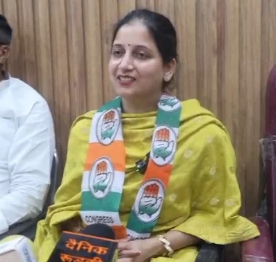
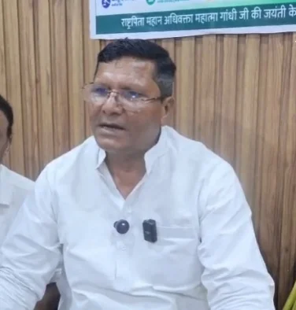
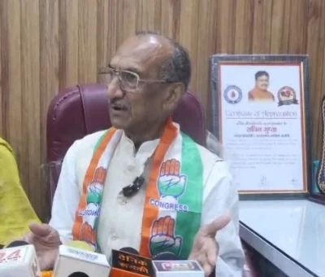
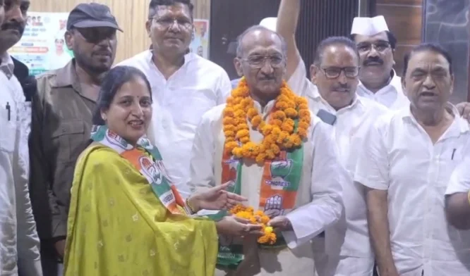
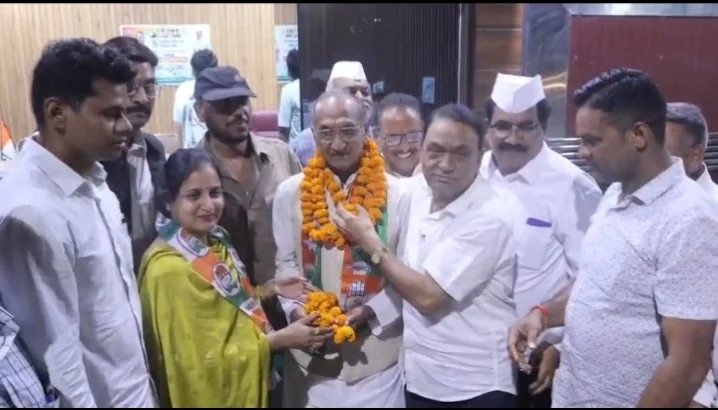

**हरिद्वार/रुड़की संवाददाता | आसिफ खान**

रुड़की। मंगलौर में आयोजित कौमी एकता मुशायरे में मुख्य अतिथि के रूप में शामिल होने पहुंचे कांग्रेस के वरिष्ठ नेता एवं दिल्ली से पांच बार सांसद रह चुके जेपी अग्रवाल के रुड़की पहुंचते ही कांग्रेस कार्यकर्ताओं में जबरदस्त उत्साह देखने को मिला। मलकपुर चुंगी स्थित कैंप ऑफिस पर कांग्रेस नेत्री पूजा गुप्ता के नेतृत्व में कार्यकर्ताओं ने जोरदार स्वागत कर अपनी राजनीतिक सक्रियता का खुला प्रदर्शन किया। फूल-मालाओं से हुए अभिनंदन के दौरान बड़ी संख्या में कार्यकर्ता मौजूद रहे और कार्यक्रम स्थल पर कांग्रेस का माहौल पूरी तरह गर्म नजर आया।

**पूजा गुप्ता ने संभाली कमान, कार्यकर्ताओं को किया लामबंद**

पूरे स्वागत कार्यक्रम में पूजा गुप्ता की भूमिका प्रमुख रही। उन्होंने कार्यकर्ताओं को एकजुट करते हुए वरिष्ठ नेता जेपी अग्रवाल के स्वागत की तैयारियों का नेतृत्व किया। बड़ी संख्या में कार्यकर्ताओं की मौजूदगी के बीच उन्होंने कांग्रेस की स्थानीय गतिविधियों और संगठन को मजबूत करने की जरूरत पर जोर दिया।

पूजा गुप्ता ने कहा कि कांग्रेस कार्यकर्ता जनता के बीच रहकर उनके सवालों और समस्याओं को उठाने का काम कर रहे हैं। उन्होंने कहा कि महंगाई, रोजगार और आम आदमी से जुड़े मुद्दों को लेकर कांग्रेस अपनी आवाज लगातार बुलंद करती रहेगी।

उन्होंने कार्यकर्ताओं से संगठन को और मजबूत करने, जनता के बीच लगातार संपर्क बनाए रखने तथा स्थानीय समस्याओं को प्रमुखता से उठाने का आह्वान किया। पूजा गुप्ता के नेतृत्व में हुए इस आयोजन में कार्यकर्ताओं की मौजूदगी ने स्थानीय कांग्रेस की सक्रियता को सामने रखा।

**आदित्य राणा की मौजूदगी ने बढ़ाया जोश**

कार्यक्रम में कांग्रेस नेता आदित्य राणा भी सक्रिय रूप से मौजूद रहे। उन्होंने जेपी अग्रवाल का स्वागत करते हुए कहा कि वरिष्ठ नेताओं का अनुभव पार्टी कार्यकर्ताओं के लिए मार्गदर्शक है। उन्होंने कार्यकर्ताओं से संगठन की मजबूती के लिए लगातार जमीन पर सक्रिय रहने का आह्वान किया।

आदित्य राणा ने कहा कि कांग्रेस कार्यकर्ताओं को जनता के बीच जाकर उनकी समस्याओं को समझना होगा और जरूरत पड़ने पर उन मुद्दों को मजबूती से उठाना होगा। उन्होंने संगठन में आपसी समन्वय और एकजुटता को महत्वपूर्ण बताते हुए कार्यकर्ताओं को लगातार सक्रिय रहने का संदेश दिया।

**जेपी अग्रवाल के निशाने पर भाजपा सरकार**

स्वागत समारोह के दौरान जेपी अग्रवाल ने भाजपा सरकार पर तीखा राजनीतिक हमला बोला। उन्होंने आरोप लगाया कि भाजपा सरकार की नीतियों से लोकतांत्रिक व्यवस्था प्रभावित हो रही है और आम जनता महंगाई तथा आर्थिक दबाव का सामना कर रही है।

जेपी अग्रवाल ने कहा कि कांग्रेस जनता से जुड़े मुद्दों को लेकर लगातार संघर्ष कर रही है। उन्होंने महंगाई, आर्थिक दबाव और जनता पर बढ़ते कर्ज के बोझ का मुद्दा उठाते हुए सरकार को घेरा।

उन्होंने कहा कि कांग्रेस आने वाले समय में जनता के मुद्दों को और मजबूती से उठाएगी। जेपी अग्रवाल ने 2027 के उत्तराखंड विधानसभा चुनाव में कांग्रेस की सरकार बनने का दावा करते हुए कार्यकर्ताओं से संगठन को मजबूत करने का आह्वान किया।

**स्वागत के बहाने कांग्रेस ने दिखाई अपनी जमीनी सक्रियता**

मलकपुर चुंगी स्थित कैंप ऑफिस पर आयोजित कार्यक्रम सिर्फ स्वागत समारोह तक सीमित नहीं रहा, बल्कि स्थानीय कांग्रेस कार्यकर्ताओं की संगठनात्मक सक्रियता भी इसमें दिखाई दी। बड़ी संख्या में कार्यकर्ताओं का जुटना और वरिष्ठ नेता के स्वागत में उत्साह दिखाना कार्यक्रम का प्रमुख आकर्षण रहा।

कांग्रेस नेताओं ने कहा कि जनता से जुड़े मुद्दों को लेकर पार्टी कार्यकर्ता लगातार सक्रिय हैं और आने वाले समय में संगठन को बूथ स्तर तक मजबूत करने पर जोर दिया जाएगा।

कार्यक्रम में कलीम खान, उमर गाजी, मकसूद हसन, एडवोकेट जसविंदर, नीरज अग्रवाल, सुशील कश्यप, दीपक चंचल, परवेज अहमद, हेमेंद्र चौधरी, सुभाष सैनी, भूपेंद्र दीवान, जाकिर हुसैन सहित बड़ी संख्या में कांग्रेस कार्यकर्ता मौजूद रहे।

जेपी अग्रवाल के स्वागत के दौरान कार्यकर्ताओं ने फूल-मालाएं पहनाकर उनका अभिनंदन किया। कार्यक्रम में कांग्रेस की स्थानीय राजनीति में सक्रियता और संगठनात्मक एकजुटता का संदेश देने की कोशिश साफ दिखाई दी।
