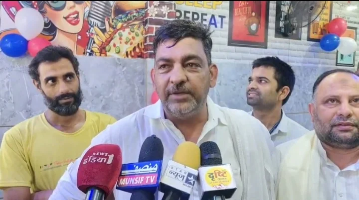
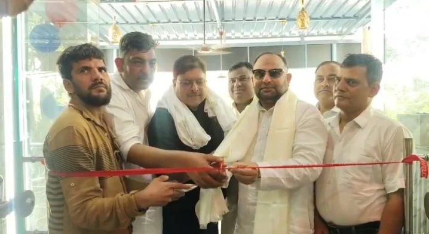
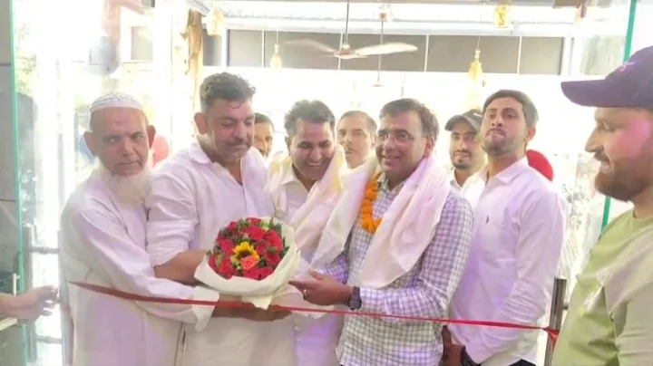

**रुड़की संवाददाता | आसिफ खान**

रुड़की। सालियर रोड स्थित श्री गुरु राम राय स्कूल के पास **BARAK-AH CAFÉ & SNOOKER** का भव्य उद्घाटन समारोह आयोजित किया गया। उद्घाटन कार्यक्रम में झबरेड़ा विधायक वीरेंद्र जाति और AIMIM के प्रदेश अध्यक्ष डॉ. नय्यर काज़मी मुख्य अतिथि के रूप में पहुंचे। दोनों अतिथियों का कैफे संचालक एवं टीम की ओर से शॉल और बुके भेंट कर गर्मजोशी से स्वागत किया गया। इसके बाद अतिथियों ने रिबन काटकर कैफे का विधिवत शुभारंभ किया।

**शाकाहारी जायकों के साथ Breakfast से Dinner तक की सुविधा**

कैफे संचालक नोमान ने बताया कि **BARAK-AH CAFÉ & SNOOKER** में ग्राहकों को शुद्ध शाकाहारी भोजन उपलब्ध कराया जाएगा। यहां **Breakfast, Lunch** और **Dinner** के साथ **Veg, Indian** और **Chinese** व्यंजनों की सुविधा मिलेगी। परिवारों को ध्यान में रखते हुए अलग बैठने की व्यवस्था की गई है और साफ-सफाई पर विशेष जोर दिया गया है।

**छात्रों के लिए बड़ी छूट, रविवार को 40 प्रतिशत तक डिस्काउंट**

कार्यक्रम में डॉ. नय्यर काज़मी ने कहा कि कैफे में छात्रों और परिवारों की सुविधा को विशेष प्राथमिकता दी गई है। छात्रों को आई-कार्ड दिखाने पर सामान्य दिनों में 25 प्रतिशत, जबकि रविवार को 40 प्रतिशत तक की छूट दी जाएगी। वहीं आम ग्राहकों और परिवारों के लिए भी 10 प्रतिशत डिस्काउंट की व्यवस्था की गई है।

**विधायक ने दी शुभकामनाएं**

झबरेड़ा विधायक वीरेंद्र जाति ने कैफे संचालक नोमान और उनकी पूरी टीम को नए प्रतिष्ठान के शुभारंभ पर बधाई दी। उन्होंने छात्रों के लिए दी जा रही विशेष छूट को उपयोगी पहल बताया और कैफे में उपलब्ध शाकाहारी भोजन की भी सराहना की।

उद्घाटन समारोह में शेरू मालिक, फाजिल त्यागी, गुलनवाज, सुलेमान प्रधान, सोनू, सलीम ठेकेदार, महबूब आलम, परवेज, शकील अहमद, अजीम आजम और फरीद सहित बड़ी संख्या में लोग मौजूद रहे।
