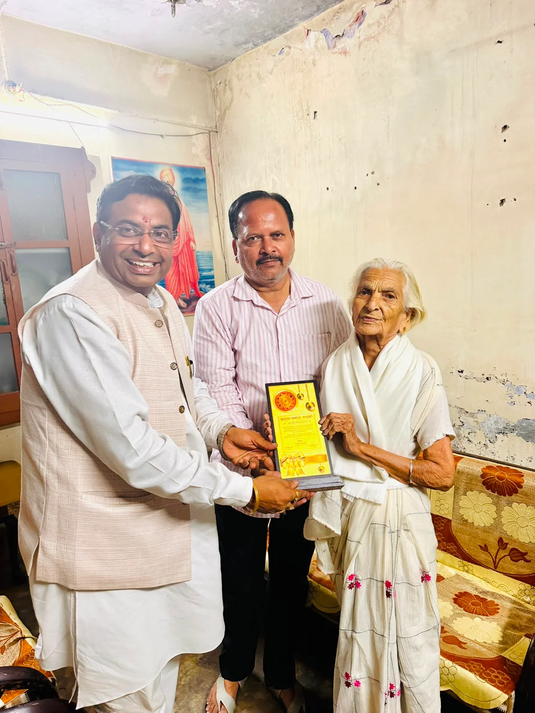
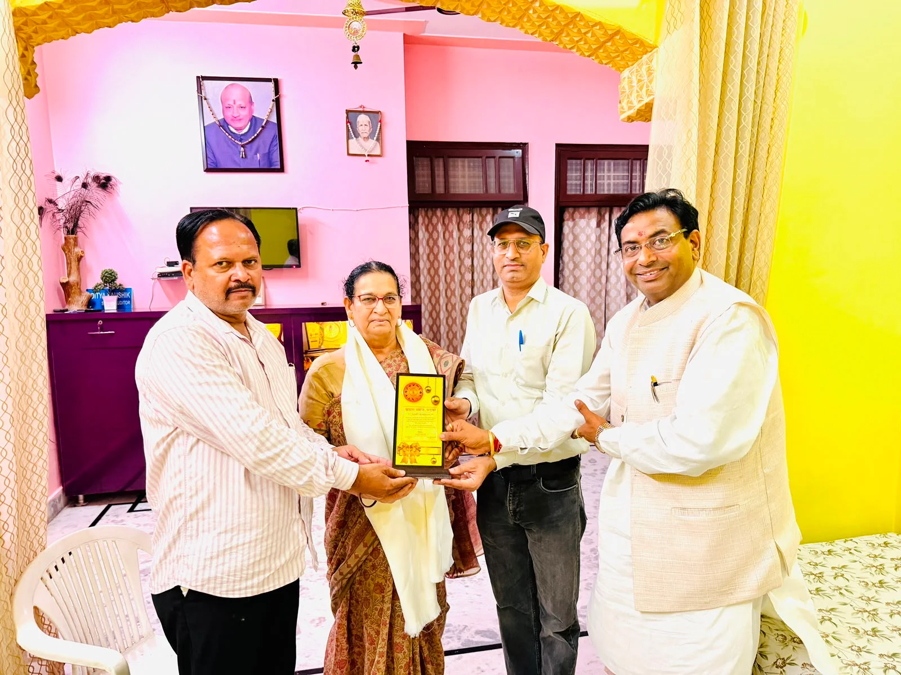
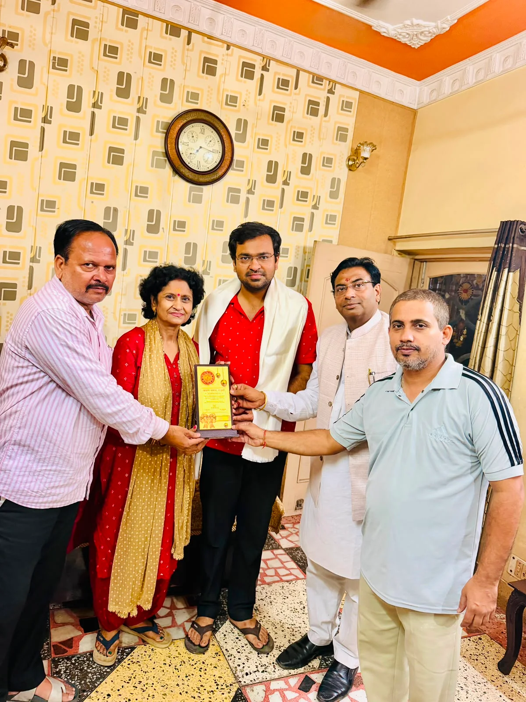
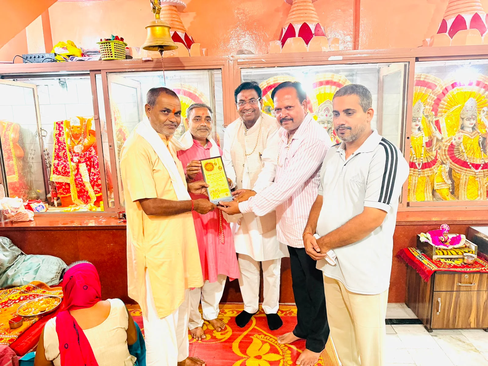

**रुड़की संवाददाता | आसिफ खान**

रुड़की। समाज के उत्थान, शिक्षा के प्रसार, धर्म-संस्कृति और जनसेवा के क्षेत्र में अपना जीवन समर्पित करने वाली दिवंगत विभूतियों के योगदान को ब्राह्मण समाज रुड़की ने भावपूर्ण ढंग से याद किया। समाज ने विगत वर्ष की परंपरा को आगे बढ़ाते हुए इस वर्ष भी पांच दिवंगत बुजुर्गों के परिजनों के घर पहुंचकर उन्हें सम्मानित किया। इस पहल के जरिए समाज ने स्पष्ट संदेश दिया कि जिन लोगों ने समाज और राष्ट्र के लिए अपना जीवन खपा दिया, उनके योगदान को समय बीतने के साथ भुलाया नहीं जा सकता।

ब्राह्मण समाज रुड़की के पदाधिकारियों ने दिवंगत विभूतियों के परिजनों से मुलाकात कर उनके संघर्ष, सेवाभाव और सामाजिक योगदान को याद किया। इस दौरान परिवारजनों को सम्मानित करते हुए कहा गया कि इन महापुरुषों की विचारधारा और कार्य आने वाली पीढ़ियों के लिए प्रेरणा का स्रोत हैं।

**इन पांच विभूतियों के परिजनों का हुआ सम्मान**

**स्वर्गीय पंडित बृज भूषण शर्मा**
राष्ट्रीय स्वयंसेवक संघ (RSS) के वरिष्ठ पदाधिकारी के रूप में उन्होंने राष्ट्र निर्माण, सामाजिक समरसता और संगठन को मजबूत करने के लिए अपना जीवन समर्पित किया।

**स्वर्गीय पंडित सुंदर लाल शर्मा**
रुड़की के प्रतिष्ठित एवं विद्वान पुरोहितों में उनकी पहचान रही। उन्होंने सनातन संस्कृति, धार्मिक परंपराओं और मान्यताओं के संरक्षण एवं संवर्धन में महत्वपूर्ण योगदान दिया।

**स्वर्गीय पंडित मानवेंद्र शर्मा**
वरिष्ठ पत्रकार के रूप में उन्होंने पत्रकारिता के क्षेत्र में ईमानदारी, निडरता और निष्पक्षता की पहचान कायम की। उनके पत्रकारिता जीवन को समाज ने सम्मान के साथ याद किया।

**स्वर्गीय पंडित दामोदर प्रसाद शर्मा**
भारतीय ब्राह्मण समाज के नगर महामंत्री के रूप में उन्होंने समाज की एकजुटता, उत्थान और जनकल्याण के लिए अनेक कार्य किए। संगठन के प्रति उनका समर्पण लंबे समय तक याद किया जाएगा।

**स्वर्गीय पंडित जय गोपाल शर्मा**
गवर्नमेंट इंटर कॉलेज रुड़की के पूर्व प्रधानाचार्य रहे पंडित जय गोपाल शर्मा शिक्षा के क्षेत्र में महत्वपूर्ण योगदान के लिए जाने जाते रहे। संस्कृत भाषा के प्रति उनके समर्पण का प्रमाण उनकी प्रकाशित पुस्तक ‘अभिमन्यु चरित्रम्’ भी है।

**‘पूर्वजों का सम्मान ही समाज की असली ताकत’**

इस अवसर पर सौरव भूषण शर्मा, प्रदेश संयोजक, व्यावसायिक प्रकोष्ठ, भारतीय जनता पार्टी, उत्तराखंड ने कहा कि जो समाज अपने पूर्वजों के त्याग, तपस्या और आदर्शों को याद रखता है, वही समाज संगठित होकर आगे बढ़ता है। उन्होंने कहा कि इन विभूतियों ने शिक्षा, समाजसेवा, धर्म और राष्ट्र के प्रति जिस समर्पण के साथ कार्य किया, वह आज भी समाज को दिशा देने वाला है।

उन्होंने पंडित बृज भूषण शर्मा की राष्ट्रभक्ति, पंडित सुंदर लाल शर्मा की विद्वता, पंडित मानवेंद्र शर्मा की पत्रकारिता में ईमानदारी और पंडित दामोदर प्रसाद शर्मा के समाज-समर्पण को भावी पीढ़ी के लिए प्रेरणादायी बताया। उन्होंने कहा कि ब्राह्मण समाज रुड़की की यह पहल युवाओं को अपने संस्कारों और सामाजिक जिम्मेदारियों से जोड़ने का महत्वपूर्ण माध्यम है।

देवेंद्र शर्मा, नगर अध्यक्ष, जनपदीय ब्राह्मण सभा ने कहा कि समाज के उत्थान के लिए अपना जीवन समर्पित करने वाले महापुरुषों के परिवारों का सम्मान करना पूरे समाज के लिए गौरव का विषय है। उन्होंने कहा कि ऐसे सम्मान से परिवारों के साथ-साथ समाज की नई पीढ़ी को भी अपने पूर्वजों के योगदान को जानने और उनसे प्रेरणा लेने का अवसर मिलता है।

आदित्य शर्मा, युवा अध्यक्ष, जनपदीय ब्राह्मण सभा ने युवाओं से इन विभूतियों के जीवन मूल्यों, सिद्धांतों और समाजसेवा की भावना को आत्मसात करने का आह्वान किया। उन्होंने कहा कि युवा शक्ति समाजहित के कार्यों में आगे बढ़कर अपनी जिम्मेदारी निभाएगी।

कार्यक्रम के दौरान ब्राह्मण समाज रुड़की के पदाधिकारी, गणमान्य नागरिक, प्रबुद्धजन एवं समाज के अनेक लोग मौजूद रहे।

**जारीकर्ता : ब्राह्मण समाज रुड़की (उत्तराखंड)**
