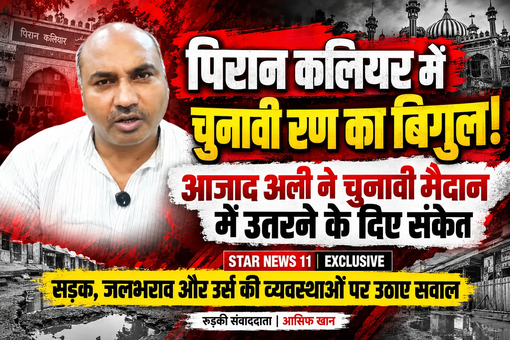

**रुड़की संवाददाता | आसिफ खान**

रुड़की। पिरान कलियर की सियासत में अब चुनावी तापमान बढ़ता दिखाई दे रहा है। जन अधिकार पार्टी (जनशक्ति) के राष्ट्रीय अध्यक्ष आजाद अली ने पिरान कलियर विधानसभा क्षेत्र से आगामी चुनाव लड़ने के संकेत देकर सियासी मैदान में हलचल तेज कर दी है। आजाद अली ने अपने बयान में क्षेत्र की मूलभूत समस्याओं को लेकर सवाल उठाए और कहा कि उनकी पार्टी पिछले दो वर्षों से लगातार जनता के बीच रहकर उनकी समस्याओं की आवाज उठाती रही है।

**दो महीने की राजनीति नहीं, पूरे पांच साल जनता के बीच रहने का दावा**

आजाद अली ने राजनीतिक प्रतिनिधित्व को लेकर सीधे सवाल खड़े करते हुए कहा कि चुनाव केवल दो महीने का होता है, लेकिन जनता को अपने नेता की जरूरत 12 महीने और पूरे पांच साल रहती है।

उन्होंने कहा कि नेता की असली परीक्षा चुनावी मंच पर नहीं, बल्कि जनता की परेशानी के समय होती है। उनके मुताबिक मजबूत नेतृत्व वही है जो लगातार जनता के बीच रहे, समस्याओं को उठाए और उनके समाधान के लिए प्रशासन तक आवाज पहुंचाए।

**सड़कों पर गड्ढे, जलभराव पर सवाल—पिरान कलियर की व्यवस्थाओं को लेकर घेरा**

पिरान कलियर विधानसभा क्षेत्र की मूलभूत सुविधाओं को लेकर आजाद अली ने तीखे सवाल उठाए। उन्होंने पिरान कलियर शरीफ से कोर कॉलोनी तक रहमतपुर रोड की खराब स्थिति का दावा करते हुए कहा कि सड़क पर जगह-जगह बड़े गड्ढे हैं और लोगों को परेशानी का सामना करना पड़ रहा है।

इतना ही नहीं, उन्होंने उर्स मेले की व्यवस्थाओं को लेकर भी सवाल खड़े किए। जलभराव, कीचड़ और अन्य व्यवस्थाओं को लेकर उन्होंने प्रशासन से सवाल किया कि आखिर हर बार जनता को इन परेशानियों से कब तक जूझना पड़ेगा?

**दुकानदारों के नोटिस पर भी सियासी हमला**

वर्षों से दुकानें लगाने वाले लोगों को अतिक्रमण के नाम पर नोटिस दिए जाने के मुद्दे को भी आजाद अली ने जोर-शोर से उठाया। उन्होंने कहा कि वर्षों से क्षेत्र में कारोबार कर रहे लोगों की समस्याओं को भी सुना जाना चाहिए।

उनका कहना है कि जनता को ऐसा जनप्रतिनिधित्व चाहिए जो नोटिस और कार्रवाई के बीच जनता की आवाज बनकर खड़ा हो, न कि केवल चुनाव के समय दिखाई दे।

**मदन कौशिक मैदान में आए तो मुकाबला आमने-सामने!**

पिरान कलियर से मदन कौशिक के चुनाव लड़ने की संभावनाओं को लेकर पूछे गए सवाल पर आजाद अली ने साफ कहा कि यदि वह मैदान में आते हैं तो उनका स्वागत है।

उन्होंने कहा कि आमने-सामने मुकाबला होने पर फैसला जनता अपने स्तर पर करेगी। इस बयान ने पिरान कलियर की आगामी चुनावी तस्वीर को लेकर चर्चाओं को और हवा दे दी है।

**“जनता ने मौका दिया तो काम से साबित करेंगे नेतृत्व”**

आजाद अली ने कहा कि यदि पिरान कलियर की जनता उन्हें मौका देती है तो वह काम के माध्यम से अपनी नेतृत्व क्षमता साबित करने का प्रयास करेंगे।

उन्होंने खादर से लेकर पिरान कलियर और दौलतपुर तक के लोगों के मुद्दों को महत्वपूर्ण बताते हुए कहा कि क्षेत्र की जनता की समस्याओं को लगातार उठाना उनकी प्राथमिकता है।

अब पिरान कलियर में सवाल सिर्फ चुनाव लड़ने का नहीं, बल्कि जनता के मुद्दों पर सियासी मुकाबले का भी है। आजाद अली के चुनावी संकेत के बाद आने वाले दिनों में क्षेत्र की राजनीति किस करवट बैठती है, इस पर सभी की निगाहें टिकी हैं।
