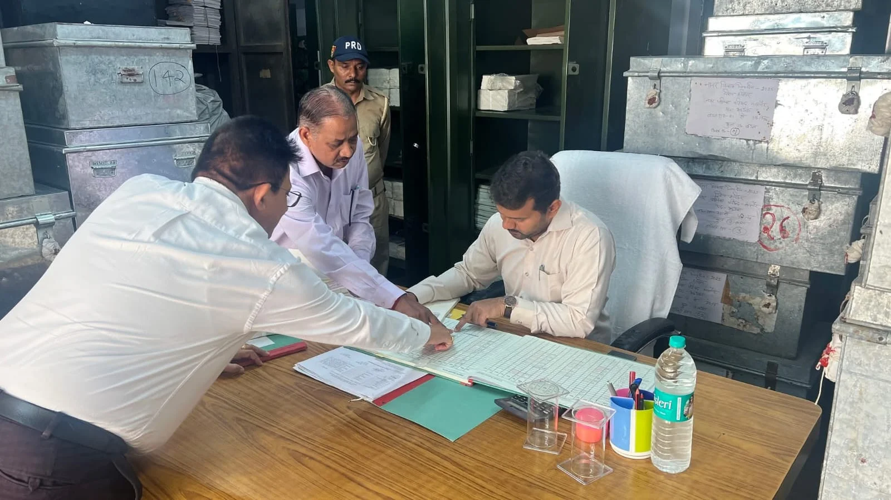
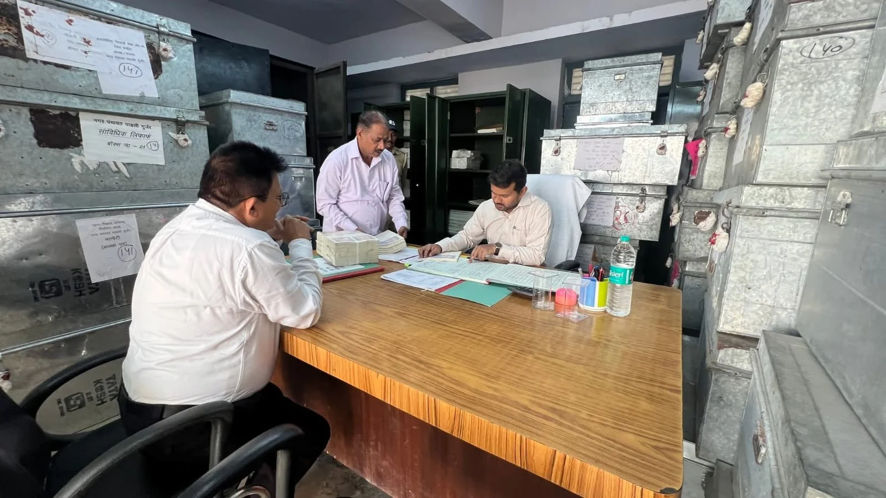

**रूडकी संवाददाता | आसिफ खान** 

रुड़की। सरकारी वित्तीय व्यवस्था के महत्वपूर्ण केंद्र कोषागार रुड़की में उस समय प्रशासनिक हलचल तेज हो गई, जब संयुक्त मजिस्ट्रेट रुड़की दीपक रामचंद्र शेट ने कोषागार का अर्द्धवार्षिक निरीक्षण किया। निरीक्षण के दौरान उन्होंने कोषागार में संचालित व्यवस्थाओं, अभिलेखों के रख-रखाव, वित्तीय कार्यप्रणाली और सुरक्षा इंतजामों का बारीकी से जायजा लिया।

संयुक्त मजिस्ट्रेट ने विभिन्न वित्तीय अभिलेखों और दस्तावेजों का अवलोकन करते हुए उनके व्यवस्थित, सुरक्षित और सुगम रख-रखाव के निर्देश दिए। उन्होंने स्पष्ट किया कि सरकारी अभिलेखों को इस प्रकार व्यवस्थित रखा जाए कि जरूरत पड़ने पर संबंधित जानकारी तत्काल उपलब्ध हो सके और रिकॉर्ड के रख-रखाव में किसी तरह की लापरवाही की गुंजाइश न रहे।

**लापरवाही पर नहीं चलेगी ढिलाई**

निरीक्षण के दौरान संयुक्त मजिस्ट्रेट ने अधिकारियों और कर्मचारियों को कार्यालय से संबंधित कार्यों का समयबद्ध निस्तारण सुनिश्चित करने के निर्देश दिए। उन्होंने वित्तीय कार्यों में पारदर्शिता, निर्धारित नियमों के अनुपालन और कार्यप्रणाली में दक्षता बनाए रखने पर विशेष जोर दिया।

उन्होंने कहा कि सरकारी कार्यालयों में कामकाज केवल औपचारिकता तक सीमित नहीं होना चाहिए, बल्कि प्रत्येक अधिकारी और कर्मचारी को अपने दायित्वों का गंभीरता से निर्वहन करना होगा।

**सुरक्षा व्यवस्था भी जांची**

कोषागार में रखे महत्वपूर्ण अभिलेखों और दस्तावेजों की सुरक्षा को लेकर भी संयुक्त मजिस्ट्रेट ने गंभीरता दिखाई। उन्होंने सुरक्षा व्यवस्था का निरीक्षण करते हुए निर्धारित सुरक्षा मानकों का कड़ाई से पालन करने के निर्देश दिए, ताकि महत्वपूर्ण वित्तीय रिकॉर्ड पूरी तरह सुरक्षित रहें।

**साफ-सफाई और बेहतर कार्य वातावरण पर जोर**

संयुक्त मजिस्ट्रेट ने कार्यालय परिसर की साफ-सफाई का भी जायजा लिया। उन्होंने अधिकारियों और कर्मचारियों को बेहतर एवं व्यवस्थित कार्य वातावरण बनाए रखने के निर्देश दिए। साथ ही आपसी समन्वय के साथ कार्य करते हुए कार्यालय की कार्यप्रणाली को और अधिक प्रभावी बनाने पर जोर दिया।

उन्होंने कहा कि सरकारी व्यवस्था में पारदर्शिता, जवाबदेही और समयबद्धता बेहद महत्वपूर्ण हैं। प्रत्येक अधिकारी और कर्मचारी को अपनी जिम्मेदारी समझते हुए कार्य करना चाहिए, ताकि आमजन से जुड़े वित्तीय एवं प्रशासनिक कार्यों का निस्तारण प्रभावी तरीके से हो सके।

**निरीक्षण के दौरान कोषागार से जुड़े अधिकारी एवं कर्मचारी मौजूद रहे।**
