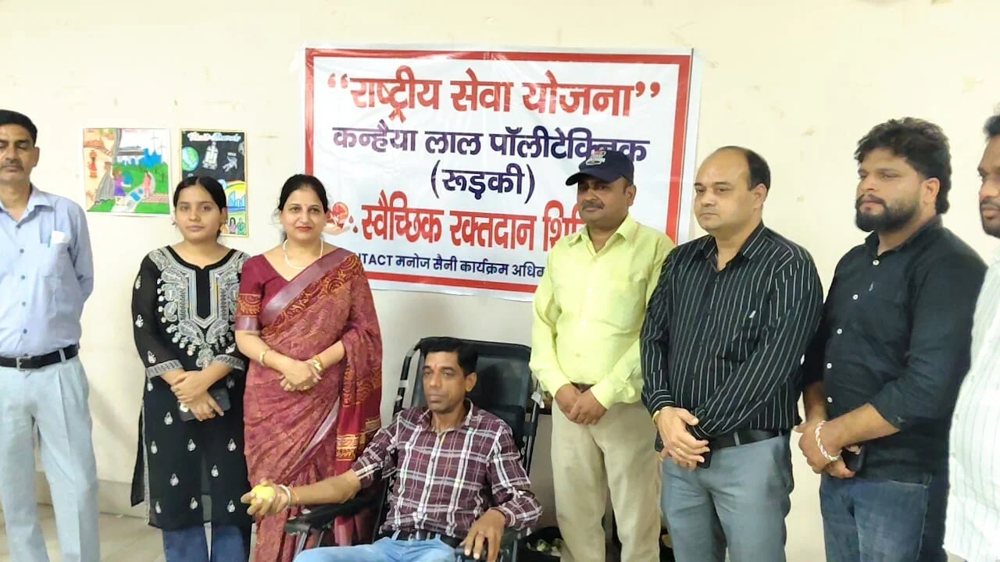
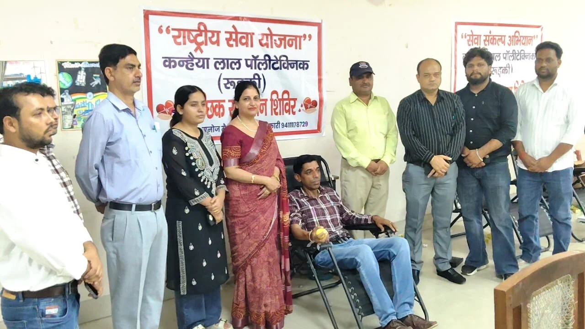

रुड़की संवाददाता | आसिफ खान

रुड़की। कन्हैया लाल पॉलीटेक्निक, रुड़की में राष्ट्रीय सेवा योजना (NSS) के तत्वावधान में आयोजित स्वैच्छिक रक्तदान शिविर में सेवा और मानवता का जज्बा खुलकर दिखाई दिया। छात्र-छात्राओं के साथ शिक्षकों, कर्मचारियों और संस्थान के पूर्व छात्रों ने भी उत्साहपूर्वक रक्तदान कर जरूरतमंदों की जिंदगी बचाने की मुहिम में अपनी भागीदारी दर्ज कराई।

शिविर में पहुंचीं पूर्व मेयर प्रत्याशी एवं समाजसेवी पूजा गुप्ता ने रक्तदान को मानव सेवा का महत्वपूर्ण माध्यम बताते हुए कहा कि रक्तदान महज एक सामाजिक कार्यक्रम नहीं, बल्कि मानवता को समर्पित महायज्ञ है। उन्होंने कहा कि किसी व्यक्ति द्वारा किया गया रक्तदान किसी जरूरतमंद मरीज के लिए जीवन की नई उम्मीद बन सकता है। विशेष रूप से थैलेसीमिया जैसी गंभीर बीमारी से जूझ रहे मरीजों के उपचार में रक्त की उपलब्धता बेहद महत्वपूर्ण है।

पूजा गुप्ता ने रक्तदान करने वाले विद्यार्थियों, शिक्षकों, कर्मचारियों और पूर्व छात्रों का आभार जताते हुए कहा कि युवाओं का सामाजिक सरोकारों से जुड़ना समाज के लिए सकारात्मक संदेश है। उन्होंने स्वस्थ एवं पात्र लोगों से रक्तदान के लिए आगे आने और अपने आसपास के लोगों को भी इसके प्रति जागरूक करने की अपील की।

**छात्राओं ने भी बढ़ाया कदम**

रक्तदान शिविर में छात्राओं ने भी बढ़-चढ़कर भागीदारी की। छात्राओं की सक्रिय भागीदारी ने यह संदेश दिया कि समाजसेवा के क्षेत्र में युवा बेटियां भी पीछे नहीं हैं। रक्तदान जैसे मानवीय कार्य में उनकी सहभागिता ने शिविर के उद्देश्य को और मजबूती प्रदान की।

कार्यक्रम अधिकारी मनोज सैनी और कुलदीप त्यागी ने छात्र-छात्राओं को रक्तदान के महत्व की जानकारी देते हुए उनका उत्साहवर्धन किया। उन्होंने कहा कि रक्तदान जरूरतमंद व्यक्ति की सहायता करने का महत्वपूर्ण माध्यम है और युवाओं को ऐसे सेवा कार्यों में सक्रिय भूमिका निभानी चाहिए।

**भ्रांतियां दूर करने पर भी जोर**

शिविर के दौरान रक्तदान को लेकर लोगों के मन में मौजूद विभिन्न भ्रांतियों को दूर करने का प्रयास किया गया। वक्ताओं ने बताया कि चिकित्सकीय जांच और निर्धारित स्वास्थ्य मानकों के अनुसार पात्र व्यक्ति सुरक्षित रूप से रक्तदान कर सकते हैं।

शिविर के माध्यम से युवाओं को केवल रक्तदान के लिए ही नहीं, बल्कि सेवा, सहयोग और मानवता की भावना को अपने जीवन का हिस्सा बनाने का संदेश दिया गया। कार्यक्रम में दिखाई दिया उत्साह इस बात का संकेत रहा कि युवा वर्ग सामाजिक जिम्मेदारी निभाने के लिए आगे आने को तैयार है।
