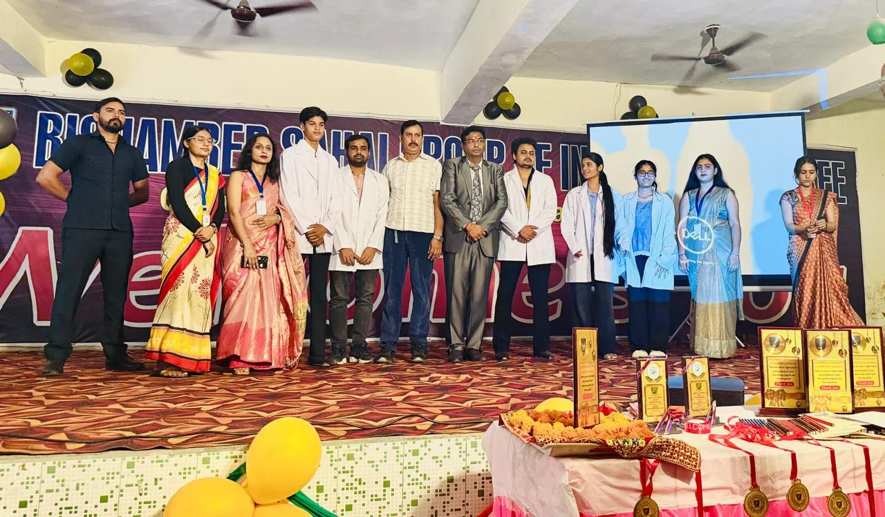
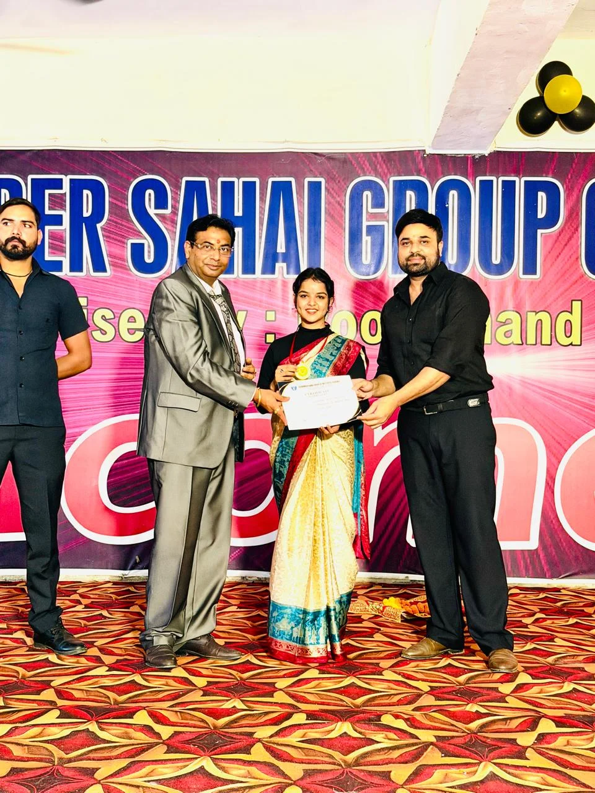
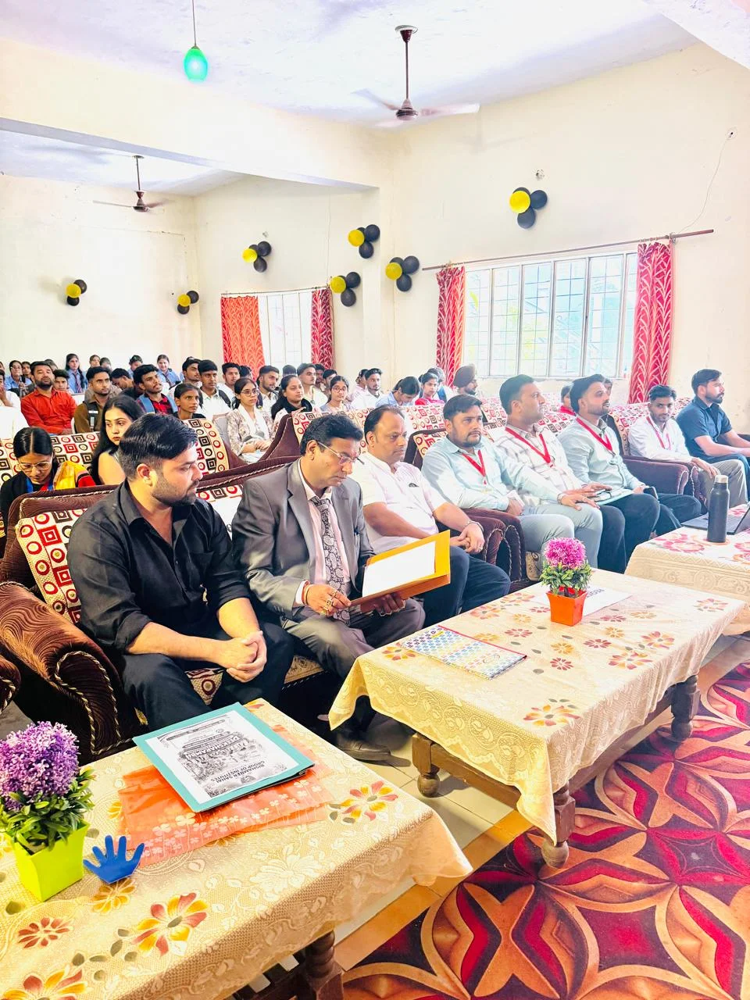

हरिद्वार/रूडकी संवाददाता | आसिफ खान 

रुड़की। बिशम्बर सहाय ग्रुप ऑफ इंस्टीट्यूट्स, संचालित रूप चंद शर्मा एजुकेशन ट्रस्ट में दीक्षारंभ-2026 कार्यक्रम का आयोजन हर्षोल्लास और उत्साह के साथ किया गया। कार्यक्रम में नवप्रवेशी छात्र-छात्राओं का गर्मजोशी से स्वागत करते हुए उन्हें संस्थान की शैक्षणिक परंपराओं, अनुशासन और संस्कारों से परिचित कराया गया। समारोह के दौरान विद्यार्थियों में जबरदस्त उत्साह देखने को मिला।

कार्यक्रम का शुभारंभ संस्थान के सेक्रेटरी चंद्रभूषण शर्मा ने विधिवत दीप प्रज्वलित कर किया। इस अवसर पर संस्थान के कोषाध्यक्ष एवं भाजपा प्रदेश संयोजक, व्यावसायिक प्रकोष्ठ सौरभ भूषण शर्मा, मैनेजिंग डायरेक्टर गौरव भूषण शर्मा, डिप्टी डायरेक्टर दिवाकर जैन, डिग्री विभागाध्यक्ष शाहज़ेब आलम सहित शिक्षकगण, कर्मचारी, छात्र-छात्राएं और अभिभावक मौजूद रहे।

**रंगारंग प्रस्तुतियों ने जीता दिल**

दीक्षारंभ समारोह में छात्र-छात्राओं ने गीत, नृत्य सहित विभिन्न रंगारंग सांस्कृतिक प्रस्तुतियां देकर कार्यक्रम में चार चांद लगा दिए। विद्यार्थियों की प्रस्तुतियों ने उपस्थित अतिथियों और अभिभावकों की जमकर तालियां बटोरीं। पूरा परिसर उत्साह और उमंग से सराबोर नजर आया।

**प्रतिभाओं को सम्मान, अभिभावकों का भी बढ़ाया मान**

कार्यक्रम में विद्यार्थियों को उनकी उपलब्धियों के लिए सम्मानित कर उनका उत्साहवर्धन किया गया। पिछले शैक्षणिक सत्र के Best Student Award से हिमांशी को सम्मानित किया गया। वहीं Maximum Attendance Award के तहत चंचल, प्रज्ञा, राधिका, विनीत, सुहेल, त्यागी, शहनवाज सहित अन्य विद्यार्थियों को सम्मानित किया गया।

संस्थान के मेधावी छात्र-छात्राओं के अभिभावकों को भी विशेष सम्मान प्रदान किया गया। सम्मान समारोह ने विद्यार्थियों और उनके परिवारों में नई ऊर्जा और उत्साह का संचार किया।

**शिक्षा के साथ संस्कार और अनुशासन पर जोर**

संस्थान के सेक्रेटरी चंद्रभूषण शर्मा ने कहा कि दीक्षारंभ केवल नए विद्यार्थियों के स्वागत तक सीमित नहीं है, बल्कि यह उनके उज्ज्वल भविष्य की दिशा में एक नई शुरुआत है। संस्थान का उद्देश्य विद्यार्थियों को गुणवत्तापूर्ण शिक्षा के साथ संस्कार, अनुशासन और जिम्मेदारी की भावना से जोड़ना है।

संस्थान के कोषाध्यक्ष एवं भाजपा प्रदेश संयोजक, व्यावसायिक प्रकोष्ठ सौरभ भूषण शर्मा ने कहा कि विद्यार्थी देश की वास्तविक शक्ति हैं। शिक्षा के माध्यम से विद्यार्थियों को अपने लक्ष्य निर्धारित कर उन्हें हासिल करने के लिए निरंतर प्रयास करना चाहिए। संस्थान विद्यार्थियों के सर्वांगीण विकास के लिए लगातार प्रयासरत है।

मैनेजिंग डायरेक्टर गौरव भूषण शर्मा ने कहा कि नए सत्र की शुरुआत विद्यार्थियों के लिए नई उम्मीदों और अवसरों का संदेश लेकर आती है। संस्थान का प्रयास है कि प्रत्येक विद्यार्थी को ऐसा शैक्षणिक वातावरण मिले, जहां वह अपनी प्रतिभा को पहचानकर उसे निखार सके।

डिप्टी डायरेक्टर दिवाकर जैन ने नवप्रवेशी विद्यार्थियों का स्वागत करते हुए कहा कि विद्यार्थियों को अपने लक्ष्य के प्रति समर्पित रहना चाहिए। नियमित कक्षाओं में उपस्थित रहने के साथ शिक्षकों के मार्गदर्शन का लाभ लेना चाहिए। सफलता के लिए मेहनत, अनुशासन और सकारात्मक सोच बेहद जरूरी है।

कार्यक्रम के अंत में अतिथियों ने सभी विद्यार्थियों को नए शैक्षणिक सत्र के लिए शुभकामनाएं दीं। दीक्षारंभ-2026 समारोह नए विद्यार्थियों के लिए उत्साह, प्रेरणा और नई ऊर्जा का संदेश देकर संपन्न हुआ।

इस अवसर पर हरिंदर चौधरी, तनु सैनी, आरजू, आबाद, जितेंद्र सिंह, विशाल सैनी, जहांगीर, सुधीर सैनी, प्रणव शर्मा, शाहीन, रुचि, सोनी, आयुषी सहित संस्थान के अध्यापक-अध्यापिकाएं उपस्थित रहे।
