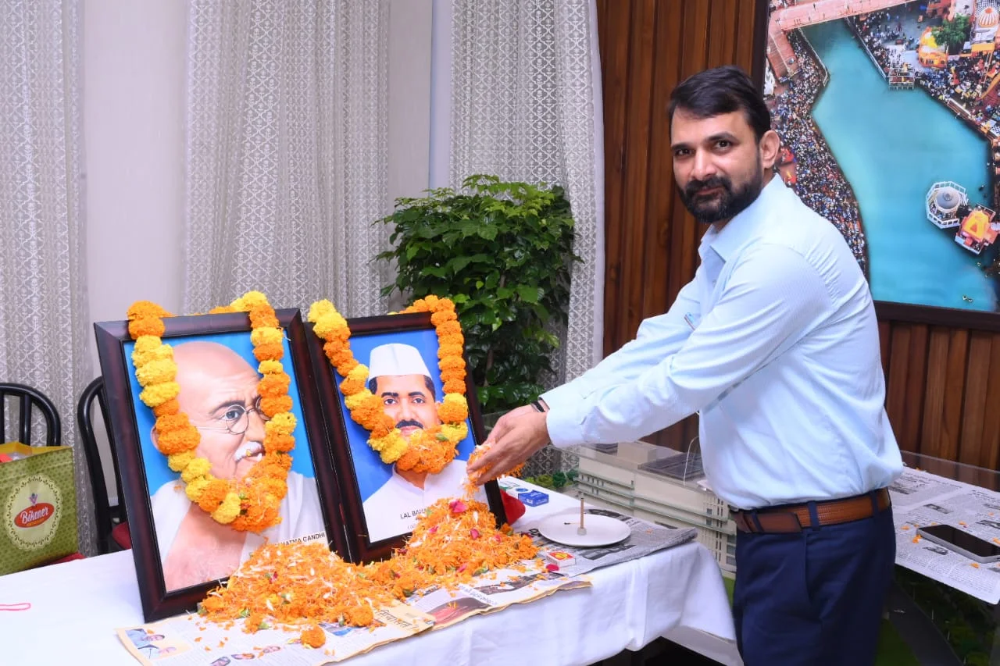

**हरिद्वार संवाददाता | आसिफ खान** 

राष्ट्रपिता महात्मा गांधी एवं पूर्व प्रधानमंत्री लाल बहादुर शास्त्री की जयंती के अवसर पर हरिद्वार-रुड़की विकास प्राधिकरण (HRDA) में श्रद्धांजलि कार्यक्रम आयोजित किया गया। कार्यक्रम में महात्मा गांधी और लाल बहादुर शास्त्री के चित्रों पर पुष्प अर्पित कर उन्हें नमन किया गया। इस दौरान सत्य, अहिंसा, सादगी, ईमानदारी और कर्तव्यनिष्ठा के संदेश को जनसेवा से जोड़ते हुए अधिकारियों और कर्मचारियों ने अपने दायित्वों का पूरी निष्ठा से निर्वहन करने का संकल्प लिया।

कार्यक्रम में HRDA सचिव प्रत्यूष सिंह ने महात्मा गांधी और लाल बहादुर शास्त्री के जीवन से प्रेरणा लेने की बात कही। उन्होंने कहा कि दोनों महापुरुषों का जीवन देशसेवा, अनुशासन और ईमानदारी का उदाहरण है। सरकारी व्यवस्था में काम करने वाले प्रत्येक अधिकारी और कर्मचारी की जिम्मेदारी है कि वह आमजन की समस्याओं को गंभीरता से सुने और अपने दायित्वों का पारदर्शिता के साथ निर्वहन करे।

वहीं सहायक अभियंता प्रशांत सेमवाल ने कहा कि गांधी जी का सत्य और अहिंसा का संदेश आज भी उतना ही प्रासंगिक है। उन्होंने कहा कि सरकारी विभागों में कार्यरत अधिकारियों और कर्मचारियों के लिए समयबद्धता, जिम्मेदारी और जनहित सर्वोच्च प्राथमिकता होनी चाहिए।

कार्यक्रम में प्रशासनिक स्तर पर जितेंद्र कुमार की भूमिका का भी उल्लेख किया गया। वक्ताओं ने कहा कि प्रशासनिक व्यवस्था में अधिकारियों की जिम्मेदारी केवल कार्यालय तक सीमित नहीं होती, बल्कि आम जनता को बेहतर सेवाएं उपलब्ध कराना भी उनकी महत्वपूर्ण जिम्मेदारी है। जितेंद्र कुमार ने भी गांधी और शास्त्री के आदर्शों को याद करते हुए जनहित में पूरी गंभीरता और जिम्मेदारी के साथ कार्य करने का संदेश दिया।

**महापुरुषों को याद करना ही नहीं, उनके आदर्शों पर चलना भी जरूरी**

कार्यक्रम में यह संदेश भी दिया गया कि 2 अक्टूबर केवल माल्यार्पण और श्रद्धांजलि तक सीमित रहने का दिन नहीं है। गांधी जी का सत्य-अहिंसा का मार्ग और शास्त्री जी का ‘जय जवान, जय किसान’ का संदेश आज भी देश की व्यवस्था और समाज के लिए महत्वपूर्ण है।

अधिकारियों ने कहा कि सरकारी तंत्र में पारदर्शिता, जवाबदेही और जनसेवा की भावना को मजबूत करना ही इन महान विभूतियों को सच्ची श्रद्धांजलि होगी। कार्यक्रम के दौरान उपस्थित अधिकारियों और कर्मचारियों ने राष्ट्रहित एवं जनहित को सर्वोच्च प्राथमिकता देते हुए पूरी निष्ठा के साथ अपने दायित्वों का निर्वहन करने का संकल्प लिया।
