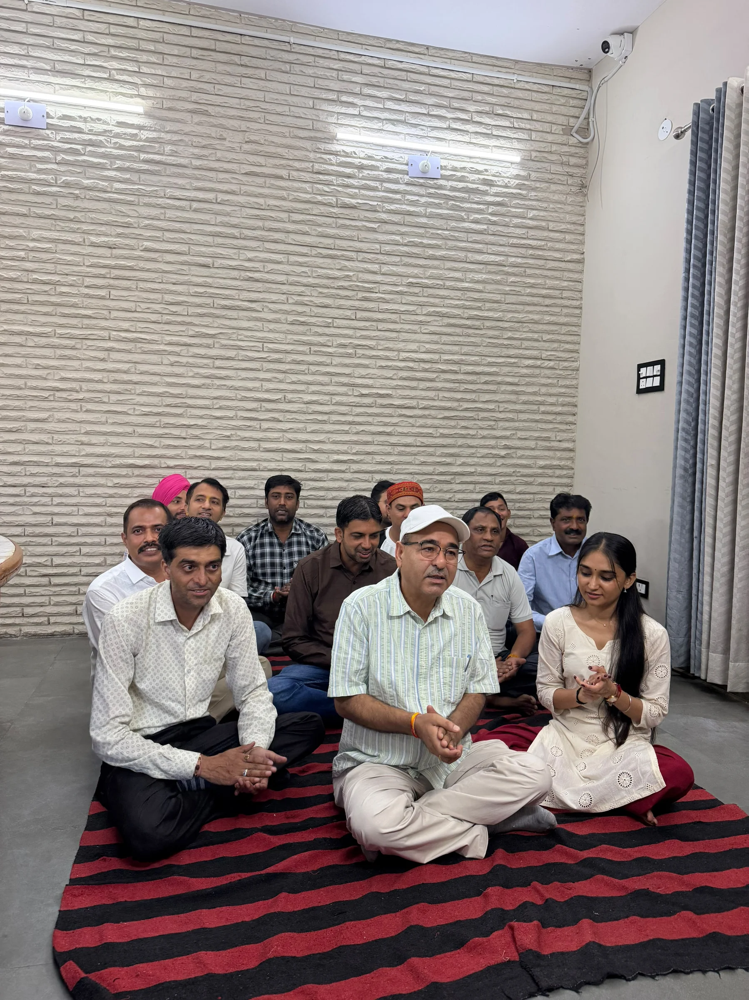
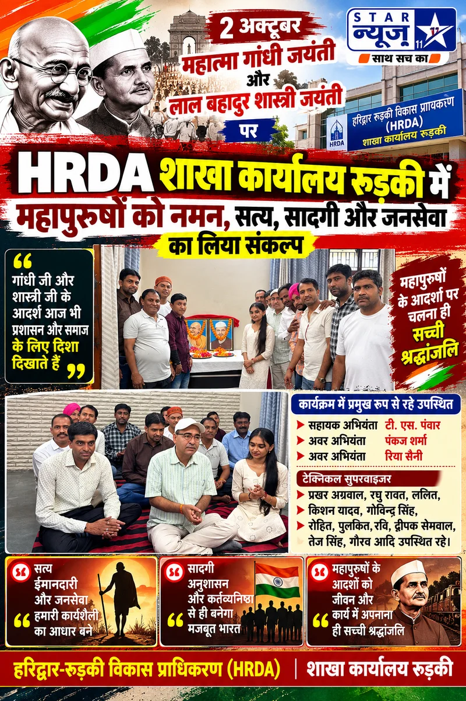

**रुड़की संवाददाता |आसिफ खान**

 राष्ट्रपिता महात्मा गांधी एवं पूर्व प्रधानमंत्री लाल बहादुर शास्त्री की जयंती के अवसर पर हरिद्वार-रुड़की विकास प्राधिकरण (HRDA) के शाखा कार्यालय रुड़की में श्रद्धांजलि कार्यक्रम आयोजित किया गया। कार्यक्रम में अधिकारियों एवं कर्मचारियों ने दोनों महापुरुषों के चित्रों पर पुष्प अर्पित कर उन्हें श्रद्धापूर्वक नमन किया और उनके आदर्शों को अपने कार्य एवं जीवन में उतारने का संकल्प लिया।

कार्यक्रम में सहायक अभियंता टी.एस. पंवार ने महात्मा गांधी के सत्य, अहिंसा और सादगी के विचारों को याद करते हुए कहा कि गांधी जी का जीवन आज भी समाज और प्रशासन के लिए प्रेरणा का स्रोत है। उन्होंने कहा कि सरकारी सेवा में जनहित को सर्वोच्च प्राथमिकता देते हुए पूरी ईमानदारी और जिम्मेदारी के साथ कार्य करना ही महापुरुषों के प्रति सच्ची श्रद्धांजलि है।

वहीं अवर अभियंता पंकज शर्मा ने लाल बहादुर शास्त्री के सादगीपूर्ण जीवन, अनुशासन और राष्ट्रसेवा को याद किया। उन्होंने कहा कि शास्त्री जी ने अपने आचरण से देश के सामने ईमानदारी और कर्तव्यनिष्ठा की मिसाल पेश की। उनके विचार आज भी प्रत्येक व्यक्ति को अपने दायित्वों के प्रति सजग रहने की प्रेरणा देते हैं।

अवर अभियंता रिया सैनी ने कहा कि गांधी जी का सत्य और अहिंसा का संदेश तथा शास्त्री जी की सादगी एवं राष्ट्रसेवा की भावना आज भी पूरी तरह प्रासंगिक है। उन्होंने कहा कि महापुरुषों को केवल जयंती के दिन याद करना पर्याप्त नहीं, बल्कि उनके आदर्शों को कार्यशैली में उतारना ही उनके प्रति वास्तविक सम्मान है।

**अधिकारियों-कर्मचारियों ने लिया जनसेवा का संकल्प**

कार्यक्रम में टेक्निकल सुपरवाइजर प्रखर अग्रवाल, रघु रावत, ललित, किशन यादव, गोविन्द सिंह, रोहित, पुलकित, रवि, दीपक सेमवाल, तेज सिंह, गौरव सहित अन्य अधिकारी एवं कर्मचारी उपस्थित रहे। सभी ने महात्मा गांधी और लाल बहादुर शास्त्री के चित्रों पर पुष्प अर्पित कर श्रद्धांजलि दी।

इस दौरान वक्ताओं ने कहा कि सत्य, ईमानदारी, अनुशासन, पारदर्शिता और जनसेवा केवल शब्द नहीं, बल्कि प्रशासनिक व्यवस्था को मजबूत बनाने के मूल आधार हैं। अधिकारियों एवं कर्मचारियों ने अपने-अपने दायित्वों का पूरी निष्ठा के साथ निर्वहन करने और आमजन की समस्याओं के प्रति संवेदनशील रहने का संकल्प लिया।

कार्यक्रम में महापुरुषों के जीवन और उनके संघर्षों को याद करते हुए कहा गया कि गांधी जी ने सत्य और अहिंसा के मार्ग से देश को नई दिशा दी, जबकि लाल बहादुर शास्त्री ने सादगी, साहस और राष्ट्रसेवा का अनुपम उदाहरण प्रस्तुत किया। आज आवश्यकता उनके विचारों को केवल भाषणों तक सीमित रखने की नहीं, बल्कि उन्हें व्यवहार और कार्यप्रणाली में उतारने की है।

श्रद्धांजलि कार्यक्रम के दौरान शाखा कार्यालय का माहौल राष्ट्रसेवा और जनसेवा के संकल्प से सराबोर नजर आया। उपस्थित अधिकारियों एवं कर्मचारियों ने दोनों महान विभूतियों को नमन करते हुए उनके आदर्शों पर चलने का संकल्प दोहराया।

