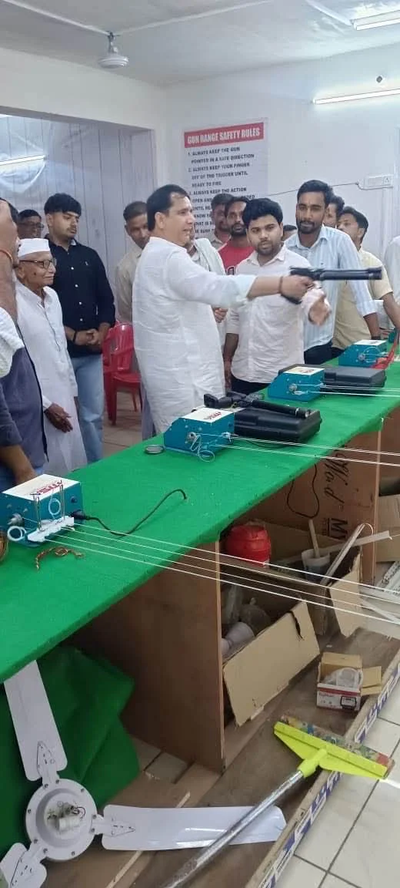
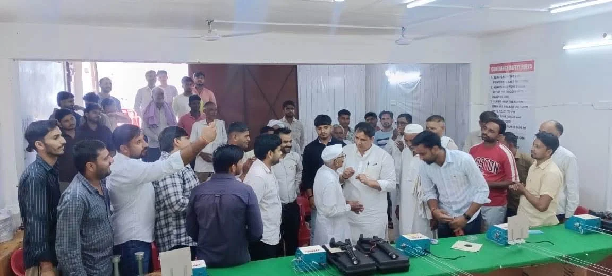
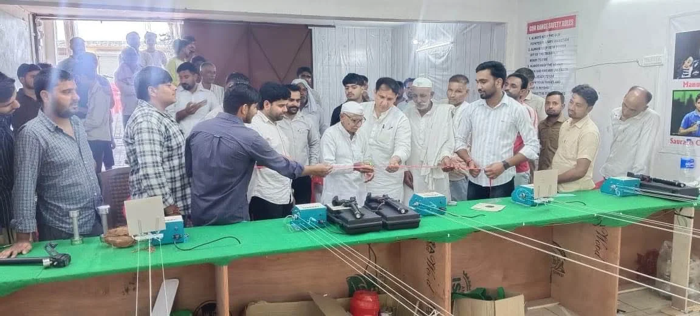

**झबरेड़ा संवाददाता | आसिफ खान**

झबरेड़ा। कस्बा झबरेड़ा में खेल प्रतिभाओं को तराशने की दिशा में एक बड़ी और महत्वपूर्ण पहल सामने आई है। क्षेत्र में शूटिंग अकैडमी का भव्य उद्घाटन समारोह आयोजित किया गया, जहां पूर्व राज्यमंत्री गौरव चौधरी ने फीता काटकर अकैडमी का विधिवत उद्घाटन किया। शूटिंग अकैडमी के शुभारंभ के साथ ही क्षेत्र के युवा खिलाड़ियों में जबरदस्त उत्साह देखने को मिला।

उद्घाटन समारोह में पहुंचे पूर्व राज्यमंत्री गौरव चौधरी ने अकैडमी संचालकों को शुभकामनाएं देते हुए कहा कि आज युवाओं को सिर्फ पढ़ाई तक सीमित रखने के बजाय उनकी खेल प्रतिभा को भी सही दिशा देना बेहद जरूरी है। ग्रामीण और कस्बाई क्षेत्रों में प्रतिभाओं की कोई कमी नहीं है, लेकिन उचित प्रशिक्षण और सुविधाओं के अभाव में कई प्रतिभाएं आगे नहीं बढ़ पातीं। ऐसे में झबरेड़ा में शूटिंग अकैडमी की शुरुआत युवाओं के लिए एक मजबूत मंच साबित हो सकती है।

गौरव चौधरी ने कहा कि शूटिंग ऐसा खेल है जिसमें अनुशासन, एकाग्रता, धैर्य और निरंतर अभ्यास की महत्वपूर्ण भूमिका होती है। यदि खिलाड़ियों को शुरुआती स्तर से ही बेहतर प्रशिक्षण और सुविधाएं उपलब्ध हों तो वे जिला, राज्य, राष्ट्रीय और अंतरराष्ट्रीय स्तर की प्रतियोगिताओं में अपनी प्रतिभा का प्रदर्शन कर सकते हैं।

उन्होंने अकैडमी संचालकों की पहल की सराहना करते हुए कहा कि झबरेड़ा जैसे कस्बे में शूटिंग की सुविधा शुरू होना क्षेत्र के लिए बड़ी उपलब्धि है। इससे स्थानीय युवाओं को अपनी प्रतिभा को निखारने का अवसर मिलेगा और उन्हें प्रशिक्षण के लिए दूर-दराज के शहरों का रुख नहीं करना पड़ेगा।

अकैडमी संचालकों ने बताया कि यहां खिलाड़ियों को शूटिंग के क्षेत्र में आवश्यक प्रशिक्षण और अभ्यास उपलब्ध कराने के साथ-साथ उन्हें प्रतियोगिताओं के लिए तैयार करने पर विशेष जोर दिया जाएगा। उनका उद्देश्य क्षेत्र की छिपी हुई खेल प्रतिभाओं को तलाशना और उन्हें बेहतर मंच प्रदान करना है।

अकैडमी के उद्घाटन समारोह में मौजूद लोगों ने भी इस पहल का स्वागत किया। क्षेत्रवासियों का कहना है कि युवाओं को खेलों से जोड़ने वाली ऐसी पहल समय की जरूरत है। इससे एक ओर जहां युवाओं को अपनी प्रतिभा दिखाने का अवसर मिलेगा, वहीं दूसरी ओर उन्हें सकारात्मक दिशा में आगे बढ़ने के लिए बेहतर वातावरण भी मिलेगा।

झबरेड़ा में शूटिंग अकैडमी की शुरुआत ने यह साफ कर दिया है कि अब कस्बे की खेल प्रतिभाएं भी बड़े मंच की ओर कदम बढ़ाने को तैयार हैं। जरूरत है तो सिर्फ निरंतर अभ्यास, बेहतर प्रशिक्षण और सही मार्गदर्शन की।
