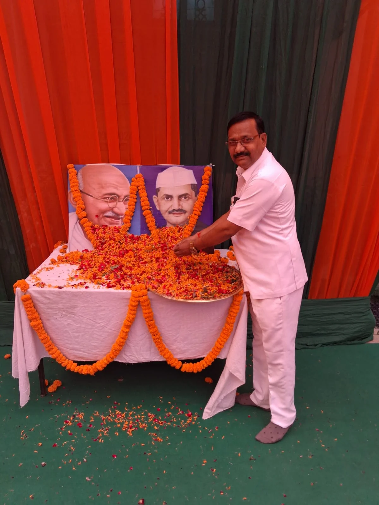

**रूडकी/भगवानपुर संवाददाता | आसिफ खान**

राष्ट्रपिता महात्मा गांधी एवं देश के पूर्व प्रधानमंत्री लाल बहादुर शास्त्री की जयंती के अवसर पर भगवानपुर विधानसभा क्षेत्र के भाजपा नेता एवं पूर्व प्रदेश कार्यकारिणी सदस्य सुशील पेगोवाल ने दोनों महान विभूतियों को श्रद्धापूर्वक नमन करते हुए उनके विचारों को आज के दौर में आत्मसात करने का आह्वान किया।

सुशील पेगोवाल ने कहा कि महात्मा गांधी ने सत्य, अहिंसा और स्वच्छता को केवल विचार नहीं, बल्कि जनआंदोलन का स्वरूप दिया। उन्होंने देश की आजादी के लिए अपना पूरा जीवन समर्पित कर यह साबित किया कि मजबूत संकल्प और सत्य के रास्ते पर चलकर बड़े से बड़ा परिवर्तन लाया जा सकता है।

उन्होंने कहा कि लाल बहादुर शास्त्री सादगी, ईमानदारी और राष्ट्रभक्ति की ऐसी मिसाल थे, जिसे आज भी देश याद करता है। कठिन परिस्थितियों में देश का नेतृत्व करते हुए शास्त्री जी ने जवान और किसान दोनों के महत्व को रेखांकित करते हुए “जय जवान, जय किसान” का नारा दिया।

पेगोवाल ने कहा कि आज देश को ऐसे ही आदर्शों और मजबूत संकल्प की आवश्यकता है। महापुरुषों की जयंती केवल माल्यार्पण और औपचारिक कार्यक्रमों तक सीमित नहीं रहनी चाहिए, बल्कि उनके बताए मार्ग पर चलने का संकल्प भी लिया जाना चाहिए।

उन्होंने कहा कि गांधी जी का सत्य और अहिंसा का संदेश तथा शास्त्री जी की ईमानदारी, सादगी और राष्ट्रसेवा की भावना आज की युवा पीढ़ी के लिए बड़ी प्रेरणा है। यदि समाज का प्रत्येक व्यक्ति अपने कर्तव्यों के प्रति ईमानदार होकर आगे बढ़े तो देश को और मजबूत बनाने में कोई बाधा नहीं आ सकती।

भगवानपुर विधानसभा क्षेत्र से जुड़े सुशील पेगोवाल ने क्षेत्रवासियों एवं प्रदेशवासियों से आह्वान किया कि वे दोनों महान नेताओं के आदर्शों को अपने जीवन में उतारें और स्वच्छता, सामाजिक एकता, राष्ट्रसेवा तथा जनकल्याण के कार्यों में बढ़-चढ़कर भाग लें।

उन्होंने कहा कि महात्मा गांधी और लाल बहादुर शास्त्री की विरासत देश की अमूल्य धरोहर है और इसे आने वाली पीढ़ियों तक पहुंचाना हम सभी की जिम्मेदारी है।
